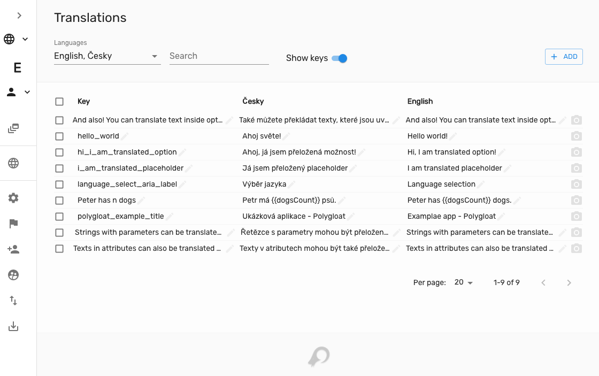

# Tolgee Toolkit Server & Web Application

For more detailed documentation about Tolgee, visit [tolgee.io](https://tolgee.io).

## Running with docker
To run Tolgee Server with docker

    docker run -v tolgee_data:/data/ -p 8085:8080 \
    tolgee/tolgee

Now you should be able to access Tolgee web application on http://localhost:8085

To learn more about deploying Tolgee server, visit 
[this documentation page](https://toolkit.tolgee.io/docs/server_and_web_app/self_hosting/running_with_docker).

## Configuration
For more information about configuration, visit 
[docs](https://toolkit.tolgee.io/doctolgeeLogo.svgs/server_and_web_app/self_hosting/configuration).
