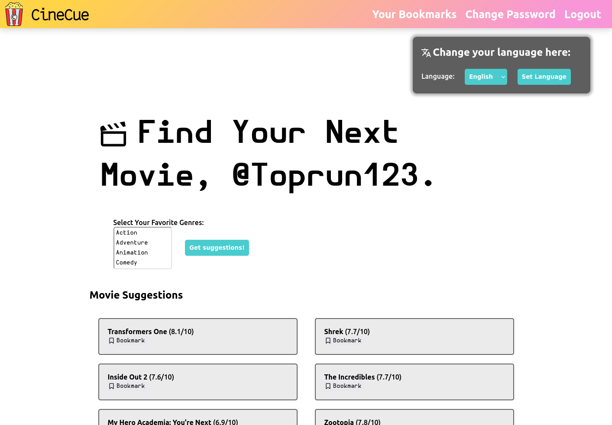
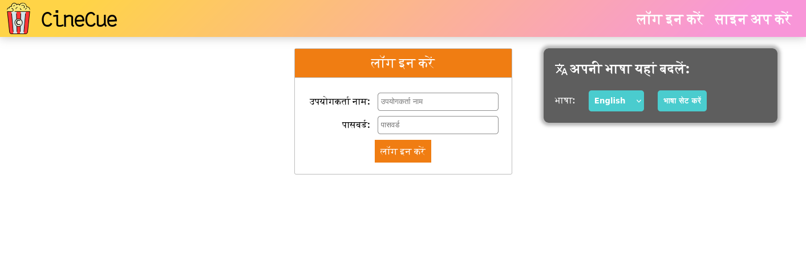
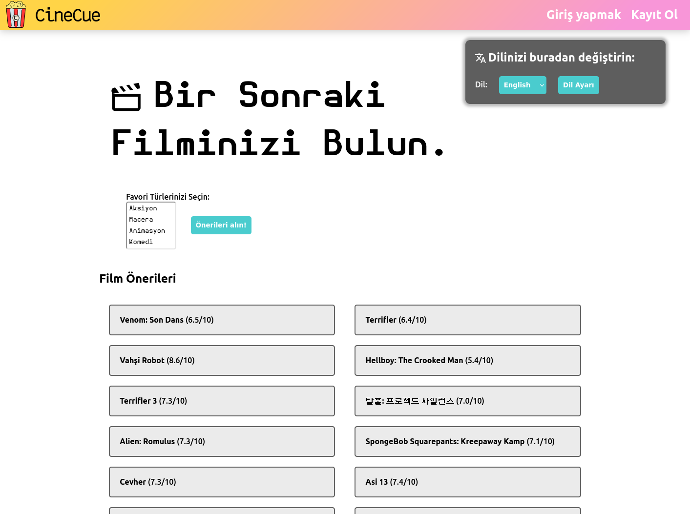
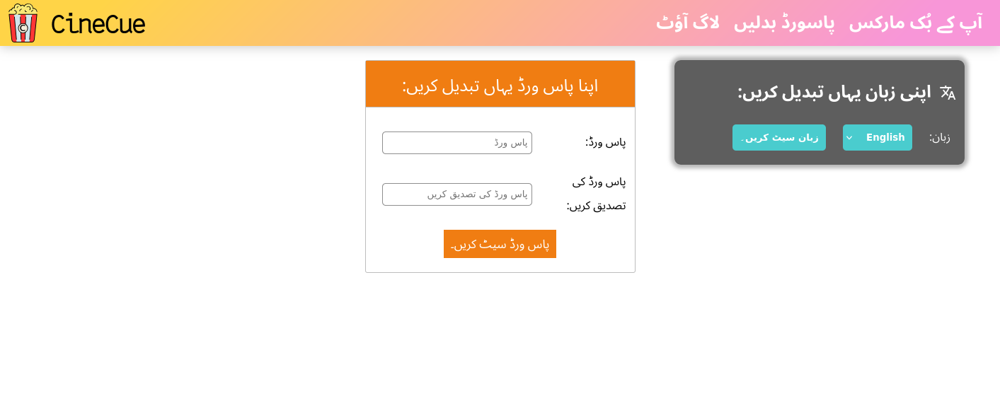
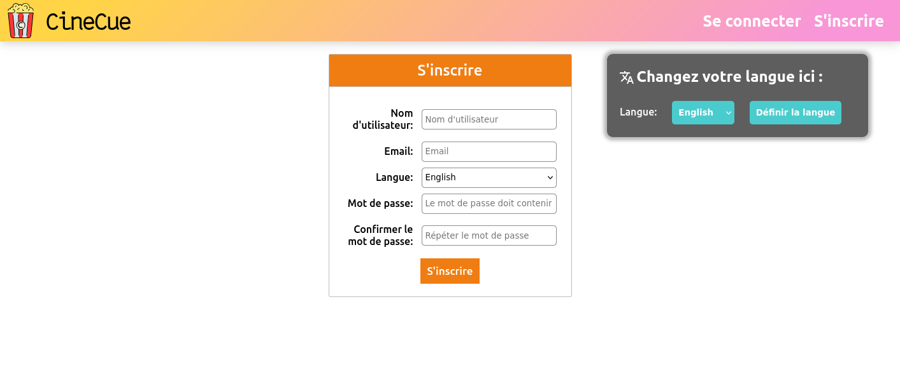

# CineCue

Welcome to **CineCue** - your ultimate movie finder based on genres in multiple languages! CineCue is a demo Ruby on Rails web app that lets you explore movies by genre in multiple languages, all powered by [Tolgee](https://tolgee.io/) for seamless localization.

## Table of Contents
- [Screenshots](#screenshots)
- [Features](#features)
- [Technologies Used](#technologies-used)
- [Installation](#installation)
- [Article](#article)

## Screenshots


<details>
    <summary>Additional Screenshots</summary>






</details>

## Features
- **Localized Movie Search**: Find the perfect movie for any mood in one of seven languages: English, Turkish, Spanish, French, Arabic, Hindi, and Urdu.
- **Genre-Based Recommendations**: Search and filter movies by genre for quick and relevant suggestions.
- **Tolgee Integration**: Provides real-time localization, making CineCue accessible for global users.
- **User-Friendly Interface**: Clean, responsive, and intuitive design for easy browsing.
- **Dynamic Content Updates**: The latest movies and recommendations, refreshed for a tailored experience every time using the [TMDb](https://themoviedb.org/) API.

## Technologies Used
- **Ruby on Rails**: The backbone of CineCue, enabling robust and scalable application development.
- **Tolgee**: Open-source localization framework for streamlined translations and multi-language support.
- **TMDb API**: Provides the latest movie data, enabling real-time genre-based recommendations and up-to-date information.

## Installation
1. **Clone the Repository**: clone the tolgee repo and see the demo under the folder `demos/CineCue`

2. **Install Dependancies**:
    ```bash
    bundle install
    ```

3. **Set Up TMDb API Key**:
    - Sign up for an API key on [The Movie Database (TMDb)](https://themoviedb.org/).
    - Add the API key to the `app/controllers/movies_controller.rb` file in the `@@api_key` variable on the 6ᵗʰ line.

4. **Migrate Database**:
    ```bash
    rails db:migrate
    ```

5. **Run the App**:
    ```bash
    rails server
    ```

6. **Access the App**:
    - Open [http://localhost:8080/](http://localhost:8080/) in your browser to start using CineCue!

# Article

Here is my article on [DEV.to](https://dev.to/sixzix/cinecue-a-seamless-localization-demo-with-ror-360j)
