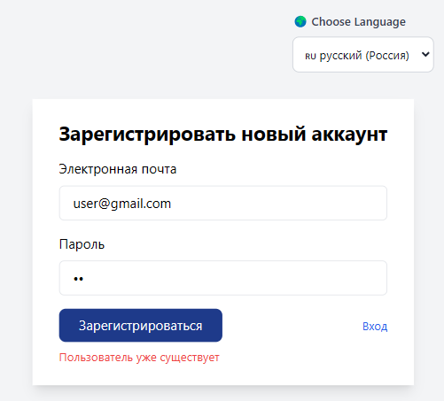
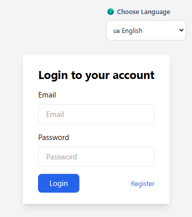
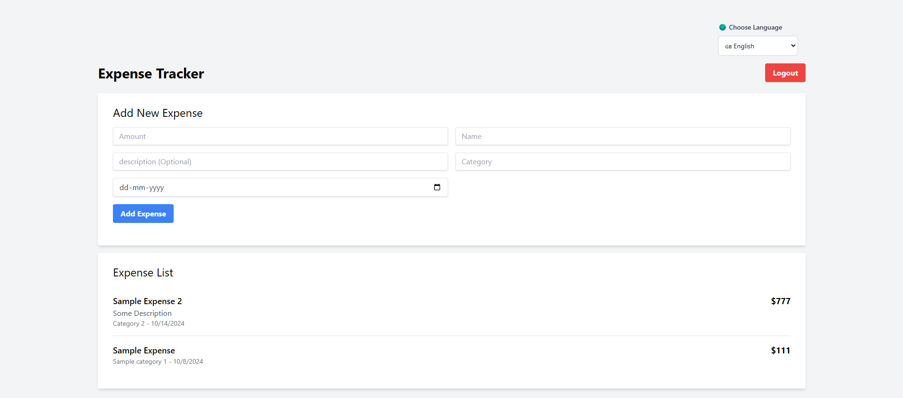
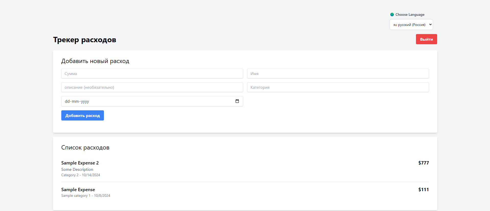
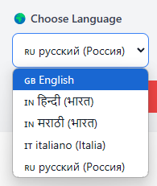

# Multi-User Expense Tracker with Tolgee Localization

This project is a full-stack expense tracker application built with React (Vite), Express, MongoDB, and Tolgee for localization. It features user authentication, expense management, and multi-language support.

## Features

- User registration and authentication
- Add and view expenses
- Localization support for multiple languages
- Responsive design with Tailwind CSS

## Tech Stack

- Frontend: React (Vite), Tailwind CSS
- Backend: Express.js, MongoDB
- Authentication: JWT
- Localization: Tolgee

## Screenshots


User registration page showing an error message in Russian localization.
---


Login page with English localization.
---


Main dashboard view with English localization.
---


Main dashboard view with Russian localization.
---


Language selector dropdown for switching between supported languages.


## Setup

1. Clone the repository
2. Install dependencies for both client and server:
   ```
   cd client && npm install
   cd ../server && npm install
   ```
3. Set up environment variables:
   - Create a `.env` file in the server directory with your MongoDB URI and JWT secret
   - Create a `.env` file in the client directory with your Tolgee API details

## Running the Application

To run the server:
```
cd server
npm run dev
```

To run the client:
```
cd client
npm run dev
```

## Localization

This project uses Tolgee for localization. To set up Tolgee:

1. Create a project on [Tolgee Cloud](https://app.tolgee.io) or use self-hosted [Tolgee Server](https://github.com/tolgee/server).
2. Generate an API key
3. Set the following environment variables in your client's `.env` file:
   ```
   VITE_APP_TOLGEE_API_URL=your_tolgee_api_url
   VITE_APP_TOLGEE_API_KEY=your_tolgee_api_key
   VITE_APP_TOLGEE_PROJECT_ID=your_tolgee_project_id
   ```

## Contributing

Contributions are welcome! Please feel free to submit a Pull Request.

## License

This project is open source and available under the [MIT License](LICENSE).