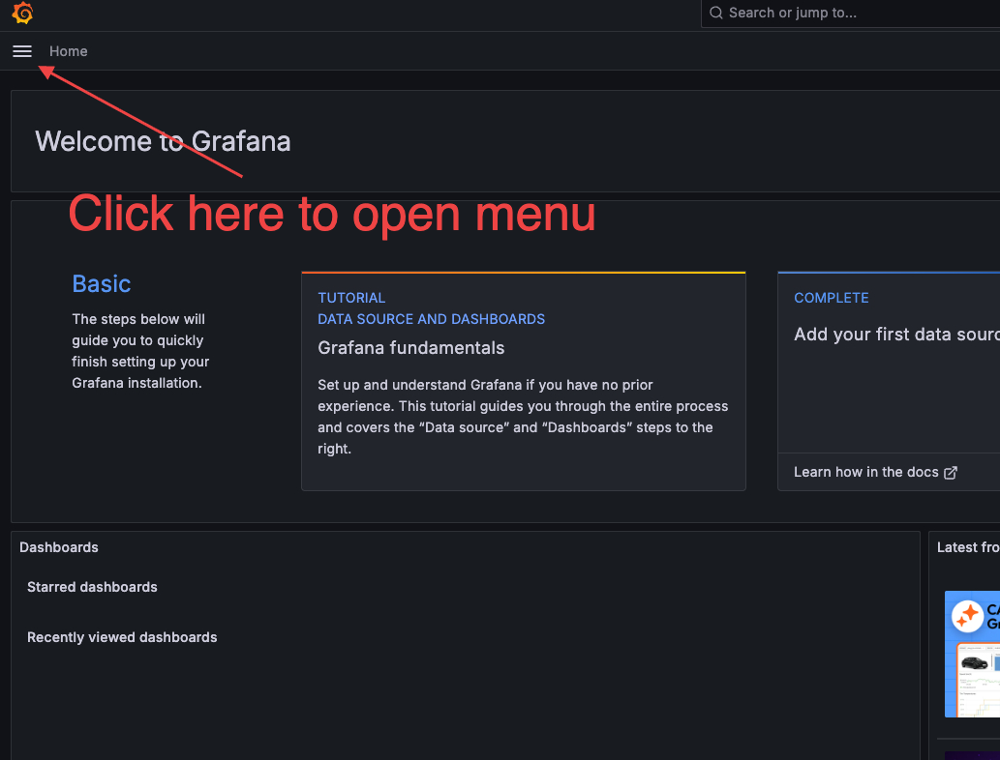
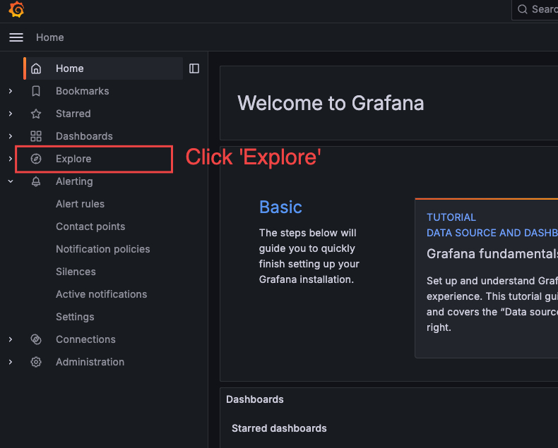
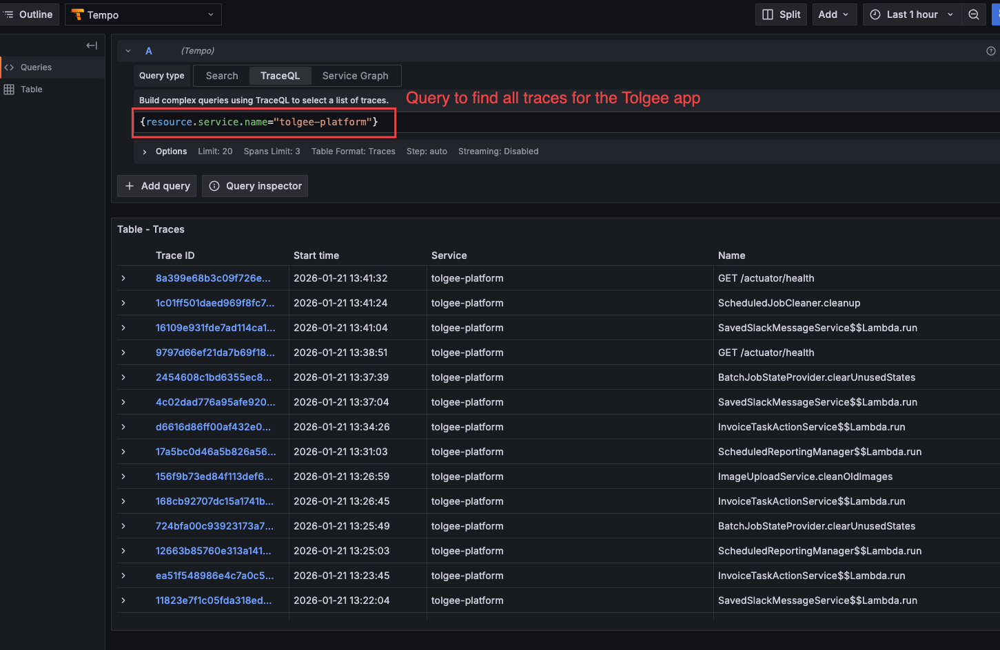

# Part 1: Setting Up the Tracing Stack

**What you'll learn:** How to start the tracing infrastructure and verify it's working.

*Skip if: You already have Grafana running at http://localhost:3000 with Tempo traces visible.*

---

## 1.1 Build and Start the Stack

The tracing stack includes Tolgee with OpenTelemetry already configured. First, build the Docker image:

```bash
./gradlew docker
```

Then start everything from the `docker` directory:

```bash
cd docker && docker compose -f docker-compose.local-observability-stack.yaml up -d
```

This starts:
- **Tolgee** (port 8080) - the application, with OpenTelemetry agent attached
- **Grafana** (port 3000) - UI for viewing traces and logs
- **Tempo** - stores and queries traces
- **Loki** - stores and queries logs
- **Promtail** - ships logs from containers to Loki
- **Prometheus** - stores metrics generated from traces
- **OpenTelemetry Collector** - receives traces and forwards them
- **PostgreSQL** and **Redis** - Tolgee dependencies

Verify all services are healthy:

```bash
docker compose -f docker-compose.local-observability-stack.yaml ps
```

All services should show `Up` or `healthy`.

## 1.2 Access Grafana

Open http://localhost:3000 in your browser.

No login required - anonymous access is enabled for local development.

**Verify Tempo datasource:**

1. Click the hamburger menu (☰) to open the navigation:



2. Click **Explore** in the menu:



3. In the datasource dropdown (top left), select **Tempo**. You should see the TraceQL query interface (don't enter any query just yet):


If you see "Datasource not found", the infrastructure may still be starting. Wait 30 seconds and refresh.

## 1.3 Verify Traces Are Generated

Tolgee is already running with tracing enabled as part of the Docker Compose stack we started earlier. Let's verify traces are being collected.

1. Make a request to Tolgee, e.g.:
   ```bash
   curl http://localhost:8080/actuator/health
   ```

2. In Grafana Explore (with Tempo selected), run this query:
   ```traceql
   {resource.service.name="tolgee-platform"}
   ```

3. You should see traces appear in the results (the specific traces you see may be different though):



If no traces appear:
- Check that the Tolgee container is healthy: `docker compose -f docker-compose.local-observability-stack.yaml ps`
- Check Tolgee logs for OpenTelemetry messages: `docker compose -f docker-compose.local-observability-stack.yaml logs app`
- Verify the OTel Collector is running: `docker compose -f docker-compose.local-observability-stack.yaml logs otel-collector`
- Wait 10-15 seconds for traces to be ingested

---

**Checkpoint:** You should now have:
- All services running (including Tolgee with tracing)
- Grafana accessible at http://localhost:3000
- Tempo showing traces from Tolgee requests

**Next:** [Part 2: Understanding Traces and Spans](2_Understanding_Traces_and_Spans.md)
