# Part 2: Understanding Traces and Spans

**What you'll learn:** The core concepts of distributed tracing - traces, spans, and how they relate.

*Skip if: You already know what spans and traces are, and understand parent-child span relationships.*

---

## 2.1 What is a Trace?

A **trace** represents the complete journey of a single request through your system. When a user makes an API call, the trace captures everything that happens to fulfill that request.

Think of a trace as an execution tree:
```text
HTTP GET /v2/projects/123
├── AuthenticationFilter.doFilter
├── ProjectController.getProject
│   ├── SELECT from project
│   └── SELECT from language
└── ResponseSerializer.serialize
```

Each node in this tree is a **span**. The trace is the entire tree.

*Deeper dive: [OpenTelemetry Traces Documentation](https://opentelemetry.io/docs/concepts/signals/traces/)*

## 2.2 What is a Span?

A **span** represents a single unit of work within a trace. Each span has:

- **Name** - what operation this represents (e.g., `GET /v2/projects/{projectId}`)
- **Start time and duration** - when it started and how long it took
- **Parent span** - which span triggered this one (except the root span)
- **Attributes** - key-value metadata (HTTP status, SQL query, etc.)

**Parent-child relationships** show causation. If span B is a child of span A, then operation A called operation B.

**Resource attributes** describe *where* the span came from (service name, host, etc.) and are shared by all spans in a trace from that service.

**Span attributes** describe *what* happened in that specific operation (HTTP route, DB query text, etc.).

*Deeper dive: [OpenTelemetry trace structure](https://grafana.com/docs/tempo/latest/traceql/trace-structure/)*

## 2.3 How Spans Are Named

Different types of operations produce spans with different naming conventions.

**Interactive:** Make this request to generate a trace:
```bash
curl http://localhost:8080/actuator/health
```

In Grafana Explore → Tempo, run this query to find traces from Tolgee:
```traceql
{resource.service.name="tolgee-platform"}
```

You'll see a table of matching traces. Click on any **Trace ID** link to open the waterfall view:

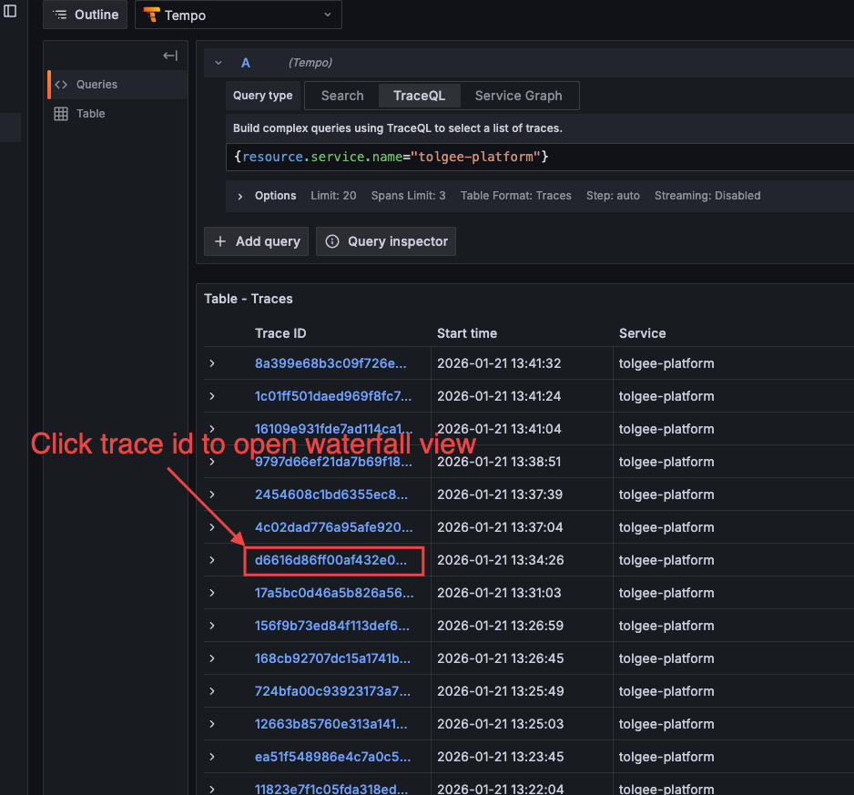

When you click a trace, Grafana opens a **split view** with your query results on the left and the trace waterfall on the right:

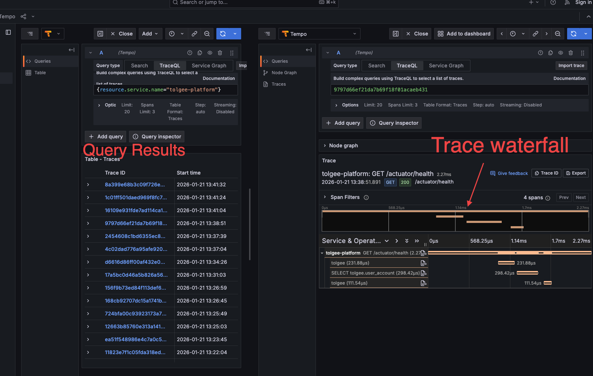

> **Tip:** To see the trace details more clearly, close the left pane by clicking the **Close** button:
>
> 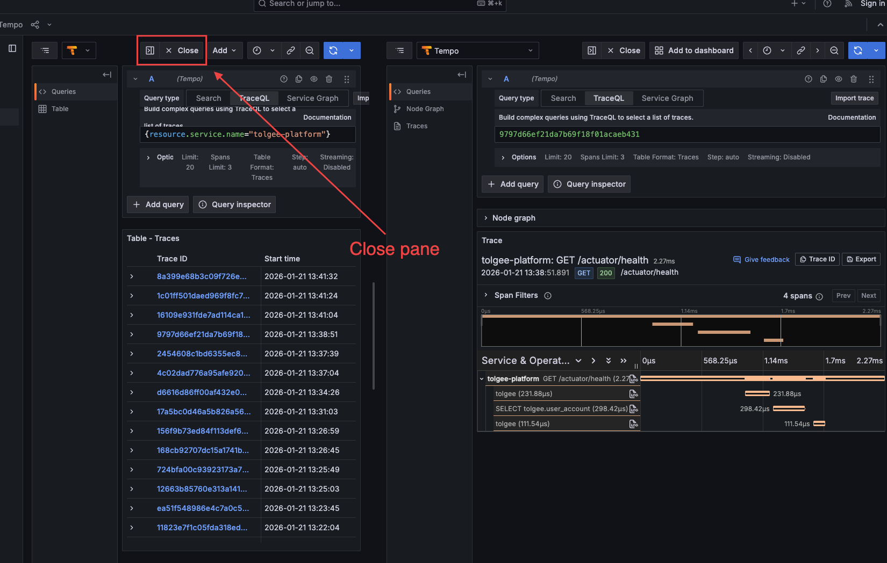

> **Note:** The query above returns *all* traces, which includes many internal operations like database queries and scheduled tasks. The following sections explain the different span types you'll encounter most often.

### Span types
Just to be clear – by "span type," we don't mean some sort of attribute or characteristic of the span itself (even though there *is* [such a thing](https://opentelemetry.io/docs/concepts/signals/traces/#span-kind) as a `type` attribute).
What we mean is the *place in the code* that caused the span to be created.

So what's the rule? What situations cause a span to be created? The answer is "there is no fixed rule" – pretty much wherever a library author
thought it prudent to add `Span.current().start()` and `Span.current().end()` calls. Now, you'll see that overall, pretty reasonable choices
were made, and the "regions" of code delimited by a span make intuitive sense. But there is no fixed rule.

As a small aside - you can (and should!) create your own, more granular, spans, but we won't go into that here.

#### HTTP Request Spans
Example name:
```text
GET /actuator/health
```
Format: `METHOD /path` or `METHOD /path/{parameter}`

**To find e.g. HTTP traces specifically**, use this query:
```traceql
{ span.http.request.method != nil }
```

This filters to traces that have an HTTP method attribute, showing only actual HTTP requests:

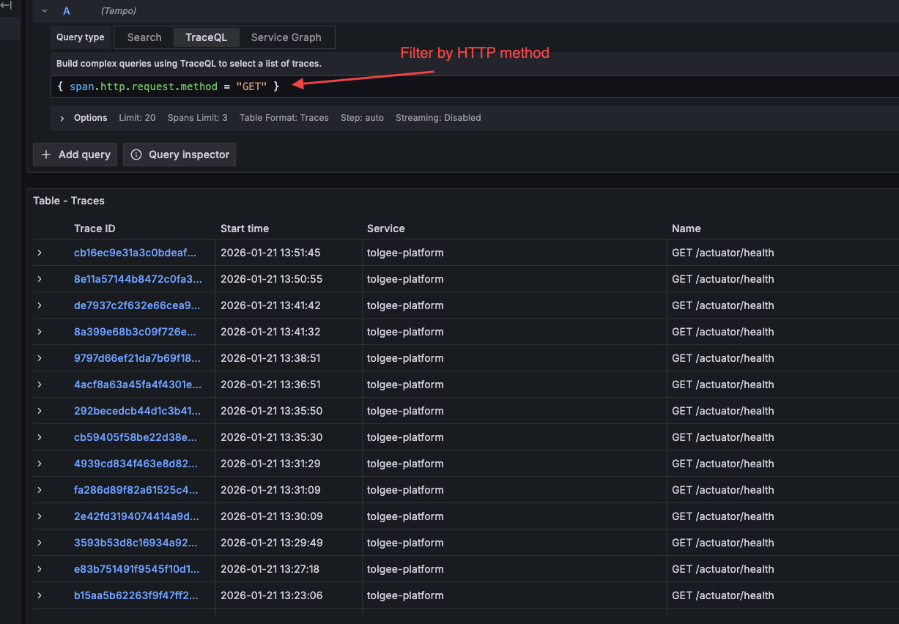

Click on an HTTP trace to see its waterfall view:

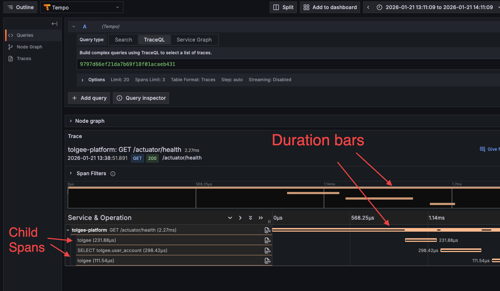

The HTTP route uses path templates (e.g., `{projectId}`) rather than actual IDs, so all requests to the same endpoint share one span name.

**Key attributes** (visible when you click on a specific span – can be the top-level one, or a child):
- `http.request.method` - GET, POST, PUT, DELETE
- `http.route` - the path template
- `http.response.status_code` - response status
- `url.path` - the actual request path


#### Database Spans
Example name:
```text
SELECT tolgee.project
```
Format: `OPERATION schema.table` or just `OPERATION`

Database spans show what SQL operation was performed.

Searching for them is a little more interesting. You can do e.g.
```traceql
{span.db.statement != nil}
```

However, as you'll see that this query actually seems to return traces that do not seem to be database-related!

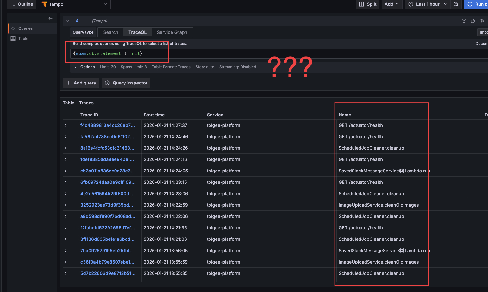

This is because of the distinction between *trace* (the entire tree) and *span* (a specific "node" of the tree).
In this view, you're searching *traces*, so that query is saying "show me all traces that have a database span".
If you actually want to search for database *spans*, you need to change the table format.

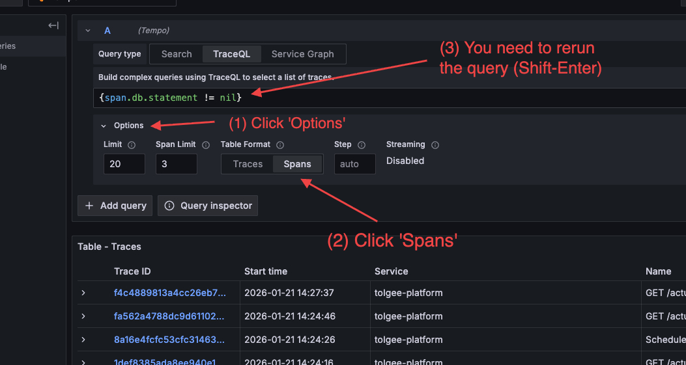
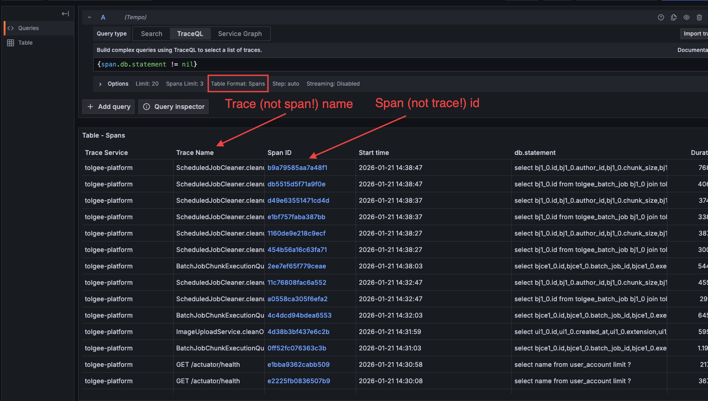


**Key attributes:**
- `db.system` - postgresql, mysql, etc.
- `db.operation` - SELECT, INSERT, UPDATE, DELETE
- `db.statement` - the actual SQL query (may be truncated)

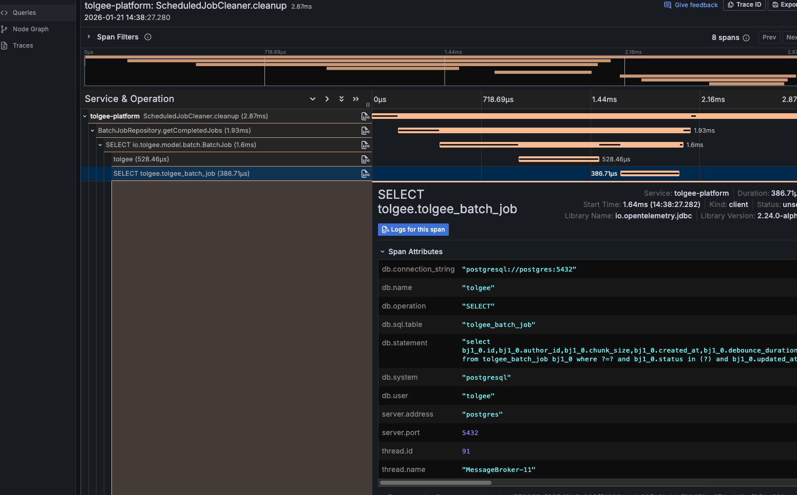

#### Internal Spans
This is pretty much "anything else."

Example name:
```text
ProjectService.getProject
```
Format: often `ClassName.methodName` (but not always)

Spans for instrumented application code show the class and method name.

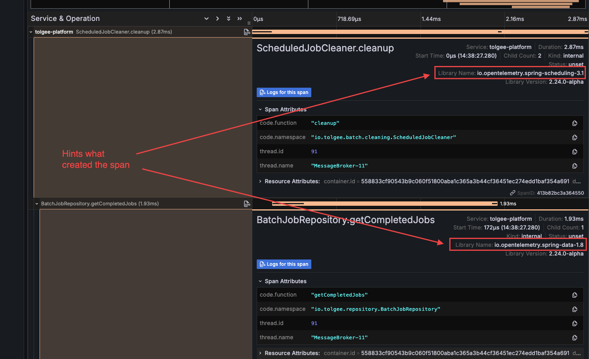

### Understanding the Waterfall

In the trace waterfall view:
- **Horizontal axis** = time (from request start to end)
- **Each bar** = one span, with width representing duration (wider = longer)
- **Indentation** shows parent-child relationships (child spans are indented under parents)
- **Color coding** may indicate status (red = error) or span type
- **Click a span row** to expand its attributes

**Gaps:** Time between spans where no instrumented operation is running. This is time spent in your application code that isn't captured by automatic instrumentation.

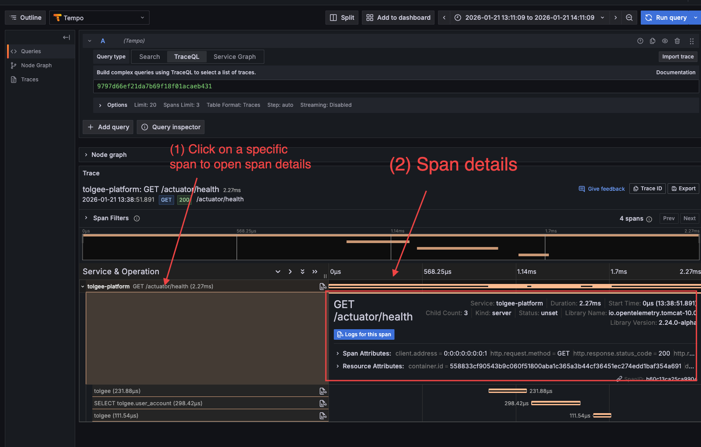

When you click a span, you'll see:
- **Span summary** - service name, duration, start time, child count, ...
- **Span Attributes** - what happened in this specific operation (HTTP method, status code, URL path, etc.), ...
- **Resource Attributes** - where this came from (container ID, service name, host, telemetry info), ...

You can filter by all of the above!

The waterfall immediately shows you where time was spent. The widest bars are your bottlenecks.

---

**Checkpoint:** You should now understand:
- A trace is a tree of spans representing one request
- Each span has a name, duration, parent, and attributes
- Different operation types have different naming patterns

**Next:** [Part 3: Navigating Grafana Tempo](3_Navigating_Grafana_Tempo.md)
