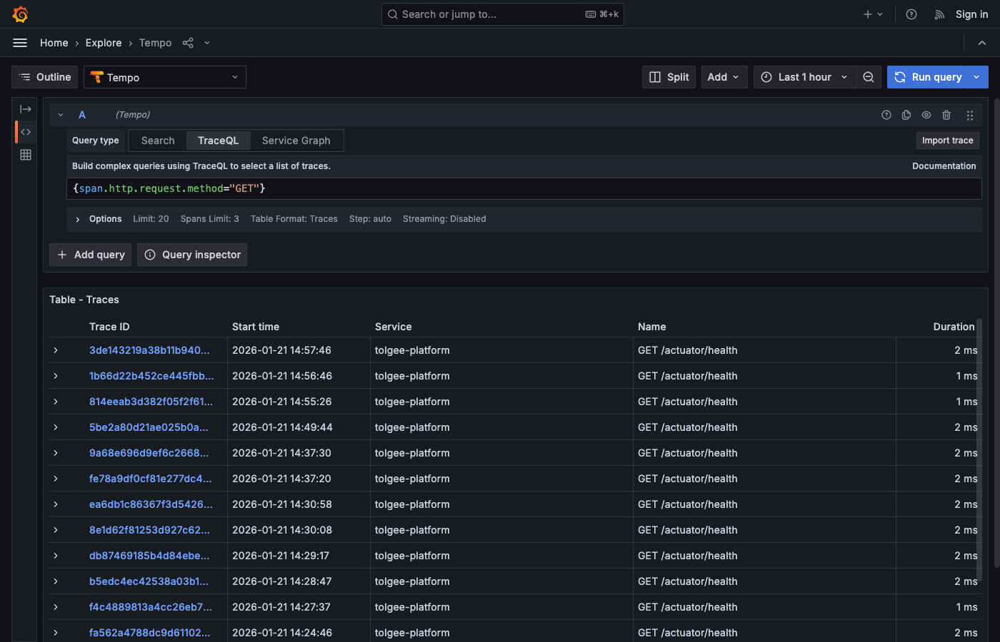
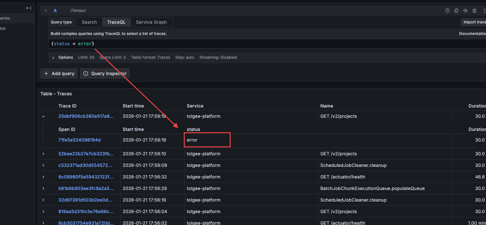
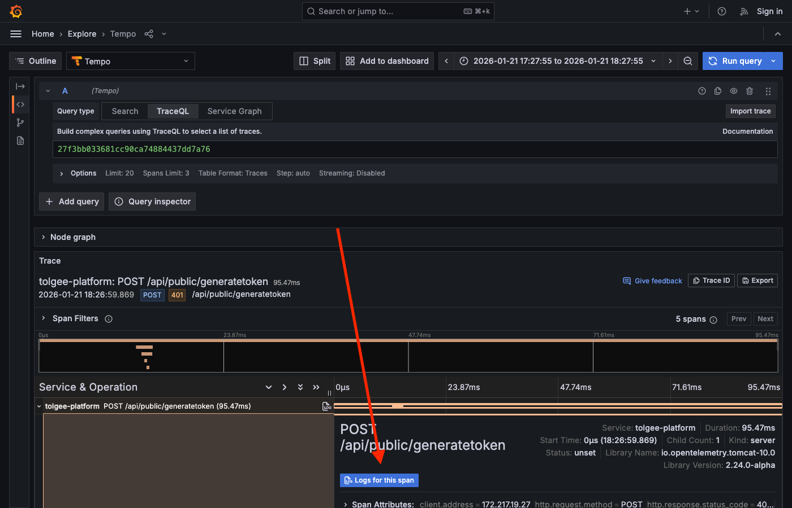
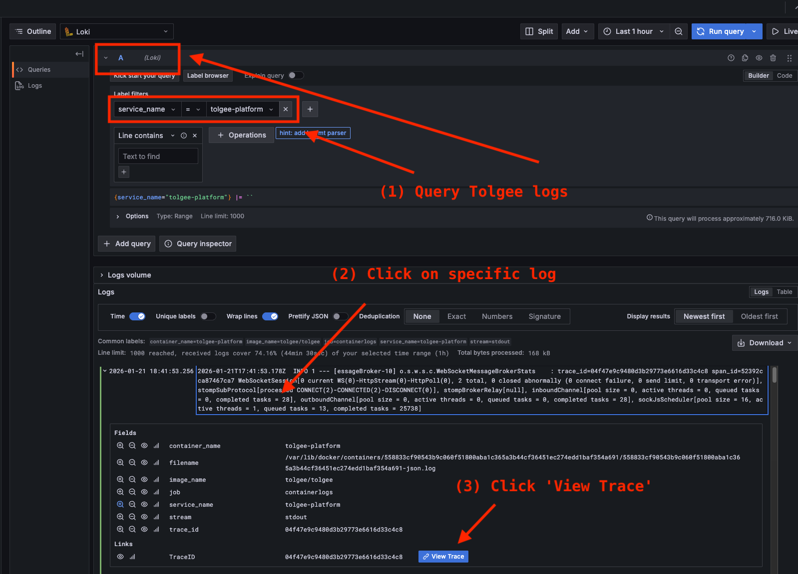

# Part 3: Navigating Grafana Tempo

**What you'll learn:** How to search for traces, read trace waterfalls, and navigate between traces and logs.

*Skip if: You already know TraceQL and can write queries like `{span.http.route=~"/v2/.*" && duration > 100ms}`.*

---

## 3.1 Accessing the Explore View

1. Open Grafana at http://localhost:3000
2. Click the hamburger menu (☰) → **Explore**
3. Select **Tempo** from the datasource dropdown (top left)

You'll see the TraceQL query interface with:
- Query input field at the top
- Time range selector (default: last 1 hour)
- Results area below

## 3.2 Basic TraceQL Queries

TraceQL filters traces by span attributes. The basic syntax is:
```traceql
{attribute="value"}
```

### By Service
All traces from Tolgee:
```traceql
{resource.service.name="tolgee-platform"}
```

### By HTTP Endpoint
Requests to a specific route:
```traceql
{span.http.route="/v2/projects/{projectId}"}
```

By HTTP method:
```traceql
{span.http.request.method="POST"}
```

Here's an example of searching for HTTP GET requests:



### By Duration
Slow requests (> 500ms):
```traceql
{duration > 500ms}
```

Fast requests (< 10ms):
```traceql
{duration < 10ms}
```

### By Status
Spans with errors (not just HTTP - [`status` is set on each span](https://opentelemetry.io/docs/concepts/signals/traces/#span-status)):
```traceql
{status=error}
```

Keep in mind, the above might not always reflect your expectations – for example, 400 errors are not considered errors by default,
as there wasn't an actual server error involved. To get a `status=error` span, you need to trigger an actual 500. 

One way you can do this is by temporarily killing the database. From the same folder you ran `docker-compose` in  [Part 1](1_Setting_Up_the_Tracing_Stack.md),

```bash
docker compose -f docker-compose.local-observability-stack.yaml stop postgres
```

There are background processes in Tolgee that run every few seconds or so, so you should start seeing error spans within about half a minute.



You can also search directly by HTTP status code, which will show 4xx spans as well:
```traceql
{span.http.response.status_code >= 200}
```

### Database Queries
All PostgreSQL operations:
```traceql
{span.db.system="postgresql"}
```

Slow queries (> 50ms):
```traceql
{span.db.system="postgresql" && duration > 50ms}
```

### Combining Conditions

**AND** - both conditions must match:
```traceql
{span.http.request.method="GET" && duration > 100ms}
```

**OR** - either condition matches:
```traceql
{span.http.response.status_code=404 || span.http.response.status_code=500}
```

### Regex Matching
Match patterns with `=~`:
```traceql
{span.http.route=~"/v2/projects.*"}
```

Negate with `!~`:
```traceql
{span.http.route!~"/v2/public.*"}
```

*Deeper dive: [TraceQL Documentation](https://grafana.com/docs/tempo/latest/traceql/) or search `traceql query language`*

## 3.3 Using the Trace Waterfall for Debugging

Click any trace in the results to open the waterfall view. For an explanation of how to read the waterfall, see [Part 2: Understanding the Waterfall](2_Understanding_Traces_and_Spans.md#understanding-the-waterfall).

### Finding Bottlenecks

The widest bar shows where the most time was spent. If one span takes 80% of the total time, that's your bottleneck.

### Key Attributes for Debugging

Click a span bar to expand its details panel. The attributes section contains the details you need for debugging:

- `http.request.method`, `http.response.status_code`, `http.route`, `url.path` for HTTP spans
- `db.statement` for database spans
- `exception.message`, `exception.stacktrace` for errors

## 3.4 Log-Trace Correlation

The tracing stack links logs and traces together using the trace ID.

### From Trace to Logs

When viewing a trace in Tempo:
1. Click on any span to expand it
2. Look for the **"Logs for this span"** button in the span details panel
3. Click it to open Loki filtered by the trace ID



Clicking this button opens Loki with a query that filters logs by the trace ID. You'll see all log messages that were emitted during this trace. (Note: Some operations like health checks may not produce logs.)

### From Logs to Trace

When viewing logs in Loki:
1. Switch to **Loki** datasource in Grafana Explore
2. Query for Tolgee logs, and click on one to expand it
3. Look for a **"View Trace"** button in the log details panel
4. Click it to open the trace in Tempo



### Why This Matters

- **Trace shows timing and flow** - which operations ran and how long they took
- **Logs show content** - actual values, debug output, error messages

Use traces to find *where* something happened, then jump to logs to see the details.

---

**Checkpoint:** You should now be able to:
- Write TraceQL queries to find specific traces
- Read the trace waterfall to identify bottlenecks
- Navigate between traces and logs

**Next:** [Part 4: Metrics from Traces](4_Metrics_From_Traces.md)
