# Part 4: Metrics from Traces

**Goal:** Learn how to derive time-series metrics from trace data for trend analysis, dashboards, and alerting.

Individual traces show you what happened in a single request. Metrics derived from traces let you see patterns across thousands of requests over time - detecting trends, identifying outliers, and feeding into alerting systems.

There are two approaches:
1. **TraceQL Metrics** - compute metrics at query time, flexible but slower
2. **Span Metrics** - pre-computed at ingest time, fast but requires upfront configuration

---

## 4.1 TraceQL Metrics

TraceQL metrics let you compute metrics directly from trace data using any attribute, without pre-configuration.

### Why Use TraceQL Metrics

- **No setup required** - query any attribute immediately
- **Flexible filtering** - use full TraceQL syntax
- **Ad-hoc exploration** - perfect for investigating a hypothesis

### Basic Syntax

Add a metrics function after your TraceQL selector with a pipe (`|`):

```traceql
{ selector } | metrics_function()
```

### Example Queries

**Error rate for a specific endpoint:**
```traceql
{ span.http.route = "/v2/projects" && status = error } | rate()
```

**Request count by status code:**
```traceql
{ span.http.route = "/v2/projects" } | count_over_time() by (span.http.response.status_code)
```

**P95 latency for database queries:**
```traceql
{ span.db.system = "postgresql" } | quantile_over_time(duration, 0.95)
```

**Compare latency across endpoints:**
```traceql
{ span.http.route =~ "/v2/.*" } | quantile_over_time(duration, 0.95) by (span.http.route)
```

### How to Query

1. In Grafana Explore, select **Tempo** as the datasource
2. Enter your metrics query with a `| function()` at the end
3. Click Run query

**Understanding the syntax:**

A TraceQL metrics query has two parts:
- **`{ selector }`** - the curly braces contain a filter that selects which spans to include (same syntax as Part 3)
- **`| function()`** - the pipe and function compute a metric from those spans

For example, `{ } | rate()` means:
- `{ }` - select *all* spans (empty selector = no filter)
- `| rate()` - count how many spans occur per second

**Example: All spans rate**

This query counts all spans per second across the entire system:


The result is a time-series chart. Each point shows the span rate at that moment. The y-axis is **spans per second** - a value of 50 means 50 spans were recorded per second at that point in time:

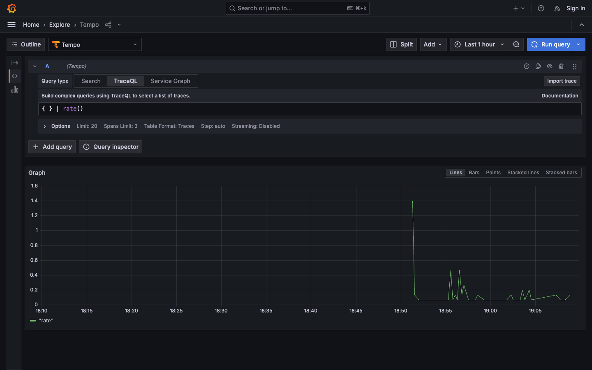

**Example: Error rate**

Adding a filter inside the braces narrows down which spans are counted. This query shows only error spans per second:

```traceql
{ status = error } | rate()
```

The y-axis is still spans per second, but now only counting spans where `status = error`:

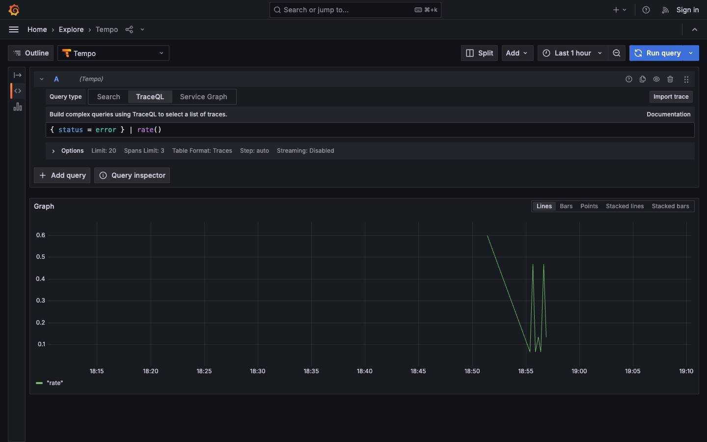

### Available Functions

| Function | Purpose | Example | Explanation |
|----------|---------|---------|-------------|
| `rate()` | Events per second | `{status=error} \| rate()` | Errors per second |
| `count_over_time()` | Total count in window | `{span.http.route="/api"} \| count_over_time()` | Total requests to /api in the time window |
| `quantile_over_time(field, q)` | Percentile of a field | `{...} \| quantile_over_time(duration, 0.95)` | The duration below which 95% of matching spans fall |
| `histogram_over_time(field)` | Distribution of values | `{...} \| histogram_over_time(duration)` | Duration distribution as histogram buckets |

Add `by (attribute)` to group results:
```traceql
{ status = error } | rate() by (span.http.route)
```

*Deeper dive: [TraceQL metrics documentation](https://grafana.com/docs/tempo/latest/traceql/metrics-queries/)*

---

## 4.2 Span Metrics & PromQL

Tempo's Metrics Generator automatically derives metrics from traces *at ingest time* and writes them to Prometheus. These pre-computed metrics are fast to query and ideal for dashboards and alerts.

### How It Works

1. Spans arrive at Tempo
2. Metrics Generator computes RED metrics (Rate, Errors, Duration)
3. Metrics are written to Prometheus
4. Query them using PromQL

### Querying Span Metrics

Navigate to **Explore** and select **Prometheus** as the datasource:

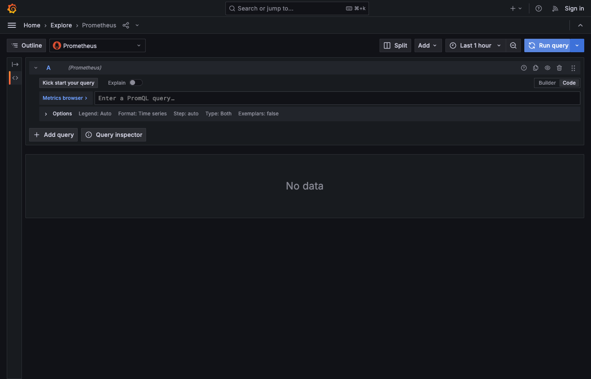

### P95 Latency by Endpoint

Enter this PromQL query:

```promql
histogram_quantile(0.95, sum(rate(traces_spanmetrics_latency_bucket[5m])) by (le, span_name))
```

Click **Run query** to see the time-series chart:

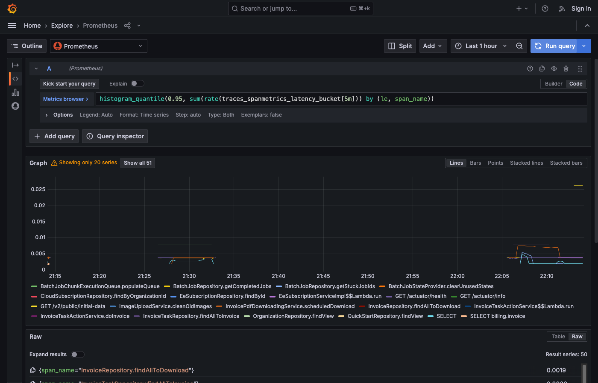

The chart shows P95 latency for each span (endpoint, database query, internal operation). HTTP endpoints appear as `GET /path` or `POST /path`.

### Request Rate by Endpoint

To see how many requests each endpoint handles:

```promql
sum(rate(traces_spanmetrics_calls_total[5m])) by (span_name)
```

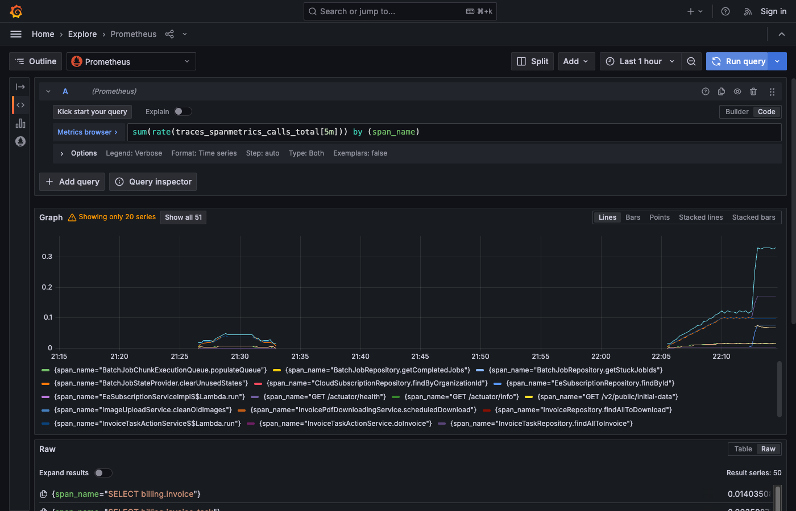

### Understanding PromQL

**External resources for deeper learning:**
- [Prometheus PromQL documentation](https://prometheus.io/docs/prometheus/latest/querying/basics/) - authoritative reference
- [Introduction to PromQL](https://grafana.com/blog/2020/02/04/introduction-to-promql-the-prometheus-query-language/) - beginner-friendly tutorial
- [Tempo Metrics Generator](https://grafana.com/docs/tempo/latest/metrics-generator/) - how Tempo derives metrics

#### Time Series in Prometheus

A **time series** is a unique combination of metric name + all label values. One metric creates many time series:

```text
// total number of GET /v2/projects calls with status OK
traces_spanmetrics_calls_total{span_name="GET /v2/projects", status_code="OK"}     -> time series #1

// total number of GET /v2/projects calls with status ERROR
traces_spanmetrics_calls_total{span_name="GET /v2/projects", status_code="ERROR"}  -> time series #2

// total number of POST /v2/keys calls with status OK
traces_spanmetrics_calls_total{span_name="POST /v2/keys", status_code="OK"}        -> time series #3
```

#### Data Types

| Type | Description | Example |
|------|-------------|---------|
| **Instant vector** | One value per matching time series, all at the same timestamp | `traces_spanmetrics_calls_total` |
| **Range vector** | Multiple values per matching time series over a time window | `traces_spanmetrics_calls_total[5m]` |
| **Scalar** | Single numeric value | `0.95` |

Most queries start with an instant vector (a metric name), transform it to a range vector with `[time]`, then process it back to an instant vector with functions like `rate()`.

#### Selectors and Label Matchers

Filter metrics by their labels using curly braces:

```promql
# Exact match
traces_spanmetrics_calls_total{span_name="GET /v2/projects"}

# Regex match (=~ operator)
traces_spanmetrics_calls_total{span_name=~"GET.*"}

# Not equal
traces_spanmetrics_calls_total{status_code!="STATUS_CODE_ERROR"}

# Negative regex match
traces_spanmetrics_calls_total{span_name!~"SELECT.*"}
```

#### Common Functions

| Function | Purpose | Example | What it returns |
|----------|---------|---------|-----------------|
| `rate(v[time])` | Per-second rate of change (use for counters) | `rate(traces_spanmetrics_calls_total[5m])` | Requests/sec for each time series |
| `sum(...) by (label)` | Aggregate across time series, grouped by label | `sum(rate(...)) by (span_name)` | Total requests/sec per endpoint |
| `avg()`, `min()`, `max()` | Other aggregations | `avg(rate(...))` | Average requests/sec across all time series |
| `histogram_quantile(q, v)` | Calculate percentiles from histogram | `histogram_quantile(0.95, ...)` | The latency at the 95th percentile |

#### Aggregation Operators

Control which labels to group by (and sum across all others):

- `by (label1, label2)` - group by these labels, sum across everything else
- `without (label1)` - group by all labels *except* these, sum across the excluded ones

```promql
# Sum across all labels except span_name -> one result per endpoint
sum(rate(traces_spanmetrics_calls_total[5m])) by (span_name)

# Sum across only status_code -> keeps span_name, instance, etc. separate
sum(rate(traces_spanmetrics_calls_total[5m])) without (status_code)
```

#### Understanding Counters and `rate()`

Metrics like `_calls_total` and `_size_total` are **counters** - they accumulate forever and never reset. After a day of running:

```text
traces_spanmetrics_calls_total{span_name="GET /v2/projects"} = 2,000,000  (total since startup)
```

This raw value isn't useful for understanding current behavior. `rate()` calculates the average per-second increase over a time window:

```promql
rate(traces_spanmetrics_calls_total[5m])   -> 300  (requests per second, averaged over last 5 minutes)
```

**The `[5m]` window** is the lookback period for calculating that per-second rate. Longer windows = smoother graphs; shorter windows = more responsive to sudden changes.

#### Understanding Histograms

Prometheus histograms track distributions by counting how many observations fell into each bucket. Imagine 5 requests with latencies 50ms, 80ms, 120ms, 200ms, 800ms:

```text
latency_bucket{le="0.1"}   = 2   <- 2 requests were <=100ms
latency_bucket{le="0.5"}   = 4   <- 4 requests were <=500ms
latency_bucket{le="1"}     = 5   <- 5 requests were <=1s
latency_bucket{le="+Inf"}  = 5   <- 5 requests total
```

The `le` label (less than or equal) encodes each bucket's upper bound. The actual latency values are lost - only the bucket counts remain.

**Calculating percentiles with `histogram_quantile()`:**

```promql
histogram_quantile(0.95, sum(rate(traces_spanmetrics_latency_bucket[5m])) by (le, span_name))
```

- First argument: quantile (0.95 = P95, 0.99 = P99, 0.5 = median)
- **Must include `le` in the `by` clause** - the function needs all buckets together to interpolate the percentile
- `by (le, span_name)` means: "keep bucket boundaries together, and group by endpoint"

**Calculating averages:**

Use `_sum` and `_count` instead of buckets:

```promql
rate(traces_spanmetrics_latency_sum[5m]) / rate(traces_spanmetrics_latency_count[5m])
```

This gives you average latency per request.

*For a visual deep-dive into histogram buckets, see [Prometheus Histograms in Grafana](https://opstrace.com/blog/grafana-histogram-howto).*

### Discovering Available Metrics

**Method 1: Grafana Metrics Browser**

In Grafana's Explore view with Prometheus selected, click the **Metrics browser** button:

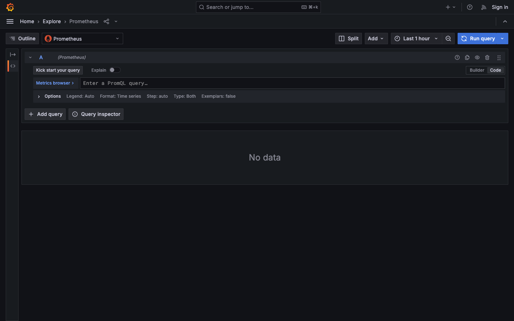

The metrics browser opens showing all available metrics:

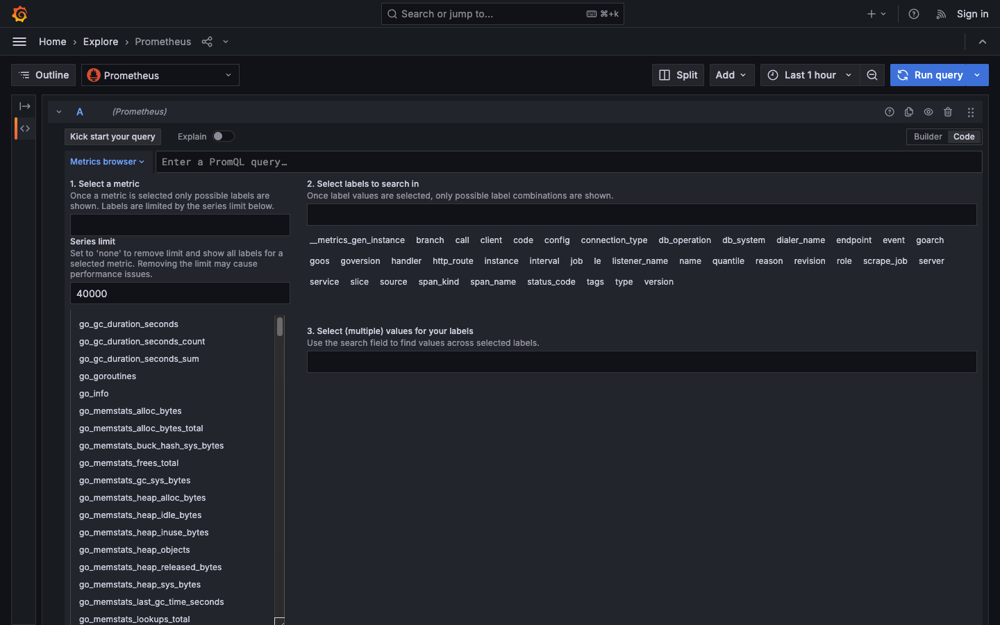

Type `traces_spanmetrics_` to filter to span-derived metrics:

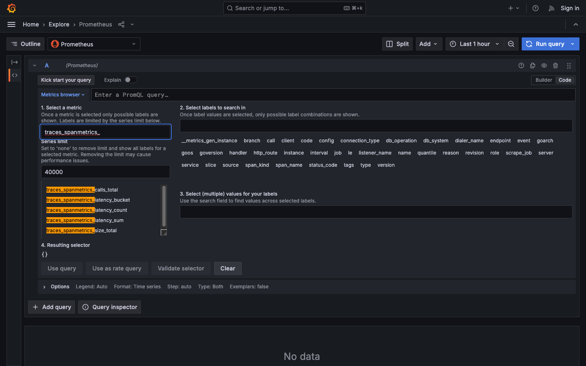

Click a metric to see its available labels:

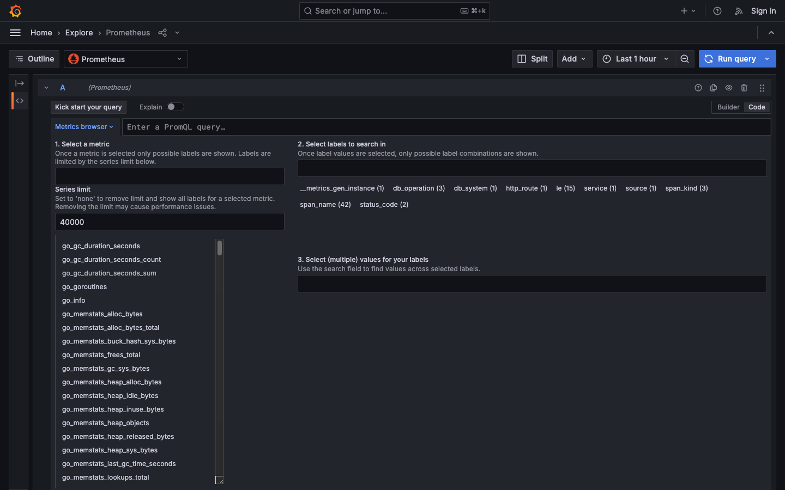

Click a label to see its available values:

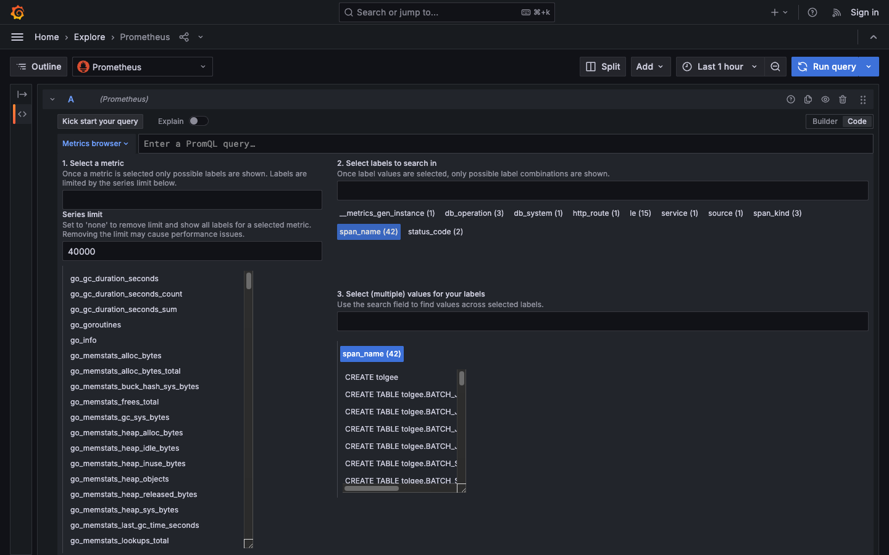

**Method 2: Prometheus UI**

Navigate to your Prometheus URL (<http://localhost:9090> if you're following this tutorial).

**Graph tab**: Start typing a metric name - autocomplete shows all matching metrics:

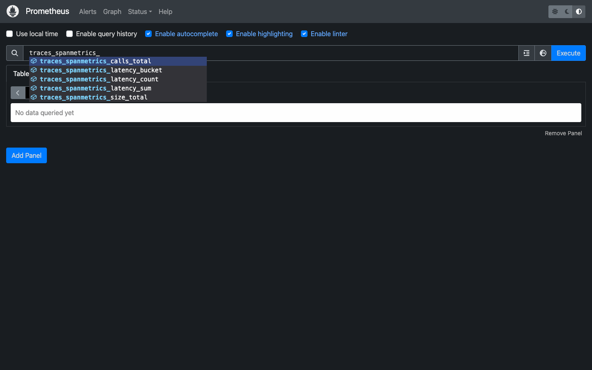

**Status -> Targets**: See what's being scraped and whether it's healthy:

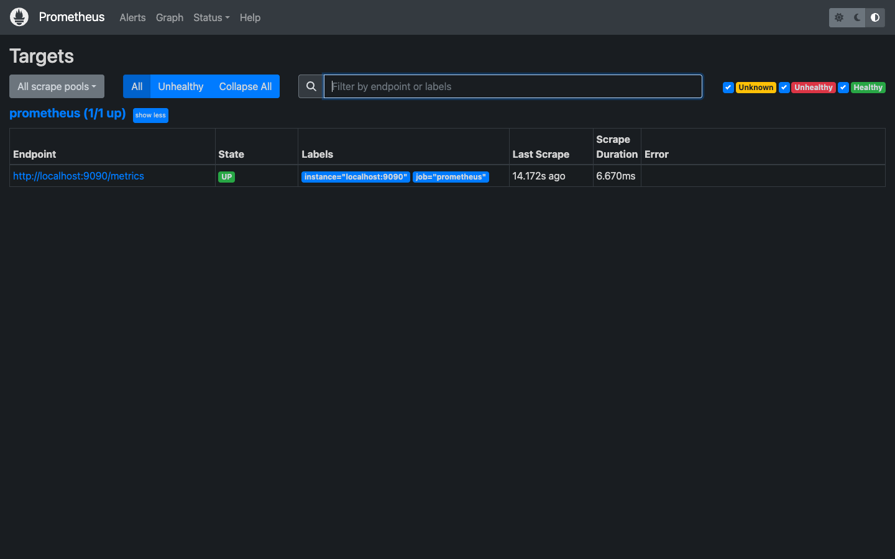

**Status -> TSDB Status**: See cardinality info (how many time series exist):

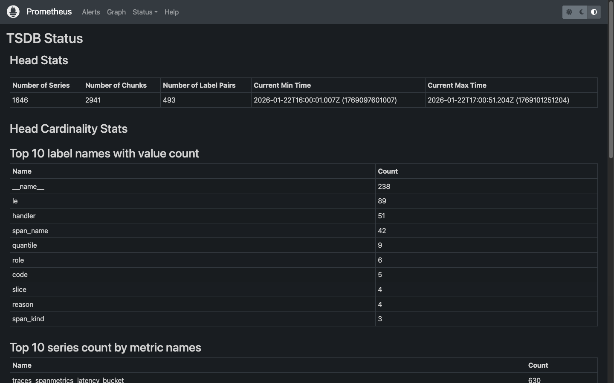

### Available Span Metrics

Tempo's Metrics Generator creates metrics with the `traces_spanmetrics_` prefix:

| Metric | Type | Purpose |
|--------|------|---------|
| `traces_spanmetrics_latency_bucket` | histogram | Duration distribution for percentile queries |
| `traces_spanmetrics_calls_total` | counter | Request count for rate calculations |
| `traces_spanmetrics_size_total` | counter | Payload size for throughput tracking |

Labels available: `span_name`, `status_code`, `span_kind`, and any dimensions configured in Tempo.

*Deeper dive: [Span metrics configuration](https://grafana.com/docs/tempo/latest/metrics-from-traces/span-metrics/)*

---

## 4.3 Creating Dashboards

For frequently-used queries, create a dashboard with dropdown selectors instead of editing queries manually.

### Duration Plot for a Specific Endpoint

To focus on a single endpoint, add a `span_name` filter:

```promql
histogram_quantile(0.95, sum(rate(traces_spanmetrics_latency_bucket{span_name="GET /v2/public/initial-data"}[5m])) by (le))
```

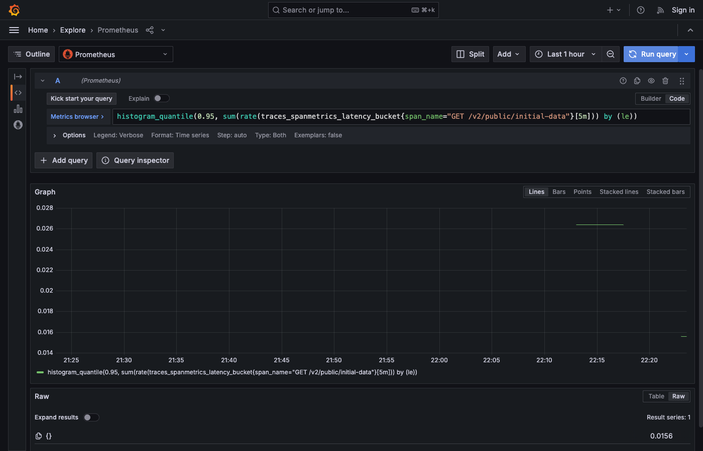

### Duration Plot for a Specific SQL Query

The same technique works for database queries:

```promql
histogram_quantile(0.95, sum(rate(traces_spanmetrics_latency_bucket{span_name="SELECT tolgee.user_account"}[5m])) by (le))
```


### Interactive Dashboard with Dropdown Selection

**Step 1: Create a new dashboard**

Navigate to Dashboards -> New -> New Dashboard:

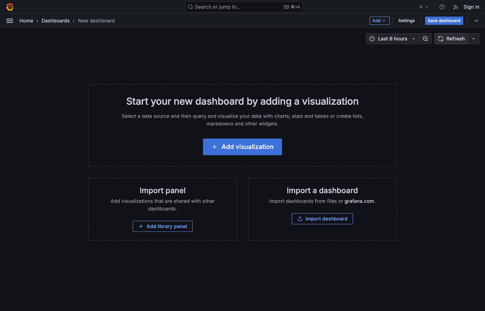

**Step 2: Add a template variable**

Click **Settings** -> **Variables** tab -> **Add variable**:

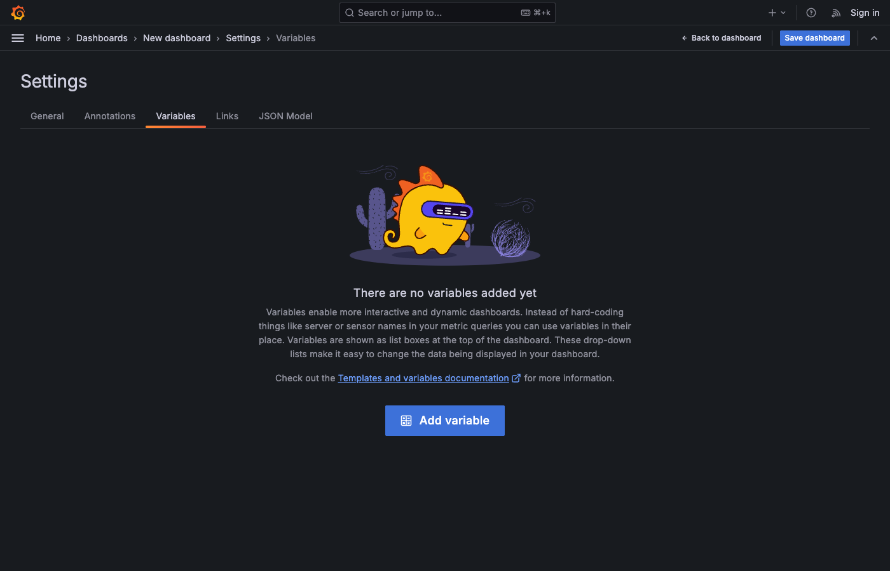

Configure the variable:
- **Name:** `endpoint`
- **Type:** Query
- **Data source:** Prometheus
- **Query type:** Label values
- **Label:** `span_name`

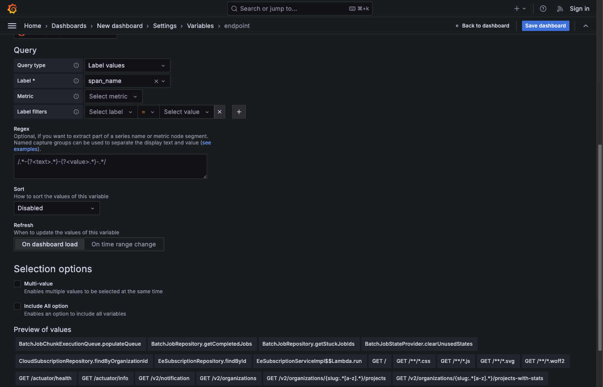

The preview shows all available span names (HTTP endpoints, SQL queries, internal operations).

**Step 3: Use the variable in a panel**

When viewing the dashboard, the dropdown appears at the top:

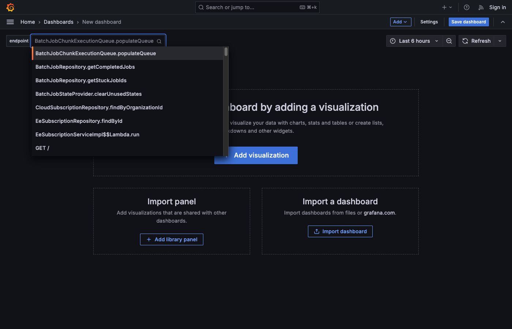

**Step 4: Create a panel using the variable**

Add a visualization and use `$endpoint` in your query:

```promql
histogram_quantile(0.95, sum(rate(traces_spanmetrics_latency_bucket{span_name="$endpoint"}[5m])) by (le))
```

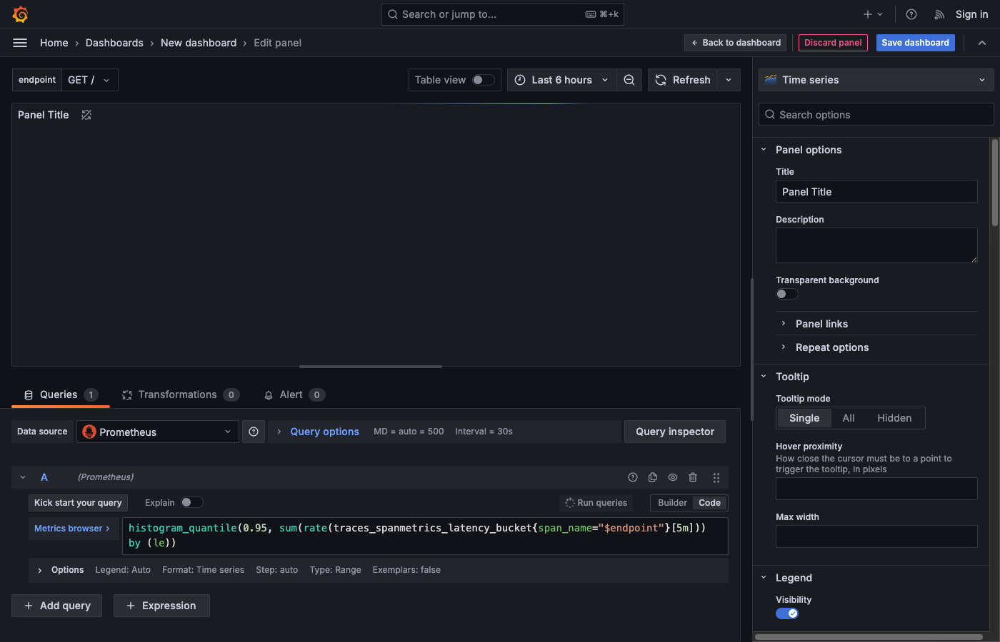

**Step 5: Use the dropdown**

Select different endpoints from the dropdown to instantly update the chart:

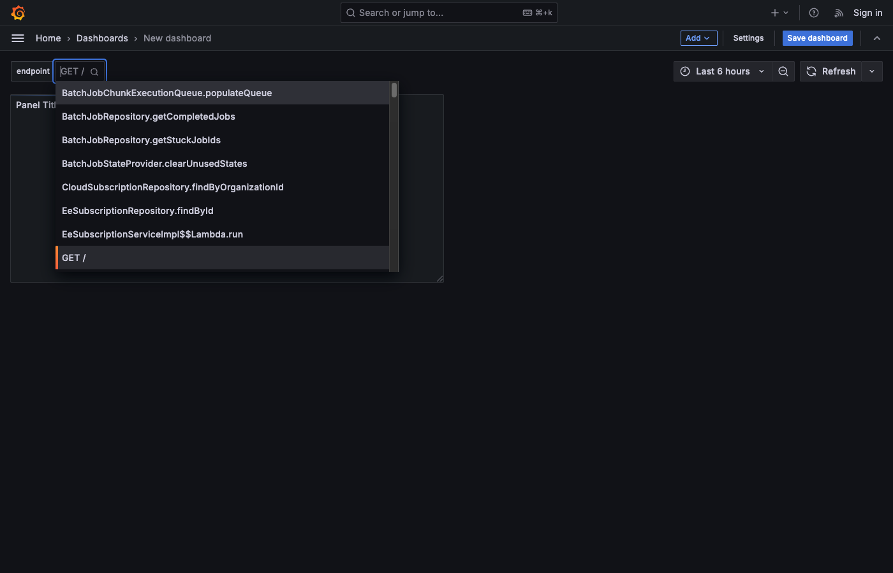

### More Useful Queries for Dashboards

**P99 latency for a specific endpoint:**
```promql
histogram_quantile(0.99, sum(rate(traces_spanmetrics_latency_bucket{span_name="GET /v2/public/initial-data"}[5m])) by (le))
```

**Error rate by endpoint:**
```promql
sum(rate(traces_spanmetrics_calls_total{status_code="STATUS_CODE_ERROR"}[5m])) by (span_name)
```

**Database query latency:**
```promql
histogram_quantile(0.95, sum(rate(traces_spanmetrics_latency_bucket{span_name=~"SELECT.*"}[5m])) by (le, span_name))
```

**Compare HTTP vs database latency:**
```promql
histogram_quantile(0.95, sum(rate(traces_spanmetrics_latency_bucket{span_name=~"GET.*|POST.*|PUT.*|DELETE.*"}[5m])) by (le, span_name))
```

---

## 4.4 TraceQL Metrics vs Span Metrics

Both approaches derive metrics from traces. Choose based on your use case.

| Aspect | TraceQL Metrics | Span Metrics (PromQL) |
|--------|-----------------|----------------------|
| **Computed** | At query time | At ingest time |
| **Stored in** | Tempo | Prometheus |
| **Dimensions** | Any attribute | Pre-configured |
| **Query latency** | Higher | Lower |
| **Historical data** | Requires flush_to_storage | Always available |
| **Resource usage** | Higher (computed on demand) | Lower (pre-aggregated) |

### When to Use Which

**Use TraceQL Metrics when:**
- Exploring a hypothesis ("Is endpoint X slow for users in region Y?")
- Querying attributes not in span metrics dimensions
- You need flexibility and don't mind slower queries
- One-off investigations

**Use Span Metrics (PromQL) when:**
- Building persistent dashboards
- Setting up alerts
- Tracking historical trends over weeks/months
- You need fast, repeatable queries

**Typical workflow:**
1. Use TraceQL metrics to explore and understand the problem
2. Once you know what to track, add it to span metrics dimensions
3. Build dashboards and alerts using PromQL

---

**Checkpoint:** You now know how to:
- Query metrics directly from traces using TraceQL
- Use pre-computed span metrics with PromQL
- Build interactive dashboards
- Choose the right approach for your use case

**Next:** [Part 5: Alerting](5_Alerting.md)
