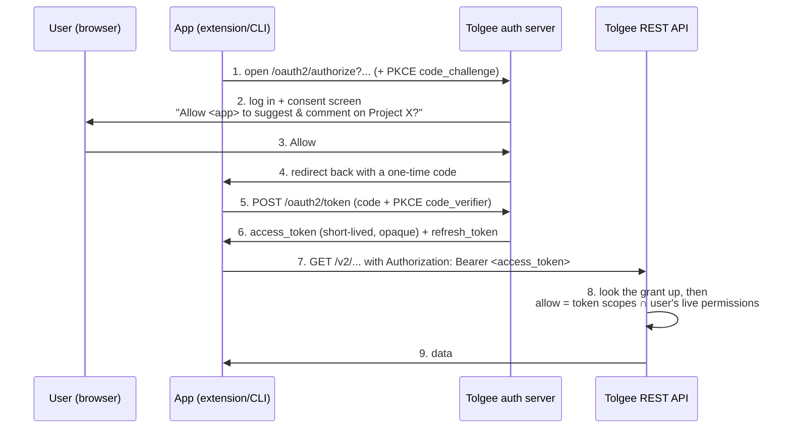

# OAuth 2.1 authorization server

Tolgee lets apps (browser extension, CLI, MCP clients) sign a user in **through the browser**
and receive a short-lived token, instead of the user pasting a long-lived API key. This is what
"Sign in with Google/GitHub" does — Tolgee is the thing you sign in *with*.

This page explains, in plain words, how it works and what the jargon means.

## 1. Overview

**The problem.** Before, every non-webapp client authenticated with a static secret (a Project API
Key or Personal Access Token) sent as `X-API-Key`. You generate it in the UI, copy it, paste it into
the client. That secret is long-lived and, for a public-project community translator, we can't safely
hand one out at all.

**The idea.** With OAuth, the app sends the user to Tolgee in the browser, the user logs in and
approves ("this app may suggest translations on Project X"), and the app gets back a **short-lived
access token**. The token is an opaque string the existing API already understands as an
`Authorization: Bearer <token>` header.

**Two halves:**
- **Authorization server** (new) — mints tokens: the `/oauth2/authorize` and `/oauth2/token`
  endpoints.
- **Resource servers** — there are now two, the REST API and the MCP endpoint (`/mcp/developer`),
  and each token is bound to exactly one of them (RFC 8707 audience binding): a token minted for MCP
  is rejected by the REST API and vice versa.

## 2. How To (the flow)

The headline case: a **community translator** authorizes the browser extension on a public project.



Key point about step 8: the token can only ever **narrow** what the user is already allowed to do.
Effective access = `token's scopes ∩ the user's live permissions on that project`, re-checked on every
request. Lose access to the project and the token instantly stops working there — nothing is "baked in".

### How the browser gets a consent screen

Tolgee's web login is stateless — a JWT in the browser's local storage, not a cookie — and step 1 above is a plain
browser navigation, which cannot send that JWT. So `/oauth2/authorize` authenticates nobody. It checks only what has
to be right before a redirect is safe (that the `client_id` is a registered client and the `redirect_uri` is one of
its registered URIs, and that the rest of the request is well formed) and then redirects the browser to the SPA's
`/oauth2/consent` route, carrying the authorize parameters as this endpoint normalized them — a parameter sent
without a value is forwarded as absent, per OAuth 2.1 §3.1. The redirect is relative
unless `front-end-url` is set — relative resolves against whatever origin the browser actually reached, which is what
a reverse proxy in front of a single origin needs; `front-end-url` makes it absolute for a split-origin deployment.

From there the consent screen is an ordinary logged-in page: if the user is not signed in, the webapp's own login
redirect handles it. The screen then drives the flow over the JWT-authenticated `/v2/oauth2` API —
`POST /v2/oauth2/authorize` to open the authorization, `GET /v2/oauth2/consent-info` to describe it, and
`POST /v2/oauth2/consent` to approve or deny — and the last of those answers with the URL to send the browser to,
which is the code redirect back to the client.

**There is no session and no cookie anywhere in this flow.** That is deliberate, and it is what keeps the API
stateless and CSRF-free by construction. It also removes three problems a bridging session would have brought:
a stale principal in the cookie jar outliving a webapp logout, session fixation, and a session store that has to be
shared across replicas.

**An API credential cannot mint an OAuth token.** The only thing that can authorize an app is a person signed into
the webapp; `OAuth2EndpointGuardsTest` is what enforces it, and says how.

**Approving costs a super token.** `POST /v2/oauth2/consent` carries `@RequiresSuperAuthentication`, the same gate a
project API key and a PAT are minted behind — an OAuth grant is one more long-lived credential, and a refresh token
outlives the session that approved it, so a lifted JWT alone must not be enough to leave one behind. Signing in with
a password already produces a super token and it lasts an hour (`tolgee.authentication.jwt-super-expiration`), so in
practice the user is asked at most once per hour, and the webapp raises the dialog and retries the request on its own.
Opening the screen and reading it are not gated; only the approval is.

## 3. Reference — the jargon

### PKCE ("pixy", Proof Key for Code Exchange)
The apps here are **public clients**: they have no secret they can keep hidden (anyone can unpack a
browser extension or CLI). PKCE replaces the missing secret with a one-time proof:
1. Before starting, the app makes a random string, the **`code_verifier`**.
2. It sends only its SHA-256 hash, the **`code_challenge`**, on `/oauth2/authorize` (step 1).
3. When exchanging the code for a token (step 5), it sends the original `code_verifier`.
4. The server hashes it and checks it matches the challenge.

So even if someone steals the one-time code in transit, it's useless without the `code_verifier` that
never left the app. PKCE is required for every Tolgee OAuth client.

### Opaque access tokens (why not a JWT)
The access token is an **opaque** random string. It carries no readable content: everything that describes
it — the user, the scopes this token carries (`issued_token_scopes`, which a narrowing refresh may set below the granted
ceiling), and the project set it is bound to — lives on the `oauth2_grant` row it belongs to, and
`OAuth2AccessTokenResolver` reads that row on every request. Like project API keys
and PATs, codes and tokens are stored **hashed**; the plaintext exists only in the response that delivered it.

The alternative, a self-contained signed JWT, is the more common choice for an authorization server, and
we deliberately did not take it:

- **Revocation actually works.** Deleting the grant kills its access tokens immediately. A signed JWT is
  valid until it expires, no matter what the server thinks, so revoking one needs a denylist that has to
  be consulted per request anyway — the lookup a JWT was supposed to avoid.
- **No key lifecycle.** No signing keypair to generate, persist, share between replicas or rotate, and no
  JWK set to publish. That is a whole class of operational failure removed rather than managed.
- **It matches the rest of Tolgee.** Project API keys and PATs are opaque strings looked up (and cached)
  the same way. OAuth tokens are not a special case.

What is given up is offline validation by a *third-party* resource server, which none of Tolgee's own
resource servers (the REST API and the MCP endpoint) needs. Each token is bound to exactly one of them
by an `audience` on the grant (RFC 8707): `OAuth2AccessTokenResolver` checks it against the resource the
request arrived at, so a token minted for one surface is `invalid_token` on the other. Grants predating this read as
`api` (the column defaults to it), so every one of them keeps working against the REST API; a grant that was being
used against `/mcp/developer` has to be re-authorized, which a spec-following client discovers for itself from the
`invalid_token` challenge.

One consequence worth knowing: refresh rotation replaces the grant's single access token, so refreshing
supersedes the previous access token immediately rather than leaving it usable until it expires.

### issuer
The base URL that identifies this authorization server; it's the `iss` parameter on every authorization response —
success and error alike, per RFC 9207, which discovery advertises as
`authorization_response_iss_parameter_supported` — and
the root of discovery (`{issuer}/.well-known/oauth-authorization-server`), and every endpoint URL is built
relative to it. It must therefore be the URL where the OAuth endpoints (`/oauth2/token`, `/oauth2/authorize`,
…) are actually reachable — i.e. the **backend / API URL** (`back-end-url`).

`OAuth2IssuerResolver` owns it. `issuerUrl` is `backEndUrl ?: frontEndUrl`, with a blank treated as unset and
any trailing slash stripped, and it is what every caller uses — the discovery documents and the `iss` on
authorization responses. It is never derived from the request, so a caller cannot choose the issuer this server
publishes about itself; it must be a bare origin. The issuer is also the server's on/off switch: the OAuth
endpoints (and CIMD) are live whenever the issuer resolves — a self-hosted instance therefore accepts unknown
MCP clients before any client is pre-registered, which is standard authorization-server behaviour. A value that
is *set but malformed* (a path, query or fragment) cannot serve as an issuer, because RFC 8414 §3 would put the
metadata document at a location Tolgee does not serve — so the OAuth server is off and a WARN names the property.
It deliberately does **not** fail startup: `front-end-url` carrying a path is valid for everything else that
property does, and an instance that never wanted OAuth must not stop booting over it. An unset issuer likewise just
leaves the server off. A pre-registered client, though, cannot function without a usable issuer, so configuring one
while the issuer is unset or malformed does fail startup — that is where the operator opted in. The
`frontEndUrl` fallback is **not** "use the web app as
the issuer": it only exists for deployments that serve the API and the web app from **one origin** (the backend
also serves the built SPA), where `back-end-url` is often left unset and `front-end-url` *is* that single
origin. Whenever the API has its own origin, `back-end-url` is the one you must set: nothing checks that the
configured value really names the API, so a `front-end-url` pointing at a separate web app will satisfy startup
and then publish an issuer the OAuth endpoints are not reachable at.

### Consent is never remembered

Every authorization shows the consent screen; nothing stores a past consent, so there is nothing to skip it
with.

The reason is the project picker. A token is bound to a project, that choice is made on the screen, and it
is per-authorization state with nowhere to be stored. Skipping the screen leaves the authorization with no
project selection at all, and the only remaining candidates would be the `project` request parameter (the
client's own choice) or "every project this user can reach" — neither of which anybody approved. So
remembering consent requires making the project selection durable first; until then, re-prompting is what
lets a reconnect mint a token at all.

Were that ever built, the token endpoint's guard — a code is only redeemable once a project set was bound, see
`OAuth2AuthorizationService.exchangeCode` — is what would catch a screen that got skipped without one.

The shape that follow-up would most likely take: let the `project` request parameter *bind* rather than hint —
`startAuthorization` binds `projectSelection` from it after the same accessibility check the consent path runs,
the screen shows it as a pre-made but editable choice, and consent is then remembered per
(user, client, scopes, project selection) with no new durable state. It changes what an existing wire parameter
means, which is why it is a deliberate decision rather than an additive one.

### scope vs. project set
- **scope** = a capability verb (`translations.suggest`, `translation-comments.add`) — *what* the token
  may do. The OAuth `scope` request parameter.
- **project set** = *where* it may do it: the `project_selection` column on the grant — specific project ids, or the
  `*` sentinel meaning "don't narrow by project" (still bounded by the user's live permissions).

### Registered clients: how an app becomes "known"
Before Tolgee will issue tokens to an app, it must know that app's `client_id` and its allowed
`redirect_uris` (so a stolen code can't be sent to an attacker's URL). Round 1 does this by
**pre-registration** (`OAuth2ClientRegistry.kt`): the client ships with a known `client_id`. The browser extension
is registered only where an operator configured its redirect URI, because that URI carries the published
extension's id, which this repo does not know and so cannot seed. The **CLI is registered on every instance whose
issuer resolves**, with a default `http://127.0.0.1/callback`: `tolgee login` has to work against an instance
nobody configured for it, and a loopback redirect is not an operator's to know. `tolgee.oauth2.cli-enabled: false`
is how an instance that will never see the CLI refuses it, and `cli-redirect-uris` accepts a different redirect
instead of the default, for a CLI build that listens elsewhere. Every client is public, must use PKCE (S256 only),
and always goes through the consent screen.

Redirect URIs are matched exactly, except that a loopback URI is accepted on any port — a CLI takes whatever port
the OS gives it at request time. RFC 8252 §7.3 requires that for the IP literals (`127.0.0.1`,
`[::1]`); §8.3 steers clients towards those rather than `localhost`, which depends on the host's name resolution,
but Tolgee matches a `localhost` registration the same way because refusing it would accept a configuration at
startup and then reject the callback it produces. Simple and safe, but it only works for apps *we* control.

A third-party client we have never seen — an MCP client such as Claude Code, VS Code or Cursor — registers
itself with **CIMD (Client ID Metadata Document)**: its `client_id` *is* an HTTPS URL serving a small JSON
document describing it. `OAuth2ClientRegistry.find` falls through to this path for a URL-form `client_id`
(a pre-registered id always wins first), fetches the document, validates it, and caches the resolved client
per pod. Such a client is **unverified**: the consent screen shows its self-asserted name, the `client_id`
origin, and a warning, so the user can tell it from a client Tolgee vouches for.

The outbound fetch is the most security-sensitive surface in the feature — it reaches a URL an untrusted
client chose — so it is https-only, follows no redirects, is size- and deadline-capped, and is **DNS-pinned**:
`UrlSecurity.validateUrlAndResolve` resolves and vets the host once and the connection is pinned to exactly
those addresses, closing the DNS-rebinding hole a re-resolving client would otherwise open. It never throws,
so a hostile document cannot 500 `/oauth2/authorize`. Validation is fail-closed: the document's `client_id`
must equal the fetched URL, the auth method must be `none`, and every `redirect_uri` must be same-origin
HTTPS or loopback. Everything the document can make Tolgee retain is bounded: the `client_name` (also stripped of
formatting control characters, so it cannot displace the unverified warning it is rendered next to), the number of
`redirect_uris` and the length of each URI. Concurrent resolutions are capped process-wide — the cap covers the DNS
lookup as well as the request, since `InetAddress.getAllByName` takes no timeout and cannot be cancelled. The cap has
two dimensions, and they bound different things: the per-origin one isolates a slow *legitimate* publisher, so one
third party having a bad day cannot starve every other client. It is not a bound on a hostile one — a party that
controls a DNS zone (which every CIMD publisher does, by definition) gets unlimited host names from a wildcard
record. What bounds them is the global cap together with the per-IP rate limit on `/oauth2/authorize`. The per-origin
bucket is keyed on the port as well as the host, so naming a *filtered* port on a real publisher's host — which would
otherwise let a third party park connect timeouts in that publisher's own bucket and deny every cold authorization of
it — lands in a bucket of its own; on the publisher's real port an attacker gets the publisher's real latency, which
is what the cap is there to bound. Unlike the webhook and SSO paths, this fetch does **not** honour the JVM's proxy
system properties: a proxy would resolve the host itself and the pin would never run, and here the URL is chosen by
an unauthenticated caller.

A failed resolution is remembered, but not as one thing: a document that was served and refused is a verdict about
the client and is cached for a minute, while "no answer right now" — a blip or a slow host — is cached for seconds,
so a third party's hiccup does not cost a legitimate client a full minute of refusals. A refusal by Tolgee's own
fetch budget is not cached at all: it says nothing about the client, and remembering it would let one burst suppress
a legitimate client for the whole negative TTL.

The grant records a hash of the terms the user consented to — the `client_id` and the redirect set — not of the
document bytes, so a publisher reformatting their JSON or fixing a typo in `client_name` changes nothing, while a
changed redirect set invalidates the grants issued against the old one at the next exchange or refresh. It covers
only what the authorize path acts on, because every false positive is a mass re-consent logged as a security event:
a loopback redirect's port is left out (RFC 8252 §7.3 means any port is accepted, so documenting a different one
changed nothing), and so is every `grant_types` entry other than `authorization_code`, which is the only one read.
Where a respelling *is* load-bearing the hash keeps it: host case and an explicit `:443` on a non-loopback entry,
because there matching is an exact string comparison; and the port of a loopback entry that carries a query,
because that entry is the one presented URI the loopback lane — which ignores both the port and the entry's own
query — does not already accept. What does *not* revoke is taking the document down: a 404 is a refusal like any
other, so the client falls back to the bare unverified form that carries no hash, and `metadataDrifted` cannot
prove a change it cannot see. A publisher whose app is compromised has to change the consented terms — narrow or
replace `redirect_uris` — rather than delete the document. The stored value carries the projection's version
(`v1:`), and a version the running build cannot reproduce reads as "cannot tell" rather than as drift — otherwise
the release that first changes what the hash covers would delete every grant every earlier release issued, at its
next refresh, logging each one as theft.

`tolgee.oauth2.cimd-allowed-hosts` restricts which hosts may present a document (empty = any public host).

There is deliberately no switch that turns CIMD off, and the reason is what CIMD is *for*: it is the general
third-party onboarding path, not an MCP feature. The CLI and anything else built against Tolgee are the same
population, so a CIMD-scoped flag would turn off more than its name implies. The authorization server has no off
switch of its own either — its endpoints are live wherever the issuer resolves — so a CIMD flag would be the only
partial one.

That is an accepted risk, not an absence of one. Before CIMD the set of parties that could obtain a grant was
exactly the set an operator had pre-registered, and an operator who registered none had a complete off state
reached by configuration. CIMD removes that state: an unauthenticated caller can now cause an outbound HTTPS
request to a host it chose and be admitted as a client. `cimd-allowed-hosts` narrows which hosts may do so but
**cannot deny all** — an empty list means any public host — so an operator who needs CIMD off has no property
today.

**`logo_uri` is not read at all.** The CIMD draft defines it and this server ignores it: it is not parsed, not
stored, and not in the consent API, so a document may carry any value without being refused over it. The consent
screen shows no image for anybody.

Rendering it would mean the *user's browser* fetching an image from the server of the party asking for access,
while the user is still deciding. Validating the URL does not fix that — the check that mattered was that it be
same-origin with the `client_id`, and the client's own origin is exactly where the request should not go. That
request carries the user's IP, their user agent and any cookie that origin has set, so an app whose user is
already signed in learns *which* of its users is on the consent screen; paths are free, so a `client_id` per
victim makes it a per-victim tracking pixel. It fires on render, which means it fires on a denial too.

Two ways to bring a logo back, if it is ever wanted:

1. **Serve it from Tolgee's origin.** Fetch the image server-side when the document is read — the same hardened
   path the document itself uses: DNS-pinned, address-blocked, budgeted, deadlined — cap its size, refuse
   anything but raster types (an SVG served from our origin is script on our origin), cache the bytes with the
   client's entry, and serve them from a Tolgee URL. The publisher then learns nothing it does not already learn
   when we read its document.
2. **Verification first, then (1).** This is what Google, GitHub and Slack do: the logo is uploaded to the
   provider, hosted by the provider, and shown because the app went through review. Showing a stranger's artwork
   next to an "unverified app" warning helps a phishing client more than an honest one — it can wear Tolgee's own
   mark, or a customer's — so the useful order is an operator-vouched-for notion of a verified publisher
   (`cimd-allowed-hosts` is half of one already), and images only for those.

**DCR — Dynamic Client Registration (RFC 7591)** — the other onboarding mechanism, where a client POSTs its
metadata to a public `/register` endpoint the server stores — remains a deliberate no-go: CIMD covers the
targeted clients without an open, unauthenticated write endpoint to rate-limit and prune.

## Where it lives in the code

The authorization server is Tolgee's own code, not a library: the authorization-code grant with PKCE for public
clients is small enough (one service, three controllers, one entity) that owning it costs less than bending a
general-purpose server to a stateless app with opaque tokens and a per-authorization project picker.
The `*ConformanceTest` classes over `AbstractOAuth2ConformanceTest` — one per endpoint: authorize, consent, token
exchange, refresh, revocation, discovery — pin the protocol contract at the HTTP level, and must keep passing
unchanged if the implementation is ever replaced. `OAuth2AuthorizationCodeFlowTest` and `OAuth2AccessTokenFlowTest`
over `AbstractOAuth2FlowTest` cover what is Tolgee-specific on top of it.

| Concern | Files |
|---|---|
| `/oauth2/authorize`, `/oauth2/token`, `/oauth2/revoke`, RFC 8414 discovery | `backend/api/.../controllers/oauth2/OAuth2AuthorizationServerController.kt` |
| Protocol decisions: request validation, code issuance and exchange, PKCE check, refresh rotation, revocation | `backend/data/.../security/oauth2/OAuth2AuthorizationService.kt` |
| The grant itself (user, client, scopes, project set, hashed code/tokens, expiries) | `backend/data/.../model/oauth2/OAuth2Grant.kt`, `db/changelog/schema.xml` |
| API accepts the token + narrows scopes | `AuthenticationFilter.kt`, `OAuth2AccessTokenResolver.kt`, `SecurityService.getCurrentPermittedScopes` |
| Websocket accepts the token + narrows the subscribed topic | `WebsocketAuthenticationResolver.kt`, `WebsocketSubscribeAuthorizer.kt` |
| Consent-screen API: open the authorization, describe it, approve/deny + project selection | `backend/api/.../controllers/oauth2/OAuth2FlowController.kt` |
| Client registry (pre-registered from config, plus the CIMD fallthrough) | `OAuth2ClientRegistry.kt` |
| CIMD: SSRF-hardened DNS-pinned fetch, fail-closed validation, per-pod cache, fetch budget, candidate policy | `security/oauth2/cimd/CimdDocumentFetcher.kt`, `CimdMetadataFetcher.kt`, `CimdClientCache.kt`, `CimdFetchBudget.kt`, `CimdClientPolicy.kt`, `util/UrlSecurity.kt` |
| RFC 8707 audience binding: which resource server a token is for, enforced on every request | `security/oauth2/OAuth2Resources.kt`, `OAuth2Audience.kt`, `OAuth2AccessTokenResolver.kt`, `AuthenticationFilter.kt` |
| MCP cold-start: a credential-less `tools/call` gets a 401 challenge a client can act on | `mcp/McpAuthChallengeFilter.kt` |
| Refresh-token replay: soft grace window + multi-generation theft history | `OAuth2AuthorizationService.kt`, `model/oauth2/OAuth2SupersededRefreshToken.kt` |
| Issuer (also the on/off switch: the server is enabled when the issuer resolves) | `OAuth2IssuerResolver.kt` |
| RFC 9728 protected-resource metadata + the RFC 6750 `WWW-Authenticate` challenge that points at it | `ProtectedResourceMetadataController.kt`, `OAuth2BearerChallengeProvider.kt` |
| Nightly cleanup of spent/abandoned grants | `OAuth2GrantCleanup.kt` |

## Websockets

An OAuth access token authenticates a STOMP connection the way a project API key does. The token is presented as
`Authorization: Bearer tgoat_…` **on the STOMP CONNECT frame** — a credential on the HTTP handshake is deliberately
ignored, so presenting it only there yields an unauthenticated socket. (A project API key arrives on the same
frame, under `X-API-Key`.)

The rest of the model — which credential is read from where, what a refused subscription does, the client `SEND`
denial, the `/ws/qa-preview` endpoint — is transport-level and applies to JWT, PAT and project API keys equally:
see [docs/websocket/README.md](../websocket/README.md). The OAuth-specific consequences are in the parity notes
below.

## Round-1 limitations (tracked follow-ups)

### PAK-parity notes

An OAuth grant is deliberately treated as a project API key that may hold several projects, and is not
special-cased against one. Some consequences of that parity are worth stating outright, because they read
differently for a token handed to a third party than for a key the user minted for their own tooling. All of them
apply to project API keys today in exactly the same way, so each fix belongs to both credentials at once and to its
own PR:

- **`@IsGlobalRoute` skips every project narrowing.** `AbstractAuthorizationInterceptor.preHandle` returns before
  `preHandleInternal` for a global route, so `coversProject` and the scope intersection are not consulted there. No
  `@AllowApiAccess @IsGlobalRoute` handler reads project-shaped data today; the structural fix is to refuse a
  `ScopedCredential` on a global route unless the handler opts in.
- **A project a scoped credential does not cover is answered 403, not a project-not-found 404.** That distinguishes
  "exists" from "does not exist" for any project id the holder cares to probe. It is what a PAK has always
  answered; this round gives an OAuth token the same answer rather than the 404 it used to get. If that oracle is
  unwanted, it should be closed for both credentials at once.
- **A live subscription is never re-authorized.** The credential is resolved once at CONNECT, and the
  authorization decision is made once per SUBSCRIBE; nothing revisits either for the life of the subscription.
  There is no session registry and no teardown hook, so until the client itself disconnects, none of the
  following stops the stream:
  - revoking the grant through `/oauth2/revoke` — the thing revocation exists to do;
  - the access token reaching `accessTokenExpiresAt`;
  - de-authorizing the client in `OAuth2ClientRegistry`;
  - removing the user from the project, or dropping their permission below `keys.view` — this last one is not an
    OAuth matter at all and applies to JWT, PAT and PAK sockets equally.

  A project API key behaves identically, but a PAK is long-lived by design and revoked by deletion, whereas short
  expiry and revocation are the OAuth model — so the exposure inherited here is materially larger than the one it
  copies. Re-resolving the token per SUBSCRIBE would *not* fix it: a live subscription sends no further SUBSCRIBE.
  Closing it needs either a periodic sweep over open subscriptions or an event that closes the affected sessions
  on revocation and on permission change.
- **With `tolgee.authentication.enabled: false` the websocket accepts a credential HTTP rejects.**
  `AuthenticationFilter` reaches its disabled-authentication branch only when no credential was presented at all;
  one that fails to validate is still a 401. On the socket a credential that fails to resolve falls back to that
  identity, so an expired PAK, a revoked grant or a malformed token yields a session as the initial user with
  `isSuperToken = true` and no scope narrowing at all. A credential that *does* resolve keeps its own identity and
  narrowing — the fallback runs only after resolution returns nothing. It escalates nothing — in that mode the
  same caller gets the same session by sending no credential at all, over HTTP too — and it is deliberate: a
  socket cannot report a refusal except by closing, so a stale token would otherwise kill it silently.
- **An OAuth socket inherits the transport's own gaps.** No SSO liveness check, no IP auth rate limit on CONNECT
  or SUBSCRIBE, and a scoped-credential session filed in `SimpUserRegistry` under the account's own username. None
  of those are OAuth-specific; they are listed in
  [docs/websocket/README.md](../websocket/README.md#gaps-this-transport-shares-with-the-http-path), and an OAuth
  token now inherits them.


These are known gaps, deferred to the client rounds that first exercise them:

- **A client's `requiredScopes` are a consent-screen affordance, not a server-side rule.** The screen locks them
  on, but `approveConsent` only checks that what was approved was requested, so a direct `POST /v2/oauth2/consent`
  can grant less than the client declared it needs. That is deliberate — RFC 6749 §3.3 lets a server issue
  narrower than requested, and it is the user's own account — and the cost is that the client discovers the
  missing scope at its first API call rather than at consent.

- **An all-projects token cannot enumerate the projects it reaches.** `*` means "every project this user can
  currently see", a set that changes with their membership, so a client cannot cache it — and nothing lets it ask:
  neither project-listing route admits an OAuth token: `getAll` is `ONLY_PAT` and `getAllWithStatistics` carries no
  `@AllowApiAccess` at all, and MCP's `listProjectsSpec` is refused for the same reason. Note what does *not* do
  that work: `@IsGlobalRoute` short-circuits `AbstractAuthorizationInterceptor.preHandle` before either
  authorization interceptor runs, and `AuthenticationInterceptor.isOAuthAllowed` inspects only
  `@AllowApiAccess.tokenType`, so a global route is not gated for OAuth tokens — it is simply never asked. Not a
  boundary problem — every request is still narrowed by `coversProject()` and the user's live permissions, so the
  failure is "cannot discover", never "reaches further than intended". The browser extension is handed its project
  by the page it edits; MCP is the round that needs discovery, and the follow-up is one non-global OAuth-reachable
  route returning the token's projects. `AuthenticationFacade.implicitProjectId` answers it through the shared
  `ScopedCredential.singleProjectId`, so `*` currently reads as "no project" — the opposite of what it means — and
  wants fixing in the same change.

- **The grant stores a project *set*, but consent can only bind one project or all of them.** A grant is a project
  API key that may hold several projects, and `project_selection`, `boundProjectIds()` and
  `ScopedCredential.coversProject` are all written for that. The consent API and screen are not: `OAuth2ConsentRequest`
  carries a single `projectId` and the picker is a two-option radio. So the reachable states today are exactly one
  project and all projects.

  That split is the V1 decision, not an oversight: one-project-or-all is what the product wants for the first
  release, while the backend is deliberately ready for a multi-project picker whenever that is decided, because the
  storage and the permission checks are the parts that are expensive to change afterwards and the picker is not. The
  consequence to know is that the width is untested from the user's side until the screen catches up.

  The stored ids are also not FK-backed, so a deleted project leaves a stale id in the column (harmless: it narrows)
  and nothing can answer "which grants reach project X", which the user-facing revoke surface will want. Both wait
  for that surface: an `oauth2_grant_project` join table is the shape.

- **The authorization request lives in the URL, not on the server.** `GET /oauth2/authorize` validates the client,
  the redirect URI, PKCE, scope and `state`, and then writes nothing: it re-emits the same parameters onto
  `/oauth2/consent?...`, the SPA reads them back out of `window.location.search`, and `POST /v2/oauth2/authorize`
  validates them again before creating the grant. Two consequences worth knowing. The parameter list is stated in
  four places — `AUTHORIZE_PARAMS`, `consentPageUrl`, `OAuth2AuthorizeRequest` and `authorizeRequestFromSearch` — so
  a new parameter is a four-place edit whose omissions fail silently. And nothing binds what the client sent to what
  the grant records: anything holding the user's webapp JWT can post a different `scope` or `project` than the
  client asked for, so `requestedScopes` is the consent page's claim about the request rather than the client's. It
  is not an escalation — the grant is still bounded by the user's own live permissions — but it does mean the issued
  scope can exceed the authorize request's, which RFC 6749 §3.3 assumes it cannot. The fix is to split the
  ephemeral authorization *request* (no user, its own TTL, its own table) from the *grant* consent creates, which is
  the shape most implementations converge on; it is larger than several commits here and is deliberately not in
  this round.

- **`refresh-token-validity-days` is a sliding inactivity window, not a grant lifetime.** Every refresh issues a new
  refresh token and pushes its expiry out again, so a grant that keeps being used never expires on its own: the 30
  days measure idleness, not age. What ends an actively-used grant is revocation — the client's own RFC 7009 call on
  logout, a password change, signing out everywhere, deleting the account, or unregistering the client — all of
  which take effect on the next request because the token is opaque and resolved per request. An absolute cap is
  deferred with the per-app revocation surface below: forcing a re-consent on a cadence is only humane once a
  user can see which apps they have authorized and why one stopped working.

- **There is no way for a *user* to see or revoke an authorized app.** A client can end its own grant
  (`POST /oauth2/revoke`, RFC 7009, advertised as `revocation_endpoint` in discovery), but from the user's side
  grants are killed only wholesale, by changing the password or signing out everywhere (`revokeAllForUser`). A
  per-app list-and-revoke API and screen were written and then removed from this round, because the planned
  Session management feature will own that surface for OAuth apps and sessions together, and shipping a separate
  Connected apps page first would mean replacing it immediately. What that surface needs is a query
  listing a user's grants by client, and a delete that revokes one — `OAuth2GrantRepository` already indexes
  `user_account_id` for it.

- **Refresh replay handling: soft grace, then theft.** Every refresh replaces both tokens on the grant. Replaying
  the token that was *just* rotated away, within `tolgee.oauth2.refresh-token-grace-seconds` (default 60s), fails
  the request but keeps the grant — an innocent collision (two tabs, a lost response, a proactive/reactive race)
  costs the loser one failed request instead of signing the user out everywhere. The same token after the window,
  or a token from two or more rotations back, is treated as theft and revokes the whole grant (RFC 9700 §4.14.2).
  The grant carries its current and immediately-previous hash for the grace check; older superseded hashes live in
  `oauth2_superseded_refresh_token`. Retention is the newest `tolgee.oauth2.refresh-token-history-generations` per
  grant, plus anything younger than `tolgee.oauth2.refresh-token-history-min-days` whatever its rank, up to a hard
  ceiling per grant. Two bounds because the two kinds of client pull opposite ways, and each knob binds for one of
  them: the depth is what a weekly CLI hits (fifty weeks back), the minimum age is what a client rotating every half
  hour hits — so the age is the one to turn down if the table is growing. The minimum age also stops depth from being
  something a thief can force, since rank depends only on how many rotations followed a row and a thief holding a
  stolen token can mint those in minutes; the ceiling in turn stops the minimum age from handing that same thief an
  unbounded table. Past all three a replay is still refused, it just no longer revokes. A secret the grant never
  issued matches nothing and can only fail — it cannot destroy anything. Every one of these outcomes is logged with
  the grant id, so a burst against one grant is visible. Not done: *idempotent* grace (returning the same token pair
  to a within-grace replay) — hash-only storage has no plaintext pair to re-return.

- **A scoped credential's lack of elevation is enforced per consumer, not at the principal.** An OAuth token's
  principal still carries the user's real ADMIN/SUPPORTER role, so every `isAdmin()` / `isSupporterOrAdmin()`
  reachable from an OAuth request grants full reach unless the consumer asks `isScopedCredential` /
  `isScopedCredentialFor` first — which `SecurityService`, `ProjectContextService`, `PermissionService` and
  `ApiKeyController` all now do. Nothing makes that structural: the next elevation check added on a project route
  is elevated for OAuth tokens until someone notices. What holds today is the annotation set, not a path gate: each
  global and organization route an OAuth token could otherwise reach is `ONLY_PAT` or carries no `@AllowApiAccess`.
  `@IsGlobalRoute` returns from `AbstractAuthorizationInterceptor.preHandle` before `preHandleInternal`, so the
  organization refusal and every project narrowing are skipped there rather than enforced. The
  structural fix is to downgrade the principal's role to `USER` when the credential is scoped, at the point
  `TolgeeAuthentication` is built, leaving only the genuinely per-user questions
  (`PermissionService.getProjectPermissionData`, authorship self-access) explicit — a change to how every request
  is authenticated, and so its own PR rather than part of this one.

- **Account-level endpoints apply no scope narrowing to any API credential.** An OAuth token is gated by
  `@AllowApiAccess.tokenType` exactly as a project API key is, so it reaches `/v2/user`, `/v2/notification`,
  `/v2/notification-settings`, `/v2/notifications-mark-seen`, `/v2/user-tasks` and `/v2/image-upload`. None of
  these resolves a project, so `SecurityService.getCurrentPermittedScopes` never runs and neither the token's
  scopes nor its project set is consulted — a project API key reads them today for the same reason. `/v2/user`
  is the one worth weighing: it returns the account's email and server role to a token the consent screen presented
  as "translations.view on project X". Making these `ONLY_PAT` is the likely answer; a scope covering account-level
  reads, or narrowing the non-project `@AllowApiAccess(ANY)` set for scoped credentials generally, are the other
  two. Either way it is a question about every API credential rather than about OAuth, so it belongs in its own PR.

- **The "may an OAuth token reach this endpoint" rule still has two implementations.**
  `AuthenticationInterceptor` answers it for servlet dispatch and `McpRequestContext` answers it again for the MCP
  RouterFunction, which no interceptor sees. Both now reduce to the same single condition
  (`tokenType == ANY`), so the copies are trivially comparable, but a second condition would still have to be
  added in both places. The same is true of the org-role refusal, which `OrganizationAuthorizationInterceptor`
  and `McpRequestContext.checkOrgRole` each state.

- **Project API keys lose the author self-access bypass** (released behaviour, changed by
  `fix: stop a project API key inheriting the account's elevations`). Several endpoints let you act on something because you
  created it — viewing and cancelling your own batch job, deleting your own suggestion, editing and deleting your own
  comment. That bypass applied to project API keys too, so a key could act on those resources while carrying none of
  `batch-jobs.view`, `batch-jobs.cancel`, `translation-suggestions.manage` or `translation-comments.edit`. A key is a
  scoped capability, so it now has to carry the real scope; a webapp JWT and a PAT still carry the user's full
  authority and are unaffected. Existing keys are not backfilled: the scopes here already exist, and adding them to
  every key would grant more than the bypass did. A key that relied on it needs the scope added, and
  `GET /v2/projects/{id}/batch-jobs/{jobId}` is the likeliest one to notice: `translations.batch-machine` does not
  expand to `batch-jobs.view`.

- **Granular permissions and project API keys lose the task-assignee elevation** (breaking change). Being a task's
  assignee used to be enough to view and edit that task whatever the permission said. `tasks.assigned-access` now
  gates it. Role-based permissions pick the scope up for free because `ProjectPermissionType` expands at runtime,
  but granular permissions and API keys store their scope list literally, so on upgrade they simply no longer carry
  it. There is deliberately no backfill: granting a new scope to every existing permission that holds any scope
  would widen a lot of grants at once to restore a bypass, and losing an elevation fails closed where granting one
  does not. Anyone who relied on it adds `tasks.assigned-access` explicitly.

- **Revocation by a superseded access token does not find the grant.** `revokeToken` resolves the presented token
  through the access-token hash, the current refresh-token hash and the *previous* refresh-token hash, so a client
  that rotated and logs out with the refresh token it replaced is still honoured. There is no equivalent for access
  tokens: `issueTokens` overwrites `accessTokenHash` in place and no previous-hash column exists for it, so an
  access token from before the last refresh resolves to nothing and the call answers 200 having revoked nothing.
  A client in that position still holds its current refresh token, which does revoke the grant.

- **A consent submitted after its deadline is a dead end for the client.** `consent-validity-seconds` defaults to
  900, so a user who opens the consent screen, leaves it for fifteen minutes and then clicks Allow hits
  `lockOwnPendingGrant`, whose `takeIf { !isExpiredOrUnset(it.consentExpiresAt) }` yields
  `NotFoundException(OAUTH_UNKNOWN_STATE)`. `OAuth2ConsentView.submitDecision`'s `onError` renders "Could not load
  the authorization request." and stops, so the browser stays on Tolgee and the client is left waiting on a
  `redirect_uri` that never fires. Nothing is issued and no grant survives, so this is a usability gap rather than a
  protocol or security one. The fix is for the failure handler to obtain a redirect it can safely leave on — re-POST
  `/v2/oauth2/authorize` with the parameters still in the URL, which re-validates the client and redirect URI, and
  follow the `redirectUrl` it returns carrying `error=access_denied` (RFC 6749 §4.1.2.1). That is new control flow in
  the consent screen, including what to do when the second authorize call fails too, so it waits for the round that
  owns the screen's own design.

- **A grant resolves on every request.** Opaque tokens are looked up in `oauth2_grant` per
  request, which is what makes revocation immediate — but it is also an uncached database read on the API
  hot path. Project API keys and PATs cache their lookup by token hash (`Caches.PROJECT_API_KEYS`); doing
  the same here is the obvious follow-up if it ever shows up in profiling, and it must come with the same
  evict-on-revoke discipline or it reintroduces exactly the revocation lag the opaque token removed.

## Testing the browser extension locally (development)

The browser OAuth flow assumes the Tolgee instance serves its SPA **and** its API/authorization-server
on **one origin** (`/oauth2/authorize` redirects to the SPA-served `/oauth2/consent` with a relative URL, and the
SPA then calls `/v2/oauth2/*` on its own origin). Production is
single-origin (the backend serves the built frontend), so nothing below is needed there — this is only
to reproduce the flow against a local dev checkout, where the webapp (vite, `:3000` by default) and the backend
(`:8080` by default) are split. Substitute your own ports below if you run on others — a feature worktree created by
`scripts/create-worktree.sh` offsets both.

### 1. Single-origin dev server (vite proxy)

`webapp/vite.config.ts` proxies the backend-owned paths (`/v2`, `/api`, `/oauth2/authorize`,
`/oauth2/token`, `/oauth2/revoke`, `/.well-known`) to the backend, leaving `/oauth2/consent` as an SPA route.

Point the app at the same origin and set the proxy target in `webapp/.env.development.local`:

```bash
VITE_APP_API_URL=                         # empty → app calls the API on its own origin (the vite port)
VITE_DEV_PROXY_TARGET=http://localhost:8080   # where the backend actually runs
```

Both are needed together: with `VITE_APP_API_URL` non-empty the app bypasses the proxy and the
consent screen calls a different origin than the one `/oauth2/authorize` redirected it to. Restart vite after
changing env (build-time vars).

### 2. Register the extension's redirect URI on the local backend

Load the unpacked extension (`chrome://extensions` → Developer mode → Load unpacked → `dist-chrome`
after `npm run build` in the chrome-plugin repo). In its **service worker** console run
`chrome.identity.getRedirectURL()` and add that exact value (trailing slash included) to the local
backend config, then restart the backend so `OAuth2ClientRegistry` picks the client up:

```yaml
tolgee:
  # In dev the browser reaches the backend through vite, and the issuer is never derived from the request
  # (X-Forwarded-* is deliberately untrusted), so this has to name the origin the browser uses (the vite port),
  # not the backend's own — otherwise the `iss` on the code redirect and the RFC 9728 document point somewhere
  # vite will not answer.
  back-end-url: http://localhost:3000
  oauth2:
    browser-extension-redirect-uris:
      - https://<your-unpacked-extension-id>.chromiumapp.org/
```

An unpacked extension keeps its id as long as `dist-chrome` isn't moved. (Production/testing/preview
already register the *published* extension's redirect in the deployment repo, so this step is
dev-only.)

### 3. Connect

Log into the webapp at `http://localhost:3000` (so the webapp JWT is in `localStorage` — the consent screen
needs it), open the extension popup on the **Login** tab, set the **Server** field to
`http://localhost:3000` (behind *Change server*), and click **Connect to Tolgee** → consent → Allow →
"Connected". Allow may ask for the password first (see "Approving costs a super token"); logging in counts, so it
usually does not. The access token is injected into the page as `__tolgee_authToken`; the
refresh token stays in the service worker.

The consent screen re-appears on every connect (see "Consent is never remembered"), so there is nothing to
clear between attempts. The extension can end its own grant with `POST /oauth2/revoke`; there is no user-facing
list-and-revoke screen in this round (see "Round-1 limitations" above).

### 4. Edit in-context against a local build of the editor

Getting to "Connected" is not enough to actually edit: the in-context editor UI is **not bundled** — the
SDK loads it at runtime from the jsdelivr CDN (`@tolgee/web@prerelease`). That published bundle predates
the OAuth `authToken` support, so it authenticates with `X-API-Key` and in-context editing fails with
**"Invalid API key"** until the patched `@tolgee/web` is published. For local dev, point the loader at
your own build — `loadInContextLib` honors a `window.__TOLGEE_IN_CONTEXT_URL__` override.

Why this is new: `@tolgee/web` ships **two** builds. The main ESM is what `testapps/react` imports from
the local workspace, so edits there show up on rebuild — this is why in-context tweaks normally "just
work" locally. The editor tools (`ContextUi` + `DevBackend`) are the **separate lazy-loaded UMD** fetched
from the CDN, i.e. always the *published* release, never your workspace. Past changes lived in the ESM (or
didn't alter the UMD's behavior), so the CDN copy was fine. OAuth is the first change to the UMD's own
request path — the Bearer branch in `DevBackend` — so the popup runs published code that lacks it, and no
amount of rebuilding the workspace helps until you override the loader URL.

The cleanest surface is the **`testapps/react`** app in the **tolgee-js** repo: it consumes the local
workspace SDK (so both the Bearer-capable `DevBackend` and the loader override are in play).

1. Build the SDK + tools UMD in tolgee-js:
   ```bash
   cd packages/web && npm run build   # → dist/tolgee-in-context-tools.umd.min.js (with Bearer support)
   ```
2. Serve that UMD from the testapp's own origin and point the override at it. In
   `testapps/react/.env.development.local` (gitignored):
   ```bash
   VITE_APP_TOLGEE_API_URL=http://localhost:3000
   VITE_APP_TOLGEE_PROJECT_ID=1                    # must exist on THIS backend (see note)
   VITE_APP_IN_CONTEXT_URL=/tolgee-in-context-tools.umd.min.js
   ```
   ```bash
   cp packages/web/dist/tolgee-in-context-tools.umd.min.js testapps/react/public/
   ```
   `testapps/react/src/inContextUrl.ts` (imported by `main.tsx`) sets `window.__TOLGEE_IN_CONTEXT_URL__`
   from that env var (inert when unset).
3. Run `npm run develop:react` from the tolgee-js root, open the testapp, Connect via the extension
   (Server = `http://localhost:3000`), Allow, and edit in-context. The editor now loads from your build
   and sends `Authorization: Bearer …`.

`develop`'s watch rebuilds the SDK bundle but **not** the tools UMD (separate build config), so re-run
`npm run build` in `packages/web` and re-copy the UMD after changing the editor's code.

**projectId must be valid on the connected server.** The extension enables Connect for any `projectId`
the page declares, but that id must exist on the server you connect to. If it doesn't, the token can't be
scoped to it: the consent screen warns, the popup shows "you can't edit this project here", and
in-context editing won't work. Use a projectId that exists on your local backend.

**Once `@tolgee/web` is published**, none of Step 4 is needed — `loadInContextLib` pulls the patched
editor from the CDN automatically.
