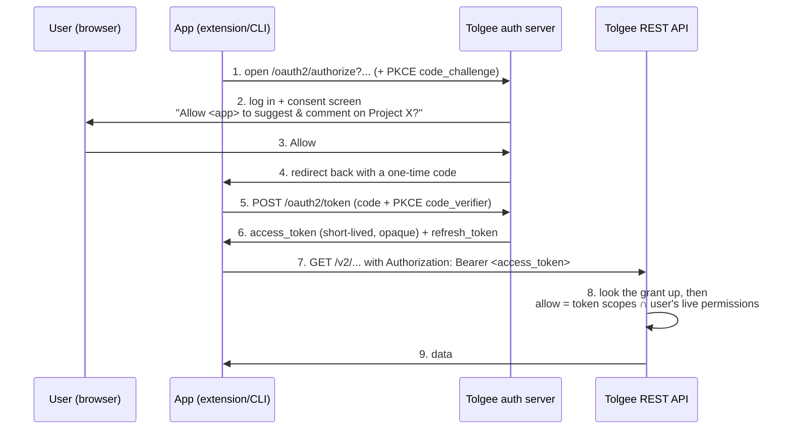

# OAuth 2.1 authorization server

Tolgee lets apps (browser extension, CLI, MCP clients) sign a user in **through the browser**
and receive a short-lived token, instead of the user pasting a long-lived API key. This is what
"Sign in with Google/GitHub" does — Tolgee is the thing you sign in *with*.

This page explains, in plain words, how it works and what the jargon means.

## 1. Overview

**The problem.** Before, every non-webapp client authenticated with a static secret (a Project API
Key or Personal Access Token) sent as `X-API-Key`. You generate it in the UI, copy it, paste it into
the client. That secret is long-lived and, for a public-project community translator, we can't safely
hand one out at all.

**The idea.** With OAuth, the app sends the user to Tolgee in the browser, the user logs in and
approves ("this app may suggest translations on Project X"), and the app gets back a **short-lived
access token**. The token is an opaque string the existing API already understands as an
`Authorization: Bearer <token>` header.

**Two halves:**
- **Authorization server** (new) — mints tokens: the `/oauth2/authorize` and `/oauth2/token`
  endpoints.
- **Resource server** (already existed) — the REST API that accepts the token. We only had to teach
  it to recognize these new tokens next to the old ones.

## 2. How To (the flow)

The headline case: a **community translator** authorizes the browser extension on a public project.



Key point about step 8: the token can only ever **narrow** what the user is already allowed to do.
Effective access = `token's scopes ∩ the user's live permissions on that project`, re-checked on every
request. Lose access to the project and the token instantly stops working there — nothing is "baked in".

### How the browser gets a consent screen

Tolgee's web login is stateless — a JWT in the browser's local storage, not a cookie — and step 1 above is a plain
browser navigation, which cannot send that JWT. So `/oauth2/authorize` authenticates nobody. It checks only what has
to be right before a redirect is safe (that the `client_id` is a registered client and the `redirect_uri` is one of
its registered URIs, and that the rest of the request is well formed) and then redirects the browser to the SPA's
`/oauth2/consent` route, carrying the authorize parameters as this endpoint normalized them — a parameter sent
without a value is forwarded as absent, per OAuth 2.1 §3.1. The redirect is relative
unless `front-end-url` is set — relative resolves against whatever origin the browser actually reached, which is what
a reverse proxy in front of a single origin needs; `front-end-url` makes it absolute for a split-origin deployment.

From there the consent screen is an ordinary logged-in page: if the user is not signed in, the webapp's own login
redirect handles it. The screen then drives the flow over the JWT-authenticated `/v2/oauth2` API —
`POST /v2/oauth2/authorize` to open the authorization, `GET /v2/oauth2/consent-info` to describe it, and
`POST /v2/oauth2/consent` to approve or deny — and the last of those answers with the URL to send the browser to,
which is the code redirect back to the client.

**There is no session and no cookie anywhere in this flow.** That is deliberate, and it is what keeps the API
stateless and CSRF-free by construction. It also removes three problems a bridging session would have brought:
a stale principal in the cookie jar outliving a webapp logout, session fixation, and a session store that has to be
shared across replicas.

**An API credential cannot mint an OAuth token.** No method on `OAuth2FlowController` carries `@AllowApiAccess`, so
`AuthenticationInterceptor` refuses every project API key, PAT and OAuth token with `API_ACCESS_FORBIDDEN` before the
controller runs. That is the platform's default-deny, applied to the whole controller rather than re-implemented per
endpoint — so the only thing that can authorize an app is a person signed into the webapp, and adding
`@AllowApiAccess` here would break that.

## 3. Reference — the jargon

### PKCE ("pixy", Proof Key for Code Exchange)
The apps here are **public clients**: they have no secret they can keep hidden (anyone can unpack a
browser extension or CLI). PKCE replaces the missing secret with a one-time proof:
1. Before starting, the app makes a random string, the **`code_verifier`**.
2. It sends only its SHA-256 hash, the **`code_challenge`**, on `/oauth2/authorize` (step 1).
3. When exchanging the code for a token (step 5), it sends the original `code_verifier`.
4. The server hashes it and checks it matches the challenge.

So even if someone steals the one-time code in transit, it's useless without the `code_verifier` that
never left the app. PKCE is required for every Tolgee OAuth client.

### Opaque access tokens (why not a JWT)
The access token is an **opaque** random string. It carries no readable content: everything that describes
it — the user, the scopes this token carries (`active_scopes`, which a narrowing refresh may set below the granted
ceiling), and the project set it is bound to — lives on the `oauth2_grant` row it belongs to, and
`OAuth2AccessTokenResolver` reads that row on every request. Like project API keys
and PATs, codes and tokens are stored **hashed**; the plaintext exists only in the response that delivered it.

The alternative, a self-contained signed JWT, is the more common choice for an authorization server, and
we deliberately did not take it:

- **Revocation actually works.** Deleting the grant kills its access tokens immediately. A signed JWT is
  valid until it expires, no matter what the server thinks, so revoking one needs a denylist that has to
  be consulted per request anyway — the lookup a JWT was supposed to avoid.
- **No key lifecycle.** No signing keypair to generate, persist, share between replicas or rotate, and no
  JWK set to publish. That is a whole class of operational failure removed rather than managed.
- **It matches the rest of Tolgee.** Project API keys and PATs are opaque strings looked up (and cached)
  the same way. OAuth tokens are not a special case.

What is given up is offline validation by a *third-party* resource server. Tolgee's own API is the only
resource server, so nothing needs it. If that ever changes, that is the moment to reconsider — not before.

One consequence worth knowing: refresh rotation replaces the grant's single access token, so refreshing
supersedes the previous access token immediately rather than leaving it usable until it expires.

### issuer
The base URL that identifies this authorization server; it's the `iss` parameter on every authorization response —
success and error alike, per RFC 9207, which discovery advertises as
`authorization_response_iss_parameter_supported` — and
the root of discovery (`{issuer}/.well-known/oauth-authorization-server`), and every endpoint URL is built
relative to it. It must therefore be the URL where the OAuth endpoints (`/oauth2/token`, `/oauth2/authorize`,
…) are actually reachable — i.e. the **backend / API URL** (`back-end-url`).

`OAuth2IssuerResolver` owns it. `issuerUrl` is `backEndUrl ?: frontEndUrl`, with a blank treated as unset and
any trailing slash stripped, and it is what every caller uses — the discovery documents and the `iss` on
authorization responses. It is never derived from the request, so a caller cannot choose the issuer this server
publishes about itself; it must be a bare origin. Once any OAuth client is configured, startup fails unless one
of the two is set and names a bare origin — a path-carrying value is rejected too, because RFC 8414 §3 would put
the metadata document at a location Tolgee does not serve. A deployment with no client configured is left alone
— it issues no tokens, so nothing reads the issuer. The `frontEndUrl` fallback is **not** "use the web app as
the issuer": it only exists for deployments that serve the API and the web app from **one origin** (the backend
also serves the built SPA), where `back-end-url` is often left unset and `front-end-url` *is* that single
origin. Whenever the API has its own origin, `back-end-url` is the one you must set: nothing checks that the
configured value really names the API, so a `front-end-url` pointing at a separate web app will satisfy startup
and then publish an issuer the OAuth endpoints are not reachable at.

### Consent is never remembered

Every authorization shows the consent screen; nothing stores a past consent, so there is nothing to skip it
with.

The reason is the project picker. A token is bound to a project, that choice is made on the screen, and it
is per-authorization state with nowhere to be stored. Skipping the screen leaves the authorization with no
project selection at all, and the only remaining candidates would be the `project` request parameter (the
client's own choice) or "every project this user can reach" — neither of which anybody approved. So
remembering consent requires making the project selection durable first; until then, re-prompting is what
lets a reconnect mint a token at all.

Were that ever built, the token endpoint's guard — a code is only redeemable once a project set was bound, see
`OAuth2AuthorizationService.exchangeCode` — is what would catch a screen that got skipped without one.

The shape that follow-up would most likely take: let the `project` request parameter *bind* rather than hint —
`startAuthorization` binds `projectSelection` from it after the same accessibility check the consent path runs,
the screen shows it as a pre-made but editable choice, and consent is then remembered per
(user, client, scopes, project selection) with no new durable state. It changes what an existing wire parameter
means, which is why it is a deliberate decision rather than an additive one.

### scope vs. project set
- **scope** = a capability verb (`translations.suggest`, `translation-comments.add`) — *what* the token
  may do. The OAuth `scope` request parameter.
- **project set** = *where* it may do it: the `project_selection` column on the grant — specific project ids, or the
  `*` sentinel meaning "don't narrow by project" (still bounded by the user's live permissions).

### Registered clients: how an app becomes "known"
Before Tolgee will issue tokens to an app, it must know that app's `client_id` and its allowed
`redirect_uris` (so a stolen code can't be sent to an attacker's URL). Round 1 does this by
**pre-registration**: the browser extension and CLI are built from configuration with a known `client_id`
(`OAuth2ClientRegistry.kt`). Every client is public, must use PKCE (S256 only), and always goes through
the consent screen. Redirect URIs are matched exactly, except that a loopback URI is accepted on any port — a CLI
takes whatever port the OS gives it at request time. RFC 8252 §7.3 requires that for the IP literals (`127.0.0.1`,
`[::1]`); §8.3 steers clients towards those rather than `localhost`, which depends on the host's name resolution,
but Tolgee matches a `localhost` registration the same way because refusing it would accept a configuration at
startup and then reject the callback it produces. Simple and safe, but it only works for apps *we* control.

Onboarding third-party clients (the MCP round) needs one of two mechanisms, neither of which is built:

- **CIMD — Client ID Metadata Document.** The `client_id` *is* an HTTPS URL serving a small JSON document
  describing the client. Tolgee would fetch and validate it on first use, so there is nothing to store or
  expire. The catch is that it makes an outbound request to a URL an untrusted client chose, which is the
  most security-sensitive surface in the whole feature — it needs an https-only, no-redirect, size- and
  timeout-capped fetch behind an SSRF guard *and* a host allow-list, because a CIMD host controls the
  redirect URIs of the client it registers.
- **DCR — Dynamic Client Registration (RFC 7591).** The client POSTs its metadata to a public `/register`
  endpoint and the server stores it. Widely specified and stable across metadata changes, but it is an
  open, unauthenticated write endpoint: a spam, abuse and storage-growth surface that has to be rate
  limited and pruned.

An implementation of CIMD was written and then removed from this round, because nothing consumes it until
the MCP client work lands and it is not the kind of code to carry unused. It is preserved in history —
recover it with `git revert f65e6e995` (`chore: remove CIMD client resolution`) rather than writing it again. A
squash merge kills that hash; `git log --all --diff-filter=D -- '*Cimd*'` still finds the removal.

## Where it lives in the code

The authorization server is Tolgee's own code, not a library: the authorization-code grant with PKCE for public
clients is small enough (one service, three controllers, one entity) that owning it costs less than bending a
general-purpose server to a stateless app with opaque tokens and a per-authorization project picker.
`OAuth2ProtocolConformanceTest` pins the protocol contract at the HTTP level; `OAuth2AuthorizationCodeFlowTest`
covers what is Tolgee-specific on top of it.

| Concern | Files |
|---|---|
| `/oauth2/authorize`, `/oauth2/token`, `/oauth2/revoke`, RFC 8414 discovery | `backend/api/.../controllers/oauth2/OAuth2AuthorizationServerController.kt` |
| Protocol decisions: request validation, code issuance and exchange, PKCE check, refresh rotation, revocation | `backend/data/.../security/oauth2/OAuth2AuthorizationService.kt` |
| The grant itself (user, client, scopes, project set, hashed code/tokens, expiries) | `backend/data/.../model/oauth2/OAuth2Grant.kt`, `db/changelog/schema.xml` |
| API accepts the token + narrows scopes | `AuthenticationFilter.kt`, `OAuth2AccessTokenResolver.kt`, `SecurityService.getCurrentPermittedScopes` |
| Consent-screen API: open the authorization, describe it, approve/deny + project selection | `backend/api/.../controllers/oauth2/OAuth2FlowController.kt` |
| Client registry (from config, not stored) | `OAuth2ClientRegistry.kt` |
| Issuer | `OAuth2IssuerResolver.kt` |
| RFC 9728 protected-resource metadata + the RFC 6750 `WWW-Authenticate` challenge that points at it | `ProtectedResourceMetadataController.kt`, `OAuth2BearerChallengeProvider.kt` |
| Nightly cleanup of spent/abandoned grants | `OAuth2GrantCleanup.kt` |

## Round-1 limitations (tracked follow-ups)

These are known gaps, deferred to the client rounds that first exercise them:

- **A client's `requiredScopes` are a consent-screen affordance, not a server-side rule.** The screen locks them
  on, but `approveConsent` only checks that what was approved was requested, so a direct `POST /v2/oauth2/consent`
  can grant less than the client declared it needs. That is deliberate — RFC 6749 §3.3 lets a server issue
  narrower than requested, and it is the user's own account — and the cost is that the client discovers the
  missing scope at its first API call rather than at consent.

- **An all-projects token cannot enumerate the projects it reaches.** `*` means "every project this user can
  currently see", a set that changes with their membership, so a client cannot cache it — and nothing lets it ask:
  both project-listing routes are `@IsGlobalRoute` (which `AuthenticationInterceptor.isOAuthAllowed` denies) —
  `getAll` is `ONLY_PAT` besides, and `getAllWithStatistics` carries no `@AllowApiAccess` at all, so it admits no
  API credential — and MCP's `listProjectsSpec` is refused for the same reason. Not a boundary problem — every
  request is still narrowed by `coversProject()` and the user's live permissions, so the failure is "cannot
  discover", never "reaches further than intended". The browser extension is handed its project by the page it
  edits; MCP is the round that needs discovery, and the follow-up is one non-global OAuth-reachable route returning
  the token's projects. `AuthenticationFacade.implicitProjectId` reuses the project-API-key conflation
  (`oauthTokenCredentials?.singleProjectId()`), so `*` currently reads as "no project" — the opposite of what it
  means — and wants fixing in the same change.

- **`refresh-token-validity-days` is a sliding inactivity window, not a grant lifetime.** Every refresh issues a new
  refresh token and pushes its expiry out again, so a grant that keeps being used never expires on its own: the 30
  days measure idleness, not age. What ends an actively-used grant is revocation — the client's own RFC 7009 call on
  logout, a password change, signing out everywhere, deleting the account, or unregistering the client — all of
  which take effect on the next request because the token is opaque and resolved per request. An absolute cap is
  deferred with the per-app revocation surface below: forcing a re-consent on a cadence is only humane once a
  user can see which apps they have authorized and why one stopped working.

- **There is no way for a *user* to see or revoke an authorized app.** A client can end its own grant
  (`POST /oauth2/revoke`, RFC 7009, advertised as `revocation_endpoint` in discovery), but from the user's side
  grants are killed only wholesale, by changing the password or signing out everywhere (`revokeAllForUser`). A
  per-app list-and-revoke API and screen were written and then removed from this round, because the planned
  Session management feature will own that surface for OAuth apps and sessions together, and shipping a separate
  Connected apps page first would mean replacing it immediately. Recover it rather than writing it again: the
  removal is `chore: remove the connected-apps API` (`48987fc85` on the release-polish branch), and if the stack
  was squash merged and that hash is gone, the deleted files are still findable by path —
  `git log --all --diff-filter=D -- '*ConnectedApps*' '*connectedApps*'` reaches
  `ConnectedAppsController.kt`, `ConnectedAppModel.kt`, `OAuth2AuthorizationQueryService.kt`,
  `OAuth2AuthorizationJdbcRepository.kt`, `ConnectedAppsView.tsx`, `ConnectedAppListItem.tsx` and
  `OAuth2ConnectedAppsAndDiscoveryTest.kt`.

- **Refresh replay detection reaches one generation back.** Every refresh replaces both tokens on the grant, and
  presenting the token the current one replaced revokes the whole grant (RFC 9700 §4.14.2). The refresh token is one
  opaque secret, looked up by hash exactly as the access token is: the current hash finds a live grant, and the
  previously-issued hash finds the grant a just-superseded token belonged to, which is what makes a replay
  detectable. A secret the grant never issued matches neither and reaches no row, so it can only fail — it cannot
  destroy anything.

  The depth is one generation, deliberately. Retaining the whole chain of superseded hashes would detect a replay
  from any generation; what is uncovered today is an attacker who steals a token and rotates it twice before the
  legitimate client refreshes. That is the follow-up if it ever matters, and it is the point at which the grant
  would need a rotation-chain table rather than a single previous-hash column.

  There is also no grace window: a client that refreshes twice in quick succession — two tabs,
  a retried request — trips the replay defence and loses the grant instead of getting the same token pair back.
  Follow-up in `OAuth2AuthorizationService.refresh`: return the current pair for a just-superseded token inside a
  short window, and revoke only outside it.

- **A scoped credential's lack of elevation is enforced per consumer, not at the principal.** An OAuth token's
  principal still carries the user's real ADMIN/SUPPORTER role, so every `isAdmin()` / `isSupporterOrAdmin()`
  reachable from an OAuth request grants full reach unless the consumer asks `isScopedCredential` /
  `isScopedCredentialInContextFor` first — which `SecurityService`, `ProjectContextService`, `PermissionService` and
  `ApiKeyController` all now do. Nothing makes that structural: the next elevation check added on a project route
  is elevated for OAuth tokens until someone notices. It holds today because the path gate keeps OAuth tokens off
  org and global routes entirely, so the un-narrowed `OrganizationRoleService` checks are unreachable for them. The
  structural fix is to downgrade the principal's role to `USER` when the credential is scoped, at the point
  `TolgeeAuthentication` is built, leaving only the genuinely per-user questions
  (`PermissionService.getProjectPermissionData`, authorship self-access) explicit — a change to how every request
  is authenticated, and so its own PR rather than part of this one.

- **Account-level endpoints apply no scope narrowing to any API credential.** An OAuth token is gated by
  `@AllowApiAccess.tokenType` exactly as a project API key is, so it reaches `/v2/user`, `/v2/notification`,
  `/v2/notification-settings`, `/v2/notifications-mark-seen`, `/v2/user-tasks` and `/v2/image-upload`. None of
  these resolves a project, so `SecurityService.getCurrentPermittedScopes` never runs and neither the token's
  scopes nor its project set is consulted — a project API key reads them today for the same reason. `/v2/user`
  is the one worth weighing: it returns the account's email and server role to any API credential. Making these
  `ONLY_PAT` is the likely answer, but it is a question about every API credential rather than about OAuth, so it
  belongs in its own PR.

- **The "may an OAuth token reach this endpoint" rule still has two implementations.**
  `AuthenticationInterceptor` answers it for servlet dispatch and `McpRequestContext` answers it again for the MCP
  RouterFunction, which no interceptor sees. Both now reduce to the same single condition
  (`tokenType == ANY`), so the copies are trivially comparable, but a second condition would still have to be
  added in both places. The same is true of the org-role refusal, which `OrganizationAuthorizationInterceptor`
  and `McpRequestContext.checkOrgRole` each state.

- **Project API keys lose the author self-access bypass** (released behaviour, changed by
  `fix: keep self-authored access out of scoped credentials`). Several endpoints let you act on something because you
  created it — viewing and cancelling your own batch job, deleting your own suggestion, editing and deleting your own
  comment. That bypass applied to project API keys too, so a key could act on those resources while carrying none of
  `batch-jobs.view`, `batch-jobs.cancel`, `translation-suggestions.manage` or `translation-comments.edit`. A key is a
  scoped capability, so it now has to carry the real scope; a webapp JWT and a PAT still carry the user's full
  authority and are unaffected. Existing keys are not backfilled — unlike `tasks.assigned-access`, the scopes here
  already exist and adding them to every key would grant more than the bypass did. A key that relied on it needs the
  scope added, and `GET /v2/projects/{id}/batch-jobs/{jobId}` is the likeliest one to notice:
  `translations.batch-machine` does not expand to `batch-jobs.view`.

- **Revocation by a superseded access token does not find the grant.** `revokeToken` resolves the presented token
  through the access-token hash, the current refresh-token hash and the *previous* refresh-token hash, so a client
  that rotated and logs out with the refresh token it replaced is still honoured. There is no equivalent for access
  tokens: `issueTokens` overwrites `accessTokenHash` in place and no previous-hash column exists for it, so an
  access token from before the last refresh resolves to nothing and the call answers 200 having revoked nothing.
  A client in that position still holds its current refresh token, which does revoke the grant.

- **A consent submitted after its deadline is a dead end for the client.** `consent-validity-seconds` defaults to
  900, so a user who opens the consent screen, leaves it for fifteen minutes and then clicks Allow hits
  `lockOwnPendingGrant`, whose `takeIf { !isExpired(it.consentExpiresAt) }` yields
  `NotFoundException(OAUTH_UNKNOWN_STATE)`. `OAuth2ConsentView.submitDecision`'s `onError` renders "Could not load
  the authorization request." and stops, so the browser stays on Tolgee and the client is left waiting on a
  `redirect_uri` that never fires. Nothing is issued and no grant survives, so this is a usability gap rather than a
  protocol or security one. The fix is for the failure handler to obtain a redirect it can safely leave on — re-POST
  `/v2/oauth2/authorize` with the parameters still in the URL, which re-validates the client and redirect URI, and
  follow the `redirectUrl` it returns carrying `error=access_denied` (RFC 6749 §4.1.2.1). That is new control flow in
  the consent screen, including what to do when the second authorize call fails too, so it waits for the round that
  owns the screen's own design.

- **A tokenless MCP client does not get the RFC 9728 challenge.** `/mcp/**` is deliberately unauthenticated at
  the filter chain so `initialize` and `tools/list` answer a health check without credentials, so a client that has
  no token yet gets a successful `initialize` and is only refused once it calls a tool — from inside the handler,
  not as a 401 carrying `WWW-Authenticate`. The challenge does fire for a client that presents a bad or revoked
  token (`OAuth2BearerChallengeTest`), which is the path a client that already authenticated once takes. Making
  discovery work from a cold start means emitting the challenge from a filter on `/mcp/**` while keeping the
  unauthenticated `tools/list` health check intact — a follow-up for the MCP round.

- **A grant resolves on every request.** Opaque tokens are looked up in `oauth2_grant` per
  request, which is what makes revocation immediate — but it is also an uncached database read on the API
  hot path. Project API keys and PATs cache their lookup by token hash (`Caches.PROJECT_API_KEYS`); doing
  the same here is the obvious follow-up if it ever shows up in profiling, and it must come with the same
  evict-on-revoke discipline or it reintroduces exactly the revocation lag the opaque token removed.

## Testing the browser extension locally (development)

The browser OAuth flow assumes the Tolgee instance serves its SPA **and** its API/authorization-server
on **one origin** (`/oauth2/authorize` redirects to the SPA-served `/oauth2/consent` with a relative URL, and the
SPA then calls `/v2/oauth2/*` on its own origin). Production is
single-origin (the backend serves the built frontend), so nothing below is needed there — this is only
to reproduce the flow against a local dev checkout, where the webapp (vite, `:3000` by default) and the backend
(`:8080` by default) are split. Substitute your own ports below if you run on others — a feature worktree created by
`scripts/create-worktree.sh` offsets both.

### 1. Single-origin dev server (vite proxy)

`webapp/vite.config.ts` proxies the backend-owned paths (`/v2`, `/api`, `/oauth2/authorize`,
`/oauth2/token`, `/oauth2/revoke`, `/.well-known`) to the backend, leaving `/oauth2/consent` as an SPA route.

Point the app at the same origin and set the proxy target in `webapp/.env.development.local`:

```bash
VITE_APP_API_URL=                         # empty → app calls the API on its own origin (the vite port)
VITE_DEV_PROXY_TARGET=http://localhost:8080   # where the backend actually runs
```

Both are needed together: with `VITE_APP_API_URL` non-empty the app bypasses the proxy and the
consent screen calls a different origin than the one `/oauth2/authorize` redirected it to. Restart vite after
changing env (build-time vars).

### 2. Trusted HTTPS (required by `launchWebAuthFlow`)

`chrome.identity.launchWebAuthFlow` will not intercept the final `https://<id>.chromiumapp.org/`
redirect when the flow runs over plain `http://` — it navigates to the (DNS-less) redirect host and
fails with *"Authorization page could not be loaded."* A **trusted** cert is required (self-signed is
rejected too). Use [`mkcert`](https://github.com/FiloSottile/mkcert):

```bash
brew install mkcert && mkcert -install     # installs a locally-trusted CA
cd webapp && mkcert localhost              # → localhost.pem + localhost-key.pem
```

`vite.config.ts` picks the certificate up on its own when `webapp/localhost.pem` exists, so there is nothing to
edit.

Now the extension's API url is `https://localhost:3000` and the whole flow is HTTPS end to end.

### 3. Register the extension's redirect URI on the local backend

Load the unpacked extension (`chrome://extensions` → Developer mode → Load unpacked → `dist-chrome`
after `npm run build` in the chrome-plugin repo). In its **service worker** console run
`chrome.identity.getRedirectURL()` and add that exact value (trailing slash included) to the local
backend config, then restart the backend so `OAuth2ClientRegistry` picks the client up:

```yaml
tolgee:
  # In dev the browser reaches the backend through vite, and the issuer is never derived from the request
  # (X-Forwarded-* is deliberately untrusted), so this has to name the origin the browser uses (the vite port),
  # not the backend's own — otherwise the `iss` on the code redirect and the RFC 9728 document point somewhere
  # vite will not answer.
  back-end-url: https://localhost:3000
  oauth2:
    browser-extension-redirect-uris:
      - https://<your-unpacked-extension-id>.chromiumapp.org/
```

An unpacked extension keeps its id as long as `dist-chrome` isn't moved. (Production/testing/preview
already register the *published* extension's redirect in the deployment repo, so this step is
dev-only.)

### 4. Connect

Log into the webapp at `https://localhost:3000` (so the webapp JWT is in `localStorage` — the consent screen
needs it), open the extension popup on the **Login** tab, set the **Server** field to
`https://localhost:3000` (behind *Change server*), and click **Connect to Tolgee** → consent → Allow →
"Connected". The access token is injected into the page as `__tolgee_authToken`; the
refresh token stays in the service worker.

The consent screen re-appears on every connect (see "Consent is never remembered"), so there is nothing to
clear between attempts. The extension can end its own grant with `POST /oauth2/revoke`; there is no user-facing
list-and-revoke screen in this round (see "Round-1 limitations" above).

### 5. Edit in-context against a local build of the editor

Getting to "Connected" is not enough to actually edit: the in-context editor UI is **not bundled** — the
SDK loads it at runtime from the jsdelivr CDN (`@tolgee/web@prerelease`). That published bundle predates
the OAuth `authToken` support, so it authenticates with `X-API-Key` and in-context editing fails with
**"Invalid API key"** until the patched `@tolgee/web` is published. For local dev, point the loader at
your own build — `loadInContextLib` honors a `window.__TOLGEE_IN_CONTEXT_URL__` override.

Why this is new: `@tolgee/web` ships **two** builds. The main ESM is what `testapps/react` imports from
the local workspace, so edits there show up on rebuild — this is why in-context tweaks normally "just
work" locally. The editor tools (`ContextUi` + `DevBackend`) are the **separate lazy-loaded UMD** fetched
from the CDN, i.e. always the *published* release, never your workspace. Past changes lived in the ESM (or
didn't alter the UMD's behavior), so the CDN copy was fine. OAuth is the first change to the UMD's own
request path — the Bearer branch in `DevBackend` — so the popup runs published code that lacks it, and no
amount of rebuilding the workspace helps until you override the loader URL.

The cleanest surface is the **`testapps/react`** app in the **tolgee-js** repo: it consumes the local
workspace SDK (so both the Bearer-capable `DevBackend` and the loader override are in play).

1. Build the SDK + tools UMD in tolgee-js:
   ```bash
   cd packages/web && npm run build   # → dist/tolgee-in-context-tools.umd.min.js (with Bearer support)
   ```
2. Serve that UMD from the testapp's own origin and point the override at it. In
   `testapps/react/.env.development.local` (gitignored):
   ```bash
   VITE_APP_TOLGEE_API_URL=https://localhost:3000
   VITE_APP_TOLGEE_PROJECT_ID=1                    # must exist on THIS backend (see note)
   VITE_APP_IN_CONTEXT_URL=/tolgee-in-context-tools.umd.min.js
   ```
   ```bash
   cp packages/web/dist/tolgee-in-context-tools.umd.min.js testapps/react/public/
   ```
   `testapps/react/src/inContextUrl.ts` (imported by `main.tsx`) sets `window.__TOLGEE_IN_CONTEXT_URL__`
   from that env var (inert when unset).
3. Run `npm run develop:react` from the tolgee-js root, open the testapp, Connect via the extension
   (Server = `https://localhost:3000`), Allow, and edit in-context. The editor now loads from your build
   and sends `Authorization: Bearer …`.

`develop`'s watch rebuilds the SDK bundle but **not** the tools UMD (separate build config), so re-run
`npm run build` in `packages/web` and re-copy the UMD after changing the editor's code.

**projectId must be valid on the connected server.** The extension enables Connect for any `projectId`
the page declares, but that id must exist on the server you connect to. If it doesn't, the token can't be
scoped to it: the consent screen warns, the popup shows "you can't edit this project here", and
in-context editing won't work. Use a projectId that exists on your local backend.

**Once `@tolgee/web` is published**, none of Step 5 is needed — `loadInContextLib` pulls the patched
editor from the CDN automatically.
