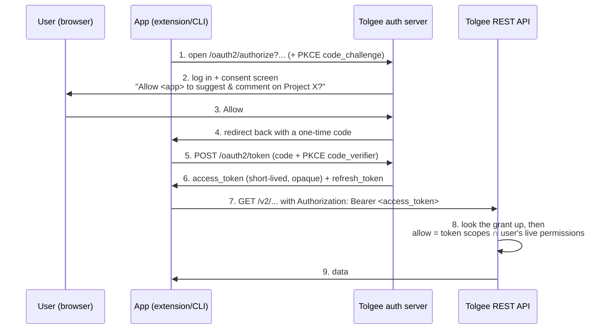

# OAuth 2.1 authorization server

Tolgee can now let apps (browser extension, CLI, MCP clients) sign a user in **through the browser**
and receive a short-lived token, instead of the user pasting a long-lived API key. This is what
"Sign in with Google/GitHub" does — Tolgee is now the thing you sign in *with*.

This page explains, in plain words, how it works and what the jargon means.

## 1. Overview

**The problem.** Before, every non-webapp client authenticated with a static secret (a Project API
Key or Personal Access Token) sent as `X-API-Key`. You generate it in the UI, copy it, paste it into
the client. That secret is long-lived and, for a public-project community translator, we can't safely
hand one out at all.

**The idea.** With OAuth, the app sends the user to Tolgee in the browser, the user logs in and
approves ("this app may suggest translations on Project X"), and the app gets back a **short-lived
access token**. The token is an opaque string the existing API already understands as an
`Authorization: Bearer <token>` header.

**Two halves:**
- **Authorization server** (new) — mints tokens: the `/oauth2/authorize` and `/oauth2/token`
  endpoints.
- **Resource server** (already existed) — the REST API that accepts the token. We only had to teach
  it to recognize these new tokens next to the old ones.

## 2. How To (the flow)

The headline case: a **community translator** authorizes the browser extension on a public project.



Key point about step 8: the token can only ever **narrow** what the user is already allowed to do.
Effective access = `token's scopes ∩ the user's live permissions on that project`, re-checked on every
request. Lose access to the project and the token instantly stops working there — nothing is "baked in".

### The extra hop for browsers (session bootstrap)

Tolgee's web login is stateless (a JWT held in the browser's local storage, not a cookie). But step 1
above is a plain browser navigation, which **can't** send that JWT. So when the browser lands on
`/oauth2/authorize` unauthenticated, we bounce it to a small SPA page that turns the stored JWT into a
short-lived server session (a cookie), then continues to `/oauth2/authorize`. After that the standard
flow above runs.

This bootstrap session is the *only* stateful part of the otherwise-stateless app. To keep it working on
multi-replica deployments (Tolgee Cloud, self-hosted HA) without requiring load-balancer session affinity,
the HTTP session is backed by **Spring Session JDBC** over the existing Postgres (`spring.session.store-type:
jdbc`; schema in `db/changelog/spring-session`). The bootstrapped `SecurityContext` is therefore visible on
any replica, so the bootstrap → authorize → consent requests can land on different replicas. No shared Redis
and no ingress stickiness are needed.

#### The session is destroyed the moment a code is issued

We invalidate the bootstrap session as soon as `/oauth2/authorize` issues an authorization code
(`OAuth2SessionInvalidatingAuthorizationResponseHandler`, wired on the authorization endpoint). Its whole
job is to carry the single authorize → consent → authorize round trip; the `/oauth2/token` and refresh
exchanges are back-channel and sessionless, so nothing needs it afterwards.

**Why we do this.** The session cookie lives in the browser's shared cookie jar, but the real web login is
the JWT in local storage — logging out of the webapp drops that JWT and does **not** touch the cookie. Without
invalidation, a lingering session keeps authenticating `/oauth2/authorize` as whoever bootstrapped it, so
after a user signs out and back in as a **different** account, the next connect would silently mint a token
for the *old* account (and, with consent already remembered, without even showing the consent screen). Killing
the session at code issuance forces the next connect to re-bootstrap, so a token is always minted for whoever
is signed into the webapp *now*.

**Why not just revoke consent on disconnect instead.** Revoking the consent row when the client
disconnects would only re-show the consent *screen* — it
does nothing to the stale session, so the reconnect still authenticates as the old account and still mints its
token (and the consent screen, fetched with the current JWT, would even disagree with the grant, bound to the
session's old principal). It would also force a re-prompt on *every* reconnect, breaking same-account
consent-skip, and it only runs if the client remembers to call it. Session invalidation fixes the actual cause
(the principal) server-side, unconditionally. Consent revocation stays reserved for its real purpose — a user
explicitly **revoking an app's access** (killing its refresh token + grant), not routine disconnect.

**This is not an OAuth-spec behavior.** The specs (RFC 6749 §3.1) deliberately leave the authorization
server's own login session out of scope, and a *typical* AS does the opposite — it keeps a long-lived **SSO**
session so repeat authorizations are silent. What we have here is not an SSO session but a **synthetic,
single-use bridge** from the stateless JWT into the session SAS requires; destroying it when its one
transaction completes is ordinary session hygiene (the same family as the session-id rotation the bootstrap
already does for fixation defense), just applied to a session that in a normal AS wouldn't be single-use.

**Trade-off.** Reusing a live session would let a same-account reconnect skip the bootstrap entirely (a
headless backend redirect), so invalidation makes every connect pay one SPA-bootstrap round trip. That cost
falls only on the occasional, user-initiated *connect* action — never on runtime API calls, which use the
already-minted access token — so in practice it's negligible. The faster-and-still-correct alternative is to
invalidate the session only on an *actual* identity change (logout / account switch / password change) rather
than on every code; that keeps the fast path but needs those events wired to delete the user's sessions, plus
a session-timeout backstop for the "logout never fired" case. The clean way to get there is to tie this
session into the first-class session lifecycle being built in
[#3839](https://github.com/tolgee/tolgee-platform/pull/3839) (revoke-on-logout/password-change), so it's left
as a follow-up.

## 3. Reference — the jargon

### PKCE ("pixy", Proof Key for Code Exchange)
The apps here are **public clients**: they have no secret they can keep hidden (anyone can unpack a
browser extension or CLI). PKCE replaces the missing secret with a one-time proof:
1. Before starting, the app makes a random string, the **`code_verifier`**.
2. It sends only its SHA-256 hash, the **`code_challenge`**, on `/oauth2/authorize` (step 1).
3. When exchanging the code for a token (step 5), it sends the original `code_verifier`.
4. The server hashes it and checks it matches the challenge.

So even if someone steals the one-time code in transit, it's useless without the `code_verifier` that
never left the app. PKCE is required for every Tolgee OAuth client.

### Opaque access tokens (why not a JWT)
The access token is an **opaque** random string. It carries no readable content: the claims that describe
it — `sub` (the user id), `scope`, and Tolgee's `tg.prj` (which projects it is bound to) — live on the
`oauth2_authorization` row the token points at, and `OAuth2AccessTokenResolver` reads them on every
request.

The alternative, a self-contained signed JWT, is the more common choice for an authorization server, and
we deliberately did not take it:

- **Revocation actually works.** Deleting the grant kills its access tokens immediately. A signed JWT is
  valid until it expires, no matter what the server thinks, so revoking one needs a denylist that has to
  be consulted per request anyway — the lookup a JWT was supposed to avoid.
- **No key lifecycle.** No signing keypair to generate, persist, share between replicas or rotate, and no
  JWK set to publish. That is a whole class of operational failure removed rather than managed.
- **It matches the rest of Tolgee.** Project API keys and PATs are opaque strings looked up (and cached)
  the same way. OAuth tokens are not a special case.

What is given up is offline validation by a *third-party* resource server. Tolgee's own API is the only
resource server, so nothing needs it. If that ever changes, that is the moment to reconsider — not before.

One consequence worth knowing: refresh rotation replaces the grant's single access token, so refreshing
supersedes the previous access token immediately rather than leaving it usable until it expires.

### issuer
The base URL that identifies this authorization server; it's the `iss` parameter on the code redirect and
the root of discovery (`{issuer}/.well-known/oauth-authorization-server`), and Spring builds every endpoint URL
relative to it. It must therefore be the URL where the OAuth endpoints (`/oauth2/token`, `/oauth2/authorize`,
…) are actually reachable — i.e. the **backend / API URL** (`back-end-url`).

We compute it as `backEndUrl ?: frontEndUrl` (`OAuth2AudienceResolver.serverBaseUrl`, read by
`OAuth2AuthorizationServerConfig`). The `frontEndUrl`
fallback is **not** "use the web app as the issuer" — it only exists for deployments that serve the API
and the web app from **one origin** (the backend also serves the built SPA), where `back-end-url` is
often left unset and `front-end-url` *is* that single origin. If your backend runs on a separate URL you
**must set `back-end-url`**, and then the fallback never fires. (If your topology always separates the
two, treat `back-end-url` as required.)

### scope vs. project set
- **scope** = a capability verb (`translations.suggest`, `translation-comments.add`) — *what* the token
  may do. Standard OAuth `scope` claim.
- **project set** (`tg.prj` claim) = *where* it may do it: specific project ids, or the `*` sentinel
  meaning "don't narrow by project" (still bounded by the user's live permissions).

### Registered clients: how an app becomes "known"
Before Tolgee will issue tokens to an app, it must know that app's `client_id` and its allowed
`redirect_uris` (so a stolen code can't be sent to an attacker's URL). Round 1 does this by
**pre-registration**: the browser extension and CLI are seeded as fixed clients with a known `client_id`
(`PreRegisteredClients.kt`). Simple and safe, but it only works for apps *we* control.

Onboarding third-party clients (the MCP round) needs one of two mechanisms, neither of which is built:

- **CIMD — Client ID Metadata Document.** The `client_id` *is* an HTTPS URL serving a small JSON document
  describing the client. Tolgee would fetch and validate it on first use, so there is nothing to store or
  expire. The catch is that it makes an outbound request to a URL an untrusted client chose, which is the
  most security-sensitive surface in the whole feature — it needs an https-only, no-redirect, size- and
  timeout-capped fetch behind an SSRF guard *and* a host allow-list, because a CIMD host controls the
  redirect URIs of the client it registers.
- **DCR — Dynamic Client Registration (RFC 7591).** The client POSTs its metadata to a public `/register`
  endpoint and the server stores it. Widely specified and stable across metadata changes, but it is an
  open, unauthenticated write endpoint: a spam, abuse and storage-growth surface that has to be rate
  limited and pruned.

An implementation of CIMD was written and then removed from this round, because nothing consumes it until
the MCP client work lands and it is not the kind of code to carry unused. It is preserved in history —
recover it with `git revert` of the commit that removed it rather than writing it again.

## Where it lives in the code

| Concern | Files |
|---|---|
| Token generation (opaque) | `backend/data/.../security/oauth2/OAuth2TokenGeneratorConfig.kt` |
| Auth-server filter chain, issuer | `backend/app/.../configuration/OAuth2AuthorizationServerConfig.kt` |
| Token claims (`sub`, `scope`, `tg.prj`) | `TolgeeOAuth2TokenCustomizer.kt` |
| API accepts the token + narrows scopes | `AuthenticationFilter.kt`, `OAuth2AccessTokenResolver.kt`, `SecurityService.getCurrentPermittedScopes` |
| Browser session bootstrap + consent info | `backend/api/.../controllers/oauth2/OAuth2FlowController.kt` |
| Bootstrap session killed on code issuance | `backend/app/.../configuration/OAuth2SessionInvalidatingAuthorizationResponseHandler.kt` |
| Grant/consent storage | `db/changelog/oauth2/oauth2-server.xml` (Spring Authorization Server JDBC schema) |
| Client registry (from config, not stored) | `PreRegisteredClients.kt`, `TolgeeRegisteredClientRepository.kt` |

## Round-1 limitations (tracked follow-ups)

These are known gaps, deferred to the client rounds that first exercise them:

- **There is no way for a user to see or revoke an authorized app.** Grants are killed only wholesale, by
  changing the password or signing out everywhere (`revokeAllForPrincipal`). A per-app list-and-revoke API
  and screen were written and then removed from this round, because the planned Session management feature
  will own that surface for OAuth apps and sessions together, and shipping a separate Connected apps page
  first would mean replacing it immediately. Recover the implementation with `git revert` of the commit that
  removed it rather than writing it again.

- **Refresh is stock rotate-on-use.** Public clients *do* get rotating refresh tokens — SAS withholds
  them by default (both on the code grant and by refusing to authenticate a public client on the
  refresh grant), so we add `PublicClientRefreshTokenGenerator` plus `PublicClientRefreshAuthentication`
  (a converter + provider that authenticate a bare `client_id`, gated strictly to
  `grant_type=refresh_token`). But `reuseRefreshTokens(false)` is plain rotation with no grace window
  and no reuse-detection family-revocation, so a client that refreshes proactively can hit
  `invalid_grant` on a near-simultaneous second refresh. Follow-up: replace
  `OAuth2RefreshTokenAuthenticationProvider` with one that accepts a just-superseded token within a
  short grace window and revokes the whole authorization family on replay of an already-rotated token.
- **A grant resolves on every request.** Opaque tokens are looked up in `oauth2_authorization` per
  request, which is what makes revocation immediate — but it is also an uncached database read on the API
  hot path. Project API keys and PATs cache their lookup by token hash (`Caches.PROJECT_API_KEYS`); doing
  the same here is the obvious follow-up if it ever shows up in profiling, and it must come with the same
  evict-on-revoke discipline or it reintroduces exactly the revocation lag the opaque token removed.

## Testing the browser extension locally (development)

The browser OAuth flow assumes the Tolgee instance serves its SPA **and** its API/authorization-server
on **one origin** (relative redirect, SPA-served `/oauth2/consent` + `/oauth2/bootstrap`, and a
session-bootstrap cookie that must belong to the origin `/oauth2/authorize` runs on). Production is
single-origin (the backend serves the built frontend), so nothing below is needed there — this is only
to reproduce the flow against a local dev checkout, where the webapp (vite, `:3995`) and backend
(`:8995`) are split.

### 1. Single-origin dev server (vite proxy)

`webapp/vite.config.ts` proxies the backend-owned paths (`/v2`, `/api`, `/oauth2/authorize`,
`/oauth2/token`, `/.well-known`) to the backend, leaving `/oauth2/consent` and
`/oauth2/bootstrap` as SPA routes:

```ts
// webapp/vite.config.ts — inside defineConfig(...).server
proxy: Object.fromEntries(
  ['/v2', '/api', '/oauth2/authorize', '/oauth2/token', '/.well-known'].map((path) => [
    path,
    {
      target: process.env.VITE_DEV_PROXY_TARGET || 'http://localhost:8080',
      changeOrigin: false,
    },
  ])
),
```

Point the app at the same origin and set the proxy target in `webapp/.env.development.local`:

```bash
VITE_APP_API_URL=                         # empty → app calls the API on its own origin (:3995)
VITE_DEV_PROXY_TARGET=http://localhost:8995   # where the backend actually runs
```

Both are needed together: with `VITE_APP_API_URL` non-empty the app bypasses the proxy and the
session-bootstrap cookie lands on the wrong origin. Restart vite after changing env (build-time vars).

### 2. Trusted HTTPS (required by `launchWebAuthFlow`)

`chrome.identity.launchWebAuthFlow` will not intercept the final `https://<id>.chromiumapp.org/`
redirect when the flow runs over plain `http://` — it navigates to the (DNS-less) redirect host and
fails with *"Authorization page could not be loaded."* A **trusted** cert is required (self-signed is
rejected too). Use [`mkcert`](https://github.com/FiloSottile/mkcert):

```bash
brew install mkcert && mkcert -install     # installs a locally-trusted CA
cd webapp && mkcert localhost              # → localhost.pem + localhost-key.pem
```

then enable HTTPS in `webapp/vite.config.ts` under `server`:

```ts
https: { cert: 'localhost.pem', key: 'localhost-key.pem' },
```

Now the extension's API url is `https://localhost:3995` and the whole flow is HTTPS end to end.

### 3. Register the extension's redirect URI on the local backend

Load the unpacked extension (`chrome://extensions` → Developer mode → Load unpacked → `dist-chrome`
after `npm run build` in the chrome-plugin repo). In its **service worker** console run
`chrome.identity.getRedirectURL()` and add that exact value (trailing slash included) to the local
backend config, then restart the backend so `PreRegisteredClients` seeds the client:

```yaml
tolgee:
  oauth2:
    browser-extension-redirect-uris:
      - https://<your-unpacked-extension-id>.chromiumapp.org/
```

An unpacked extension keeps its id as long as `dist-chrome` isn't moved. (Production/testing/preview
already register the *published* extension's redirect in the deployment repo, so this step is
dev-only.)

### 4. Connect

Log into the webapp at `https://localhost:3995` (so the webapp JWT is in `localStorage` — the bootstrap
step reads it), open the extension popup on the **Login** tab, set the **Server** field to
`https://localhost:3995` (behind *Change server*), and click **Connect to Tolgee** → bootstrap →
consent → Allow → "Connected". The access token is injected into the page as `__tolgee_authToken`; the
refresh token stays in the service worker.

To re-show the consent screen after a first approval (Spring remembers consent per client+user), delete the
user's rows from `oauth2_authorization_consent` and `oauth2_authorization`. There is no revocation API in this
round — see below.

### 5. Edit in-context against a local build of the editor

Getting to "Connected" is not enough to actually edit: the in-context editor UI is **not bundled** — the
SDK loads it at runtime from the jsdelivr CDN (`@tolgee/web@prerelease`). That published bundle predates
the OAuth `authToken` support, so it authenticates with `X-API-Key` and in-context editing fails with
**"Invalid API key"** until the patched `@tolgee/web` is published. For local dev, point the loader at
your own build — `loadInContextLib` honors a `window.__TOLGEE_IN_CONTEXT_URL__` override.

Why this is new: `@tolgee/web` ships **two** builds. The main ESM is what `testapps/react` imports from
the local workspace, so edits there show up on rebuild — this is why in-context tweaks normally "just
work" locally. The editor tools (`ContextUi` + `DevBackend`) are the **separate lazy-loaded UMD** fetched
from the CDN, i.e. always the *published* release, never your workspace. Past changes lived in the ESM (or
didn't alter the UMD's behavior), so the CDN copy was fine. OAuth is the first change to the UMD's own
request path — the Bearer branch in `DevBackend` — so the popup runs published code that lacks it, and no
amount of rebuilding the workspace helps until you override the loader URL.

The cleanest surface is the **`testapps/react`** app in the **tolgee-js** repo: it consumes the local
workspace SDK (so both the Bearer-capable `DevBackend` and the loader override are in play).

1. Build the SDK + tools UMD in tolgee-js:
   ```bash
   cd packages/web && npm run build   # → dist/tolgee-in-context-tools.umd.min.js (with Bearer support)
   ```
2. Serve that UMD from the testapp's own origin and point the override at it. In
   `testapps/react/.env.development.local` (gitignored):
   ```bash
   VITE_APP_TOLGEE_API_URL=https://localhost:3995
   VITE_APP_TOLGEE_PROJECT_ID=1                    # must exist on THIS backend (see note)
   VITE_APP_IN_CONTEXT_URL=/tolgee-in-context-tools.umd.min.js
   ```
   ```bash
   cp packages/web/dist/tolgee-in-context-tools.umd.min.js testapps/react/public/
   ```
   `testapps/react/src/inContextUrl.ts` (imported by `main.tsx`) sets `window.__TOLGEE_IN_CONTEXT_URL__`
   from that env var (inert when unset).
3. Run `npm run develop:react` from the tolgee-js root, open the testapp, Connect via the extension
   (Server = `https://localhost:3995`), Allow, and edit in-context. The editor now loads from your build
   and sends `Authorization: Bearer …`.

`develop`'s watch rebuilds the SDK bundle but **not** the tools UMD (separate build config), so re-run
`npm run build` in `packages/web` and re-copy the UMD after changing the editor's code.

**projectId must be valid on the connected server.** The extension enables Connect for any `projectId`
the page declares, but that id must exist on the server you connect to. If it doesn't, the token can't be
scoped to it: the consent screen warns, the popup shows "you can't edit this project here", and
in-context editing won't work. Use a projectId that exists on your local backend.

**Once `@tolgee/web` is published**, none of Step 5 is needed — `loadInContextLib` pulls the patched
editor from the CDN automatically.
