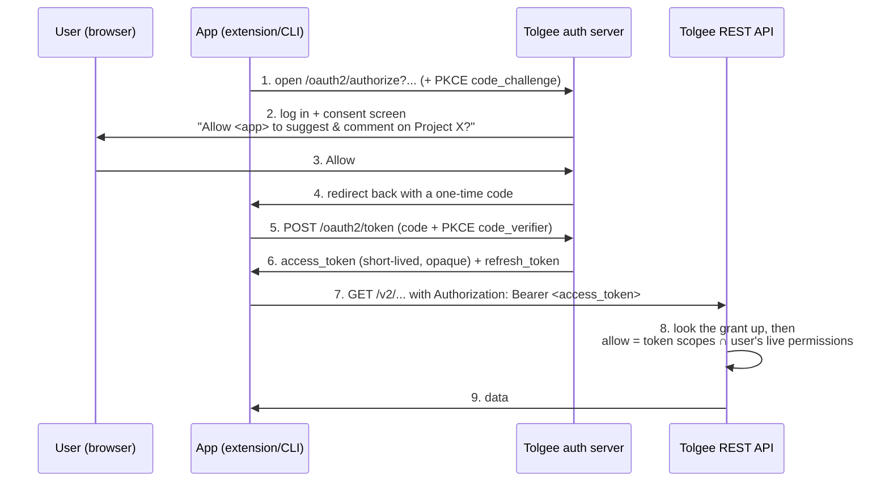

# OAuth 2.1 authorization server

Tolgee lets apps (browser extension, CLI, MCP clients) sign a user in **through the browser**
and receive a short-lived token, instead of the user pasting a long-lived API key. This is what
"Sign in with Google/GitHub" does — Tolgee is the thing you sign in *with*.

This page explains, in plain words, how it works and what the jargon means.

## 1. Overview

**The problem.** Before, every non-webapp client authenticated with a static secret (a Project API
Key or Personal Access Token) sent as `X-API-Key`. You generate it in the UI, copy it, paste it into
the client. That secret is long-lived and, for a public-project community translator, we can't safely
hand one out at all.

**The idea.** With OAuth, the app sends the user to Tolgee in the browser, the user logs in and
approves ("this app may suggest translations on Project X"), and the app gets back a **short-lived
access token**. The token is an opaque string the existing API already understands as an
`Authorization: Bearer <token>` header.

**Two halves:**
- **Authorization server** (new) — mints tokens: the `/oauth2/authorize` and `/oauth2/token`
  endpoints.
- **Resource servers** — there are now two, the REST API and the MCP endpoint (`/mcp/developer`),
  and each token is bound to exactly one of them (RFC 8707 audience binding): a token minted for MCP
  is rejected by the REST API and vice versa.

## 2. How To (the flow)

The headline case: a **community translator** authorizes the browser extension on a public project.


```mermaid
sequenceDiagram
    participant U as User (browser)
    participant C as App (extension/CLI)
    participant AS as Tolgee auth server
    participant API as Tolgee REST API

    C->>AS: 1. open /oauth2/authorize?...  (+ PKCE code_challenge)
    AS->>U: 2. log in + consent screen<br/>"Allow <app> to suggest & comment on Project X?"
    U->>AS: 3. Allow
    AS->>C: 4. redirect back with a one-time code
    C->>AS: 5. POST /oauth2/token (code + PKCE code_verifier)
    AS->>C: 6. access_token (short-lived, opaque) + refresh_token
    C->>API: 7. GET /v2/... with Authorization: Bearer <access_token>
    API->>API: 8. look the grant up, then<br/>allow = token scopes ∩ user's live permissions
    API->>C: 9. data
```

Key point about step 8: the token can only ever **narrow** what the user is already allowed to do.
Effective access = `token's scopes ∩ the user's live permissions on that project`, re-checked on every
request. Lose access to the project and the token instantly stops working there — nothing is "baked in".

### How the browser gets a consent screen

Tolgee's web login is stateless — a JWT in the browser's local storage, not a cookie — and step 1 above is a plain
browser navigation, which cannot send that JWT. So `/oauth2/authorize` authenticates nobody. It checks only what has
to be right before a redirect is safe (that the `client_id` is a registered client and the `redirect_uri` is one of
its registered URIs, and that the rest of the request is well formed) and then redirects the browser to the SPA's
`/oauth2/consent` route, carrying the authorize parameters as this endpoint normalized them — a parameter sent
without a value is forwarded as absent, per OAuth 2.1 §3.1. The redirect is relative
unless `front-end-url` is set — relative resolves against whatever origin the browser actually reached, which is what
a reverse proxy in front of a single origin needs; `front-end-url` makes it absolute for a split-origin deployment.

From there the consent screen is an ordinary logged-in page: if the user is not signed in, the webapp's own login
redirect handles it. The screen then drives the flow over the JWT-authenticated `/v2/oauth2` API —
`POST /v2/oauth2/authorize` to open the authorization, `GET /v2/oauth2/consent-info` to describe it, and
`POST /v2/oauth2/consent` to approve or deny — and the last of those answers with the URL to send the browser to,
which is the code redirect back to the client.

**There is no session and no cookie anywhere in this flow.** That is deliberate, and it is what keeps the API
stateless and CSRF-free by construction. It also removes three problems a bridging session would have brought:
a stale principal in the cookie jar outliving a webapp logout, session fixation, and a session store that has to be
shared across replicas.

**An API credential cannot mint an OAuth token.** The only thing that can authorize an app is a person signed into
the webapp; `OAuth2EndpointGuardsTest` is what enforces it, and says how.

**Approving costs a super token.** `POST /v2/oauth2/consent` carries `@RequiresSuperAuthentication`, the same gate a
project API key and a PAT are minted behind — an OAuth grant is one more long-lived credential, and a refresh token
outlives the session that approved it, so a lifted JWT alone must not be enough to leave one behind. Signing in with
a password already produces a super token and it lasts an hour (`tolgee.authentication.jwt-super-expiration`), so in
practice the user is asked at most once per hour, and the webapp raises the dialog and retries the request on its own.
Opening the screen and reading it are not gated; only the approval is.

## 3. Reference — the jargon

### PKCE ("pixy", Proof Key for Code Exchange)
The apps here are **public clients**: they have no secret they can keep hidden (anyone can unpack a
browser extension or CLI). PKCE replaces the missing secret with a one-time proof:
1. Before starting, the app makes a random string, the **`code_verifier`**.
2. It sends only its SHA-256 hash, the **`code_challenge`**, on `/oauth2/authorize` (step 1).
3. When exchanging the code for a token (step 5), it sends the original `code_verifier`.
4. The server hashes it and checks it matches the challenge.

So even if someone steals the one-time code in transit, it's useless without the `code_verifier` that
never left the app. PKCE is required for every Tolgee OAuth client.

### Opaque access tokens (why not a JWT)
The access token is an **opaque** random string. It carries no readable content: everything that describes
it — the user, the scopes this token carries (`issued_token_scopes`, which a narrowing refresh may set below the granted
ceiling), and the project set it is bound to — lives on the `oauth2_grant` row it belongs to, and
`OAuth2AccessTokenResolver` reads that row on every request. Like project API keys
and PATs, codes and tokens are stored **hashed**; the plaintext exists only in the response that delivered it.

The alternative, a self-contained signed JWT, is the more common choice for an authorization server, and
we deliberately did not take it:

- **Revocation actually works.** Deleting the grant kills its access tokens immediately. A signed JWT is
  valid until it expires, no matter what the server thinks, so revoking one needs a denylist that has to
  be consulted per request anyway — the lookup a JWT was supposed to avoid.
- **No key lifecycle.** No signing keypair to generate, persist, share between replicas or rotate, and no
  JWK set to publish. That is a whole class of operational failure removed rather than managed.
- **It matches the rest of Tolgee.** Project API keys and PATs are opaque strings looked up (and cached)
  the same way. OAuth tokens are not a special case.

What is given up is offline validation by a *third-party* resource server, which none of Tolgee's own
resource servers (the REST API and the MCP endpoint) needs. Each token is bound to exactly one of them
by an `audience` on the grant (RFC 8707): `OAuth2AccessTokenResolver` checks it against the resource the
request arrived at, so a token minted for one surface is `invalid_token` on the other. Grants predating this read as
`api` (the column defaults to it), so every one of them keeps working against the REST API; a grant that was being
used against `/mcp/developer` has to be re-authorized, which a spec-following client discovers for itself from the
`invalid_token` challenge.

One consequence worth knowing: refresh rotation replaces the grant's single access token, so refreshing
supersedes the previous access token immediately rather than leaving it usable until it expires.

### issuer
The base URL that identifies this authorization server; it's the `iss` parameter on every authorization response —
success and error alike, per RFC 9207, which discovery advertises as
`authorization_response_iss_parameter_supported` — and
the root of discovery (`{issuer}/.well-known/oauth-authorization-server`), and every endpoint URL is built
relative to it. It must therefore be the URL where the OAuth endpoints (`/oauth2/token`, `/oauth2/authorize`,
…) are actually reachable — i.e. the **backend / API URL** (`back-end-url`).

`OAuth2IssuerResolver` owns it. `issuerUrl` is `backEndUrl ?: frontEndUrl`, with a blank treated as unset and
any trailing slash stripped, and it is what every caller uses — the discovery documents and the `iss` on
authorization responses. It is never derived from the request, so a caller cannot choose the issuer this server
publishes about itself; it must be a bare origin. The issuer is also the server's on/off switch: the OAuth
endpoints (and CIMD) are live whenever the issuer resolves — a self-hosted instance therefore accepts unknown
MCP clients before any client is pre-registered, which is standard authorization-server behaviour. A value that
is *set but malformed* (a path, query or fragment) cannot serve as an issuer, because RFC 8414 §3 would put the
metadata document at a location Tolgee does not serve — so the OAuth server is off and a WARN names the property.
It deliberately does **not** fail startup: `front-end-url` carrying a path is valid for everything else that
property does, and an instance that never wanted OAuth must not stop booting over it. An unset issuer likewise just
leaves the server off. A pre-registered client, though, cannot function without a usable issuer, so configuring one
while the issuer is unset or malformed does fail startup — that is where the operator opted in. The
`frontEndUrl` fallback is **not** "use the web app as
the issuer": it only exists for deployments that serve the API and the web app from **one origin** (the backend
also serves the built SPA), where `back-end-url` is often left unset and `front-end-url` *is* that single
origin. Whenever the API has its own origin, `back-end-url` is the one you must set: nothing checks that the
configured value really names the API, so a `front-end-url` pointing at a separate web app will satisfy startup
and then publish an issuer the OAuth endpoints are not reachable at.

### Consent is never remembered

Every authorization shows the consent screen; nothing stores a past consent, so there is nothing to skip it
with.

The reason is the project picker. A token is bound to a project, that choice is made on the screen, and it
is per-authorization state with nowhere to be stored. Skipping the screen leaves the authorization with no
project selection at all, and the only remaining candidates would be the `project` request parameter (the
client's own choice) or "every project this user can reach" — neither of which anybody approved. So
remembering consent requires making the project selection durable first; until then, re-prompting is what
lets a reconnect mint a token at all.

Were that ever built, the token endpoint's guard — a code is only redeemable once a project set was bound, see
`OAuth2AuthorizationService.exchangeCode` — is what would catch a screen that got skipped without one.

The shape that follow-up would most likely take: let the `project` request parameter *bind* rather than hint —
`startAuthorization` binds `projectSelection` from it after the same accessibility check the consent path runs,
the screen shows it as a pre-made but editable choice, and consent is then remembered per
(user, client, scopes, project selection) with no new durable state. It changes what an existing wire parameter
means, which is why it is a deliberate decision rather than an additive one.

### scope vs. project set
- **scope** = a capability verb (`translations.suggest`, `translation-comments.add`) — *what* the token
  may do. The OAuth `scope` request parameter.
- **project set** = *where* it may do it: the `project_selection` column on the grant — specific project ids, or the
  `*` sentinel meaning "don't narrow by project" (still bounded by the user's live permissions).

**A scope this server does not know is dropped, not refused.** `validateAuthorizeRequest` keeps the supported
scopes and carries on with those; only a request left with nothing at all is `invalid_scope`. Clients ship on their
own schedule, so a client that learns a scope added in a later release would otherwise fail to sign in against
every server older than that release — a whole-authorization failure for one optional capability. RFC 6749 §3.3
permits this exactly because the token response states the scopes actually granted, which Tolgee sends on both the
code exchange and the refresh. What the user never saw on the consent screen cannot be approved either: consent is
checked against the filtered list. A refresh drops an unknown scope the same way, so a client may echo one
configured scope string for as long as the server does not know the scope. It does **not** let the client pick
the scope up later: the grant's ceiling is fixed at authorize time, so a scope dropped then is not in the grant,
and once the server learns that scope the same string starts being refused (the first consequence below) — which
arrives late, looks to the client's author like the server upgrade breaking them, and is the strongest reason to
follow the advice there and send no `scope` on a refresh at all. A client that wants a scope it was never granted
has to authorize again. Two consequences a client author should know:
- **"Not granted" still means refused.** A scope this server *knows* but never granted is the client asking for
  more than it holds, which RFC 6749 §6 forbids and §5.2 answers with `invalid_scope`; only the unknown ones are
  dropped. Sending no `scope` on a refresh (the grant's scopes are then used) or echoing the `scope` the token
  response returned is still the better practice, because it says what the client actually holds.
- **A misspelled scope is indistinguishable from a future one**, so it is dropped rather than refused, and the
  client ends up with a working token that quietly lacks the capability; it surfaces as 403s from the API instead
  of `invalid_scope` at the door. The server cannot tell the two apart, so this is the price of the guarantee.

`OAuth2Grant.requested_scope_values` holds the filtered list, not the client's raw request: nothing records a scope
that was dropped.

A grant bound to exactly one project reports it to the client: the token response carries `project_id` alongside
`access_token`, on the code exchange and on every refresh. RFC 6749 §5.1 allows extra parameters, and without one a
client would have to ask the user for a project id the authorization has already fixed — there is no endpoint it
could read it from (`/v2/api-keys/current` is PAK-only, `/v2/projects` is PAT-only). A grant covering every project
sends no `project_id`, because there is no single answer. Inside the API the same fact is
`OAuth2TokenCredentials.singleProjectId`, which feeds `AuthenticationFacade.implicitProjectId` so that a
single-project token resolves the project-implicit endpoints exactly as a project API key does.

### Registered clients: how an app becomes "known"
Before Tolgee will issue tokens to an app, it must know that app's `client_id` and its allowed
`redirect_uris` (so a stolen code can't be sent to an attacker's URL). Round 1 does this by
**pre-registration** (`OAuth2ClientRegistry.kt`): the client ships with a known `client_id`, an on/off flag and a
redirect URI list with a built-in default. The **CLI is on by default and registered on every instance whose
issuer resolves**, with `http://127.0.0.1/callback`: `tolgee login` has to work against an instance nobody
configured for it, and a loopback redirect is predefined in the CLI, not chosen by the operator. The **browser
extension is off by default** (`tolgee.oauth2.browser-extension-enabled`), because not every self-hosted instance
wants anyone with the published extension to sign in; turning it on registers the published extension's Chrome
and Firefox redirect URIs (`OAuth2Constants.OFFICIAL_BROWSER_EXTENSION_REDIRECT_URIS`). For both clients the
`*-redirect-uris` list replaces the default when set, for a build that listens elsewhere, and an empty list means
the default: off is only ever the flag, so an empty YAML value and an absent key cannot mean different things.
Every client is public, must use PKCE (S256 only), and always goes through the consent screen.

Redirect URIs are matched exactly, except that a loopback URI is accepted on any port — a CLI takes whatever port
the OS gives it at request time. RFC 8252 §7.3 requires that for the IP literals (`127.0.0.1`,
`[::1]`); §8.3 steers clients towards those rather than `localhost`, which depends on the host's name resolution,
but Tolgee matches a `localhost` registration the same way because refusing it would accept a configuration at
startup and then reject the callback it produces. Simple and safe, but it only works for apps *we* control.

A third-party client we have never seen — an MCP client such as Claude Code, VS Code or Cursor — registers
itself with **CIMD (Client ID Metadata Document)**: its `client_id` *is* an HTTPS URL serving a small JSON
document describing it. `OAuth2ClientRegistry.find` falls through to this path for a URL-form `client_id`
(a pre-registered id always wins first), fetches the document, validates it, and caches the resolved client
per pod. Such a client is **unverified**: the consent screen shows its self-asserted name, the `client_id`
origin, and a warning, so the user can tell it from a client Tolgee vouches for.

The outbound fetch is the most security-sensitive surface in the feature — it reaches a URL an untrusted
client chose — so it is https-only, follows no redirects, is size- and deadline-capped, and is **DNS-pinned**:
`UrlSecurity.validateUrlAndResolve` resolves and vets the host once and the connection is pinned to exactly
those addresses, closing the DNS-rebinding hole a re-resolving client would otherwise open. It never throws,
so a hostile document cannot 500 `/oauth2/authorize`. Validation is fail-closed: the document's `client_id`
must equal the fetched URL, the auth method must be `none`, and every `redirect_uri` must be same-origin
HTTPS or loopback. Everything the document can make Tolgee retain is bounded: the `client_name` (also stripped of
formatting control characters, so it cannot displace the unverified warning it is rendered next to), the number of
`redirect_uris` and the length of each URI. Concurrent resolutions are capped process-wide — the cap covers the DNS
lookup as well as the request, since `InetAddress.getAllByName` takes no timeout and cannot be cancelled. The cap has
two dimensions, and they bound different things: the per-origin one isolates a slow *legitimate* publisher, so one
third party having a bad day cannot starve every other client. It is not a bound on a hostile one — a party that
controls a DNS zone (which every CIMD publisher does, by definition) gets unlimited host names from a wildcard
record. What bounds them is the global cap together with the per-IP rate limit on `/oauth2/authorize`. The per-origin
bucket is keyed on the port as well as the host, so naming a *filtered* port on a real publisher's host — which would
otherwise let a third party park connect timeouts in that publisher's own bucket and deny every cold authorization of
it — lands in a bucket of its own; on the publisher's real port an attacker gets the publisher's real latency, which
is what the cap is there to bound. Unlike the webhook and SSO paths, this fetch does **not** honour the JVM's proxy
system properties: a proxy would resolve the host itself and the pin would never run, and here the URL is chosen by
an unauthenticated caller.

A failed resolution is remembered, but not as one thing. The host answering 404 or 410 means the document is
**gone**, which is the publisher retiring the client; a document that was served but did not validate is
**refused**; and "no answer right now" is **unavailable**. Gone and refused are cached as long as a positive
answer, five minutes, because a caller who can fill the fetch budget must not be able to age a retirement out.
Unavailable is cached for seconds, so a third party's hiccup does not cost a legitimate client five minutes of
refusals. Every other outcome — a 5xx, a 429, a WAF page, a redirect, a body over the size cap, a read that passes
the deadline — is unavailable, not refused: only the host saying the document is not there is read as a decision by
the publisher. A refusal by Tolgee's own fetch budget is not cached at all: it says nothing about the client, and
remembering it would let one burst suppress a legitimate client for the whole negative TTL.

The grant records a hash of the terms the user consented to — the `client_id` and the redirect set — not of the
document bytes, so a publisher reformatting their JSON or fixing a typo in `client_name` changes nothing, while a
changed redirect set invalidates the grants issued against the old one at the next exchange or refresh. It covers
only what the authorize path acts on, because every false positive is a mass re-consent logged as a security event:
a loopback redirect's port is left out (RFC 8252 §7.3 means any port is accepted, so documenting a different one
changed nothing), and so is every `grant_types` entry other than `authorization_code`, which is the only one read.
Where a respelling *is* load-bearing the hash keeps it: host case and an explicit `:443` on a non-loopback entry,
because there matching is an exact string comparison; and the port of a loopback entry that carries a query,
because that entry is the one presented URI the loopback lane — which ignores both the port and the entry's own
query — does not already accept. A document that is served but no longer validates does *not* revoke: the client
falls back to the bare unverified form that carries no hash, and `metadataDrifted` cannot prove a change it cannot
see. Taking the document down does revoke — see "Retiring a client" below. The two signals a publisher can send
are both durable, and differ only in how fast: a changed redirect set deletes the grant at once, because the terms
the user agreed to no longer exist; a document taken down ends the grant after a short grace window, because a
mis-deploy looks the same for the first few minutes. The stored value carries the projection's version (`v1:`),
and a version the running build cannot reproduce reads as "cannot tell" rather than as drift — otherwise
the release that first changes what the hash covers would delete every grant every earlier release issued, at its
next refresh, logging each one as theft.

### The short version: what each rule stops

The sections below explain this in detail. The table says the same thing in plain words: each rule, and what
someone could do if it were missing.

| Rule | What it stops |
|---|---|
| The withdrawal mark is written to the grant rows, not kept in memory | Only the instance that read the document knows the client is retired, and a restart forgets it. The publisher pulls the one lever they have and nothing happens. |
| A document that comes back lifts the mark only inside the grace window | Someone who takes over the `client_id` URL publishes a file again and gets back every grant the retirement ended. |
| The document of an existing grant is read only behind a validated refresh token, once per client per interval | An anonymous caller picks both the host Tolgee connects to and how often. Tolgee becomes the tool that floods someone else's server, and its own threads sit waiting on a slow host. |
| The claim for a read is one conditional `UPDATE` | Two refreshes of the same client at the same moment both fetch, and a busy client's users turn one read per interval into one read per refresh. |
| `cimd-max-clients-per-user` caps how many clients one account can add | One scripted account decides how many publishers this server talks to, and how often. |
| A fetch this server had no room for is not an attempt | A busy minute on this server reads as a publisher's failure, and seven days of those sign out every user of a healthy client. |
| The freshness bound counts from the first failed read, not from the last successful one | A user who comes back after a month is signed out by a single 503. |
| Refresh history is dropped by age, never by rank alone | A thief who holds a stolen token refreshes it fast, pushes its record out of the history, and the theft is never seen. See "Refresh replay handling" below. |

### Who reads the document, and when

For a client that already has a grant, exactly one thing reads its document: `CimdDocumentCheck`, called from the
token endpoint while a refresh token is being used. It runs only after the token matched a live grant of that
client, and at most once per client within `tolgee.oauth2.cimd-check-interval-minutes` (default 15). What it
learns it writes to the grant rows and to `oauth2_client_document_check`: the withdrawal mark, the revocation of
grants whose consented terms the document no longer matches, and since when the document has been failing to read.

The order inside one refresh matters. The token hash is first matched against a live grant without loading it.
Then the check claims the attempt, fetches, and writes. Only then is the grant locked and loaded. The check's
writes land on that grant's row from their own transactions, so a row this request already held would make them
wait on itself.

**Who can start the fetch.** Only a holder of a valid refresh token for the client. An anonymous caller cannot:
the pre-check matches the token first, and a token that matches nothing reads nothing. That is the difference from
the first version of this branch, where the client lookup on `POST /oauth2/token` fetched before any credential
was read, and every bound on that fetch turned out to be something an anonymous caller could spend on somebody
else.

**How often.** The claim is one `UPDATE ... WHERE checked_at < :dueBefore`, so two refreshes racing for the same
client cannot both fetch. The first attempt for a client inserts the row, and the loser of that race fails on the
unique constraint and simply does not fetch. One account can hold at most `tolgee.oauth2.cimd-max-clients-per-user`
(default 25) document-backed clients, so its refreshes can cause at most that many fetches per interval, to at most
that many publishers. Nothing refuses a new client because the instance as a whole is busy: doing that would hand
an attacker a way to stop all third-party onboarding, which is a worse trade than more fetches.

**Room on this server.** The fetch takes a slot from `CimdFetchBudget`, the same budget `/oauth2/authorize` uses:
32 in flight at once, 3 per origin, 120 per origin per minute. A fetch the budget turns away, or one the resolver
pool refuses, is **not an attempt**: the claim is given back, nothing is written, and the client is due again on
the next refresh. Counting it would turn a busy minute on this server into a publisher's failure, and seven days
of those into a sign-out. `tolgee.oauth2.cimd.capacity_refusals` counts these refusals.

The check keeps no resolution cache at all: it reads the publisher on every attempt, and what it reads is never
written to the cache `/oauth2/authorize` answers from. Sharing one cache meant the clients somebody held a grant
for were exactly the ones kept warm, so `/oauth2/authorize` answered *faster* for them, which is a "does anyone
here use app X" bit arriving by latency. A hit on the request path means only that somebody asked about that id
recently, which the caller can arrange for themselves. What the check learns reaches a request through the grant
rows, never through the cache.

**Why the token endpoint and not a schedule.** An earlier version of this branch ran the read as a scheduled job
over the grant rows. It removed the anonymous fetch, but it made the job's liveness an input to a security
decision: a stopped job, a starved queue or a dead gauge each turned into "every third-party user signed out" in a
different way, and three review rounds went into bounding that. Reading behind a validated refresh token removes
the anonymous fetch too, and there is no queue, no lock, no cron and no backlog left to go wrong. What it gives
up: a retired client's already issued access token lives out its 30 minutes, where the job would have refused it
within a round. Its refresh is refused the moment it is tried.

### Retiring a client

Taking the document down is how a publisher retires a client they no longer control. A **gone** answer at the next
read is written to every grant of that `client_id` (`oauth2_grant.client_withdrawn_at`). From then on every
access token of those grants is refused, on every instance, and so is every refresh: `invalid_client` on an
instance whose cache holds the refusal, `invalid_grant` where the mark is read off the grant row. The mark is in
the database rather than in memory, so it outlives the process that read it and reaches the instances that never
fetched anything.

A document that answers again clears the mark, so a publisher who took a document down by mistake can put it
back. Two rules decide whether it is still liftable, and either is enough: the mark is younger than
`tolgee.oauth2.cimd-withdrawal-grace-minutes` (default 60), or no read has happened since it was made. The second
one matters because a document is read only when a user of the client refreshes: a client nobody refreshed for an
hour has not had its chance to recover, and the clock alone would turn an honest mis-deploy into a permanent
revocation of every grant that publisher holds.

Past both, the retirement is permanent for those grants. That bound exists because `client_id` is the app's
identity and is baked into every installed copy: a publisher who retires a compromised client and later ships a
fix republishes at the *same* URL, and without it that ordinary act would hand back every grant the retirement
ended — the thief's among them. Users of the fixed build simply consent again. So a publisher who wants a
retirement to stick just leaves the URL answering 404 until it has been read twice.

This is also why the gone/unreadable split matters so much: if a 503 or a slow read counted as gone, one bad
minute at a publisher's origin would log out every user of that client everywhere. And it is why the check never
answers from a cache — a stored positive answer is up to five minutes old and local to one instance, and lifting
a mark on the strength of one would undo what another instance had just learned. What it reads it keeps to
itself: it neither fills the request lane's entry for that `client_id` nor drops one, because either would let an
anonymous caller polling `/oauth2/authorize` time the check and learn that somebody here holds a grant for that
client. So a consent screen can be served from a document up to five minutes old. That is safe on its own terms:
the grant records the document's hash at consent time, and the next read revokes every grant whose document has
drifted.

The mirror of the mark is a **freshness bound**. An unreadable document is forgiven, so a blip cannot end a grant,
but only up to `tolgee.oauth2.cimd-verification-max-age-days` (default 7). The time counts from the first failed
read after the last successful one (`oauth2_client_document_check.failing_since`), and a successful read clears
it. A grant whose client's document has been failing for longer than the bound is refused and the user consents
again. Without the bound, "we could not read it" would be an indefinite free pass and anyone able to keep this
server from reading a document could keep a retired client alive for the full life of its refresh tokens; with it,
that becomes a delay.

Counting from the first failure and not from the last success is not a detail. A document is read only when a
user of the client refreshes, so a user who comes back after a month has a document that was last read a month
ago. If the bound counted from that read, one 503 at the moment they came back would sign them out. A failure that
started just now is forgiven for the full window, whatever happened before it. And a fetch this server had no room
for sets nothing, so the server's own busy minute never counts against a publisher.

The failing-since time is a fact about the `client_id`, so it lives on the one check row per client and not on
the grants. One successful read by any user of the client clears it for every grant of that client, the same way
the withdrawal mark is written to and lifted from every grant at once. An earlier version stamped a per-grant
"last read" instead, on whichever request happened to read the document, which on a busy client is one request in
hundreds; most users of a healthy client would have aged out.

What the per-request path checks is split on purpose. The **retirement** is read from the grant row, which the
check writes. Whether the client is one this instance serves at all is `servesClient`, and it reads no
resolution cache: that lane is filled by `/oauth2/authorize`, so a caller who samples a publisher through a deploy
or a CDN purge could otherwise have every token of a client nobody retired refused until the entry expired.

### Turning it off and narrowing it

`tolgee.oauth2.cimd-allowed-hosts` restricts which hosts may present a document (empty = any public host), and
`tolgee.oauth2.cimd-enabled` (default `true`) turns the whole path off. Neither of this instance's *own* origins
may present one, whatever those lists say: the consent screen prints the client's origin as its identity, and for
an unverified client that line is the whole anti-phishing signal — so both the issuer (`back-end-url`) and the
origin the screen is served from (`front-end-url`) are refused, which on a split deployment are two different
hosts. With it unset no `client_id` is a CIMD
candidate at all, which also refuses existing CIMD grants rather than leaving them unchecked.

The flag is blunt on purpose, and an operator should know what it costs. CIMD is the general third-party
onboarding path, not an MCP feature: with it off, the only parties that can obtain a grant are the ones the
operator pre-registered. That is the pre-CIMD state, and it is the reason the default is on — an unauthenticated
caller causing an outbound HTTPS request to a host it chose is the price of letting anyone build against Tolgee
without asking the operator first.

What bounds that outbound traffic: at most 32 resolutions in flight at once and 3 per origin, at most 120 fetches
per origin per minute, a 2-second resolve deadline, a 256KB body cap, no redirects, and a `client_id` that must be
an https URL with no fragment and no query string. A separate lane with its own resolver pool and its own stuck-host
memo belongs to the document check. It is entered only from the refresh path, behind a validated refresh token, so
an anonymous caller cannot fill it, and what the request lane learns about a stuck host does not decide what the
check may read. The budget above is shared: a check fetch takes the same slots as a request-lane fetch, and when
none is free the check records nothing and tries again at the next refresh.

Two of those need their reason stated, because each is a bound one party can spend on another.

The minute quota is per origin and shared by every `client_id` there, and paths are free — so junk ids minted at a
publisher's origin can spend the quota that publisher's own clients need, and a new login for one of them is
refused while the attack is paid for. An earlier version exempted a `client_id` somebody already held a grant for,
which fixed that and introduced something worse: the endpoint then answered differently depending on a fact about
*other people*, so spending a victim origin's quota and asking for one of its clients told an anonymous caller
whether anyone on this instance uses that app. The exemption is gone. Every caller is charged the same, and the
residual is the one named above — new logins, while somebody pays for it, visible in
`tolgee.oauth2.cimd.capacity_refusals`.

The resolver pools are the other. `InetAddress.getAllByName` cannot be interrupted, so a name whose nameserver
drops queries keeps its thread for as long as the platform resolver retries — tens of seconds — while the caller
gives up after two. A cap counted on the caller's wait would therefore bound nothing, so the per-host cap (4 of
16, and 2 of the 8 grant resolvers) is counted for the thread's real life. Ports are free, so it is keyed on the
host and not the origin, and a host whose lookup just ran past the deadline is refused without a thread for the
next 30 seconds — otherwise one host strands a fresh thread every couple of seconds. Every refusal for lack of
capacity increments `tolgee.oauth2.cimd.capacity_refusals`: ones are ordinary, a sustained stream is somebody
holding the resolvers and is worth an alert.

**`logo_uri` is not read at all.** The CIMD draft defines it and this server ignores it: it is not parsed, not
stored, and not in the consent API, so a document may carry any value without being refused over it. The consent
screen shows no image for anybody.

Rendering it would mean the *user's browser* fetching an image from the server of the party asking for access,
while the user is still deciding. Validating the URL does not fix that — the check that mattered was that it be
same-origin with the `client_id`, and the client's own origin is exactly where the request should not go. That
request carries the user's IP, their user agent and any cookie that origin has set, so an app whose user is
already signed in learns *which* of its users is on the consent screen; paths are free, so a `client_id` per
victim makes it a per-victim tracking pixel. It fires on render, which means it fires on a denial too.

Two ways to bring a logo back, if it is ever wanted:

1. **Serve it from Tolgee's origin.** Fetch the image server-side when the document is read — the same hardened
   path the document itself uses: DNS-pinned, address-blocked, budgeted, deadlined — cap its size, refuse
   anything but raster types (an SVG served from our origin is script on our origin), cache the bytes with the
   client's entry, and serve them from a Tolgee URL. The publisher then learns nothing it does not already learn
   when we read its document.
2. **Verification first, then (1).** This is what Google, GitHub and Slack do: the logo is uploaded to the
   provider, hosted by the provider, and shown because the app went through review. Showing a stranger's artwork
   next to an "unverified app" warning helps a phishing client more than an honest one — it can wear Tolgee's own
   mark, or a customer's — so the useful order is an operator-vouched-for notion of a verified publisher
   (`cimd-allowed-hosts` is half of one already), and images only for those.

**DCR — Dynamic Client Registration (RFC 7591)** — the other onboarding mechanism, where a client POSTs its
metadata to a public `/register` endpoint the server stores — remains a deliberate no-go: CIMD covers the
targeted clients without an open, unauthenticated write endpoint to rate-limit and prune.

### What an MCP client may call before it logs in

The MCP endpoint is a RouterFunction, so a call with no credential fails inside the tool handler as an in-band
JSON-RPC error. A client's OAuth machinery never reads that, so it cannot learn it needs to log in.
`McpAuthChallengeFilter` turns it into an HTTP 401 with a `WWW-Authenticate` challenge, which a client does act on.

The filter names the methods that may run **without** a credential and challenges everything else:

| Method | Why it is open |
|---|---|
| `initialize` | The handshake. A client has to finish it before it can know a token is needed. |
| `tools/list` | Discovery. The same: a client reads the tool list to decide what to ask for. |
| `ping` | Liveness. External monitors such as glama.ai call it, and they hold no account. |
| `notifications/*` | A notification carries no id and expects no response, so a 401 would only confuse the client. |

Naming the open set rather than the challenged set is the part that matters. The set that must be challenged grows
with every capability MCP adds - `resources/read` and `prompts/get` already exist - so listing *that* side would let
each new method through unchallenged until somebody noticed. A body the filter cannot classify is challenged too:
over the peek cap, unparseable, or a JSON-RPC batch. None of those can be one of the four above, whose bodies are
tiny single objects, so the cost to an honest caller is one retry with a credential.

## Where it lives in the code

The authorization server is Tolgee's own code, not a library: the authorization-code grant with PKCE for public
clients is small enough (one service, three controllers, one entity) that owning it costs less than bending a
general-purpose server to a stateless app with opaque tokens and a per-authorization project picker.
The `*ConformanceTest` classes over `AbstractOAuth2ConformanceTest` — one per endpoint: authorize, consent, token
exchange, refresh, revocation, discovery — pin the protocol contract at the HTTP level, and must keep passing
unchanged if the implementation is ever replaced. `OAuth2AuthorizationCodeFlowTest` and `OAuth2AccessTokenFlowTest`
over `AbstractOAuth2FlowTest` cover what is Tolgee-specific on top of it.

| Concern | Files |
|---|---|
| `/oauth2/authorize`, `/oauth2/token`, `/oauth2/revoke`, RFC 8414 discovery | `backend/api/.../controllers/oauth2/OAuth2AuthorizationServerController.kt` |
| Protocol decisions: request validation, code issuance and exchange, PKCE check, refresh rotation, revocation | `backend/data/.../security/oauth2/OAuth2AuthorizationService.kt` |
| The grant itself (user, client, scopes, project set, hashed code/tokens, expiries) | `backend/data/.../model/oauth2/OAuth2Grant.kt`, `db/changelog/schema.xml` |
| API accepts the token + narrows scopes | `AuthenticationFilter.kt`, `OAuth2AccessTokenResolver.kt`, `SecurityService.getCurrentPermittedScopes` |
| Websocket accepts the token + narrows the subscribed topic | `WebsocketAuthenticationResolver.kt`, `WebsocketSubscribeAuthorizer.kt` |
| Consent-screen API: open the authorization, describe it, approve/deny + project selection | `backend/api/.../controllers/oauth2/OAuth2FlowController.kt` |
| Client registry (pre-registered from config, plus the CIMD fallthrough) | `OAuth2ClientRegistry.kt` |
| CIMD: SSRF-hardened DNS-pinned fetch, fail-closed validation, per-pod cache, fetch budget, candidate policy | `security/oauth2/cimd/CimdHostResolver.kt`, `CimdDocumentFetcher.kt`, `CimdMetadataFetcher.kt`, `CimdClientCache.kt`, `CimdFetchBudget.kt`, `CimdClientPolicy.kt`, `util/UrlSecurity.kt` |
| CIMD client lifecycle: the document read on the refresh path, written to the grant rows and the document-check table | `security/oauth2/cimd/CimdDocumentCheck.kt`, `CimdClientLifecycleService.kt` |
| RFC 8707 audience binding: which resource server a token is for, enforced on every request | `security/oauth2/OAuth2Resources.kt`, `OAuth2Audience.kt`, `OAuth2AccessTokenResolver.kt`, `AuthenticationFilter.kt` |
| MCP cold-start: a credential-less call to anything but the open set gets a 401 challenge a client can act on | `mcp/McpAuthChallengeFilter.kt` |
| Refresh-token replay: soft grace window + multi-generation theft history | `OAuth2AuthorizationService.kt`, `model/oauth2/OAuth2SupersededRefreshToken.kt` |
| Issuer (also the on/off switch: the server is enabled when the issuer resolves) | `OAuth2IssuerResolver.kt` |
| RFC 9728 protected-resource metadata + the RFC 6750 `WWW-Authenticate` challenge that points at it | `ProtectedResourceMetadataController.kt`, `OAuth2BearerChallengeProvider.kt` |
| Nightly cleanup of spent/abandoned grants | `OAuth2GrantCleanup.kt` |

## Websockets

An OAuth access token authenticates a STOMP connection the way a project API key does. The token is presented as
`Authorization: Bearer tgoat_…` **on the STOMP CONNECT frame** — a credential on the HTTP handshake is deliberately
ignored, so presenting it only there yields an unauthenticated socket. (A project API key arrives on the same
frame, under `X-API-Key`.)

The rest of the model — which credential is read from where, what a refused subscription does, the client `SEND`
denial, the `/ws/qa-preview` endpoint — is transport-level and applies to JWT, PAT and project API keys equally:
see [docs/websocket/README.md](../websocket/README.md). The OAuth-specific consequences are in the parity notes
below.

## Round-1 limitations (tracked follow-ups)

### Structure the review asked for

Three relocations inside the CIMD code were agreed to be right. All three are in this round, each a move with no
behaviour change:

- The CIMD client lifecycle lives in `CimdClientLifecycleService`, which owns the `oauth2_client_document_check`
  table and is called only by the scheduled check and the cleanup job.
- The fetch lane is `CimdFetchLane` rather than a boolean, so a call site names the lane and the resolver picks the
  pool, the stuck-host memo and the per-host cap in one place.
- `CimdHostResolver` (admission and the pinned lookup) and `CimdDocumentFetcher` (the HTTP fetch of an
  already-pinned address list) are separate classes. Each keeps a deadline of its own — two seconds for the lookup,
  four for the fetch — rather than one budget across both: the two steps fail in different ways, and the most a
  hostile host can cost a caller is their sum, six seconds, which is explicit and small.

### PAK-parity notes

An OAuth grant is deliberately treated as a project API key that may hold several projects, and is not
special-cased against one. Some consequences of that parity are worth stating outright, because they read
differently for a token handed to a third party than for a key the user minted for their own tooling. All of them
apply to project API keys today in exactly the same way, so each fix belongs to both credentials at once and to its
own PR:

- **Account-level endpoints apply no scope narrowing to any API credential.** `GET /v2/user` returns the account's
  email and server role, and `GET /v2/notifications` returns notifications across every project, to a token the
  consent screen presented as "translations.view on project X". Neither resolves a project, so neither the token's
  scopes nor its project set is consulted. The follow-up is a scope covering account-level reads, or narrowing the
  non-project `@AllowApiAccess(ANY)` set for scoped credentials generally.
- **`current-permissions` tells the client what the *user* may do, not only what the token may do.**
  `GET /v2/api-keys/current-permissions` returns `userScopes`, the expanded scope set of the user's own project
  permission, alongside `scopes`, which is narrowed by the credential. A third-party client therefore learns the
  user's full project scope set whatever its own grant asked for. That is deliberate and is what makes "your
  account can do this, this sign-in cannot" expressible — a client can offer to ask for more only when asking would
  actually help — but it is more than the grant requested, and it applies to project API keys in exactly the same
  way.
- **`@IsGlobalRoute` skips every project narrowing.** `AbstractAuthorizationInterceptor.preHandle` returns before
  `preHandleInternal` for a global route, so `coversProject` and the scope intersection are not consulted there. No
  `@AllowApiAccess @IsGlobalRoute` handler reads project-shaped data today; the structural fix is to refuse a
  `ScopedCredential` on a global route unless the handler opts in.
- **A project a scoped credential does not cover is answered 403, not a project-not-found 404.** That distinguishes
  "exists" from "does not exist" for any project id the holder cares to probe. It is what a PAK has always
  answered; this round gives an OAuth token the same answer rather than the 404 it used to get. If that oracle is
  unwanted, it should be closed for both credentials at once.
- **A live subscription is never re-authorized.** The credential is resolved once at CONNECT, and the
  authorization decision is made once per SUBSCRIBE; nothing revisits either for the life of the subscription.
  There is no session registry and no teardown hook, so until the client itself disconnects, none of the
  following stops the stream:
  - revoking the grant through `/oauth2/revoke` — the thing revocation exists to do;
  - the access token reaching `accessTokenExpiresAt`;
  - de-authorizing the client in `OAuth2ClientRegistry`;
  - removing the user from the project, or dropping their permission below `keys.view` — this last one is not an
    OAuth matter at all and applies to JWT, PAT and PAK sockets equally.

  A project API key behaves identically, but a PAK is long-lived by design and revoked by deletion, whereas short
  expiry and revocation are the OAuth model — so the exposure inherited here is materially larger than the one it
  copies. Re-resolving the token per SUBSCRIBE would *not* fix it: a live subscription sends no further SUBSCRIBE.
  Closing it needs either a periodic sweep over open subscriptions or an event that closes the affected sessions
  on revocation and on permission change.
- **With `tolgee.authentication.enabled: false` the websocket accepts a credential HTTP rejects.**
  `AuthenticationFilter` reaches its disabled-authentication branch only when no credential was presented at all;
  one that fails to validate is still a 401. On the socket a credential that fails to resolve falls back to that
  identity, so an expired PAK, a revoked grant or a malformed token yields a session as the initial user with
  `isSuperToken = true` and no scope narrowing at all. A credential that *does* resolve keeps its own identity and
  narrowing — the fallback runs only after resolution returns nothing. It escalates nothing — in that mode the
  same caller gets the same session by sending no credential at all, over HTTP too — and it is deliberate: a
  socket cannot report a refusal except by closing, so a stale token would otherwise kill it silently.
- **An OAuth socket inherits the transport's own gaps.** No SSO liveness check, no IP auth rate limit on CONNECT
  or SUBSCRIBE, and a scoped-credential session filed in `SimpUserRegistry` under the account's own username. None
  of those are OAuth-specific; they are listed in
  [docs/websocket/README.md](../websocket/README.md#gaps-this-transport-shares-with-the-http-path), and an OAuth
  token now inherits them.


These are known gaps, deferred to the client rounds that first exercise them:

- **A client's `requiredScopes` are a consent-screen affordance, not a server-side rule.** The screen locks them
  on, but `approveConsent` only checks that what was approved was requested, so a direct `POST /v2/oauth2/consent`
  can grant less than the client declared it needs. That is deliberate — RFC 6749 §3.3 lets a server issue
  narrower than requested, and it is the user's own account — and the cost is that the client discovers the
  missing scope at its first API call rather than at consent.

- **An all-projects token cannot enumerate the projects it reaches.** `*` means "every project this user can
  currently see", a set that changes with their membership, so a client cannot cache it — and nothing lets it ask:
  neither project-listing route admits an OAuth token: `getAll` is `ONLY_PAT` and `getAllWithStatistics` carries no
  `@AllowApiAccess` at all, and MCP's `listProjectsSpec` is refused for the same reason. Note what does *not* do
  that work: `@IsGlobalRoute` short-circuits `AbstractAuthorizationInterceptor.preHandle` before either
  authorization interceptor runs, and `AuthenticationInterceptor.isOAuthAllowed` inspects only
  `@AllowApiAccess.tokenType`, so a global route is not gated for OAuth tokens — it is simply never asked. Not a
  boundary problem — every request is still narrowed by `coversProject()` and the user's live permissions, so the
  failure is "cannot discover", never "reaches further than intended". The browser extension is handed its project
  by the page it edits; MCP is the round that needs discovery, and the follow-up is one non-global OAuth-reachable
  route returning the token's projects. `AuthenticationFacade.implicitProjectId` answers it through the shared
  `ScopedCredential.singleProjectId`, so `*` currently reads as "no project" — the opposite of what it means — and
  wants fixing in the same change.

- **The grant stores a project *set*, but consent can only bind one project or all of them.** A grant is a project
  API key that may hold several projects, and `project_selection`, `boundProjectIds()` and
  `ScopedCredential.coversProject` are all written for that. The consent API and screen are not: `OAuth2ConsentRequest`
  carries a single `projectId` and the picker is a two-option radio. So the reachable states today are exactly one
  project and all projects.

  That split is the V1 decision, not an oversight: one-project-or-all is what the product wants for the first
  release, while the backend is deliberately ready for a multi-project picker whenever that is decided, because the
  storage and the permission checks are the parts that are expensive to change afterwards and the picker is not. The
  consequence to know is that the width is untested from the user's side until the screen catches up.

  The stored ids are also not FK-backed, so a deleted project leaves a stale id in the column (harmless: it narrows)
  and nothing can answer "which grants reach project X", which the user-facing revoke surface will want. Both wait
  for that surface: an `oauth2_grant_project` join table is the shape.

- **The authorization request lives in the URL, not on the server.** `GET /oauth2/authorize` validates the client,
  the redirect URI, PKCE, scope and `state`, and then writes nothing: it re-emits the same parameters onto
  `/oauth2/consent?...`, the SPA reads them back out of `window.location.search`, and `POST /v2/oauth2/authorize`
  validates them again before creating the grant. Two consequences worth knowing. The parameter list is stated in
  four places — `AUTHORIZE_PARAMS`, `consentPageUrl`, `OAuth2AuthorizeRequest` and `authorizeRequestFromSearch` — so
  a new parameter is a four-place edit whose omissions fail silently. And nothing binds what the client sent to what
  the grant records: anything holding the user's webapp JWT can post a different `scope` or `project` than the
  client asked for, so `requestedScopes` is the consent page's claim about the request rather than the client's. It
  is not an escalation — the grant is still bounded by the user's own live permissions — but it does mean the issued
  scope can exceed the authorize request's, which RFC 6749 §3.3 assumes it cannot. The fix is to split the
  ephemeral authorization *request* (no user, its own TTL, its own table) from the *grant* consent creates, which is
  the shape most implementations converge on; it is larger than several commits here and is deliberately not in
  this round.

- **`refresh-token-validity-days` is a sliding inactivity window, not a grant lifetime.** Every refresh issues a new
  refresh token and pushes its expiry out again, so a grant that keeps being used never expires on its own: the 30
  days measure idleness, not age. What ends an actively-used grant is revocation — the client's own RFC 7009 call on
  logout, a password change, signing out everywhere, deleting the account, or unregistering the client — all of
  which take effect on the next request because the token is opaque and resolved per request. An absolute cap is
  deferred with the per-app revocation surface below: forcing a re-consent on a cadence is only humane once a
  user can see which apps they have authorized and why one stopped working.

- **There is no way for a *user* to see or revoke an authorized app.** A client can end its own grant
  (`POST /oauth2/revoke`, RFC 7009, advertised as `revocation_endpoint` in discovery), but from the user's side
  grants are killed only wholesale, by changing the password or signing out everywhere (`revokeAllForUser`). A
  per-app list-and-revoke API and screen were written and then removed from this round, because the planned
  Session management feature will own that surface for OAuth apps and sessions together, and shipping a separate
  Connected apps page first would mean replacing it immediately. What that surface needs is a query
  listing a user's grants by client, and a delete that revokes one — `OAuth2GrantRepository` already indexes
  `user_account_id` for it. CIMD raises what this costs: before it, the parties that could hold a grant were the
  ones the operator had pre-registered, and now any host with a valid document can. Until that surface ships, the
  levers are the client's own `POST /oauth2/revoke`, the publisher taking the document down, `cimd-allowed-hosts`,
  `cimd-enabled`, and signing out everywhere.

- **Refresh replay handling: soft grace, then theft.** Every refresh replaces both tokens on the grant. Replaying
  the token that was *just* rotated away, within `tolgee.oauth2.refresh-token-grace-seconds` (default 60s), fails
  the request but keeps the grant — an innocent collision (two tabs, a lost response, a proactive/reactive race)
  costs the loser one failed request instead of signing the user out everywhere. The same token after the window,
  or a token from two or more rotations back, is treated as theft and revokes the whole grant (RFC 9700 §4.14.2).
  The grant carries its current and immediately-previous hash for the grace check; older superseded hashes live in
  `oauth2_superseded_refresh_token`. Retention is the newest `tolgee.oauth2.refresh-token-history-generations` per
  grant, plus anything younger than `tolgee.oauth2.refresh-token-history-min-days` whatever its rank, up to a hard
  ceiling per grant. Two bounds because the two kinds of client pull opposite ways, and each knob binds for one of
  them: the depth is what a weekly CLI hits (fifty weeks back), the minimum age is what a client rotating every half
  hour hits — so the age is the one to turn down if the table is growing. The minimum age also stops depth from being
  something a thief can force, since rank depends only on how many rotations followed a row and a thief holding a
  stolen token can mint those in minutes; the ceiling in turn stops the minimum age from handing that same thief an
  unbounded table. Past all three a replay is still refused, it just no longer revokes. A secret the grant never
  issued matches nothing and can only fail — it cannot destroy anything. Every one of these outcomes is logged with
  the grant id, so a burst against one grant is visible. `tolgee.oauth2.refresh.grace_hits` counts the within-grace
  replays: ones are an innocent race, a repeated stream on one grant is a stolen token raced against its owner.
  Not done: *idempotent* grace (returning the same token pair
  to a within-grace replay) — hash-only storage has no plaintext pair to re-return.

- **A scoped credential's lack of elevation is enforced per consumer, not at the principal.** An OAuth token's
  principal still carries the user's real ADMIN/SUPPORTER role, so every `isAdmin()` / `isSupporterOrAdmin()`
  reachable from an OAuth request grants full reach unless the consumer asks `isScopedCredential` /
  `isScopedCredentialFor` first — which `SecurityService`, `ProjectContextService`, `PermissionService` and
  `ApiKeyController` all now do. Nothing makes that structural: the next elevation check added on a project route
  is elevated for OAuth tokens until someone notices. What holds today is the annotation set, not a path gate: each
  global and organization route an OAuth token could otherwise reach is `ONLY_PAT` or carries no `@AllowApiAccess`.
  `@IsGlobalRoute` returns from `AbstractAuthorizationInterceptor.preHandle` before `preHandleInternal`, so the
  organization refusal and every project narrowing are skipped there rather than enforced. The
  structural fix is to downgrade the principal's role to `USER` when the credential is scoped, at the point
  `TolgeeAuthentication` is built, leaving only the genuinely per-user questions
  (`PermissionService.getProjectPermissionData`, authorship self-access) explicit — a change to how every request
  is authenticated, and so its own PR rather than part of this one.

- **Account-level endpoints apply no scope narrowing to any API credential.** An OAuth token is gated by
  `@AllowApiAccess.tokenType` exactly as a project API key is, so it reaches `/v2/user`, `/v2/notification`,
  `/v2/notification-settings`, `/v2/notifications-mark-seen`, `/v2/user-tasks` and `/v2/image-upload`. None of
  these resolves a project, so `SecurityService.getCurrentPermittedScopes` never runs and neither the token's
  scopes nor its project set is consulted — a project API key reads them today for the same reason. `/v2/user`
  is the one worth weighing: it returns the account's email and server role to any API credential. Making these
  `ONLY_PAT` is the likely answer, but it is a question about every API credential rather than about OAuth, so it
  belongs in its own PR.

  A security review of this branch narrowed these for OAuth alone, with a per-endpoint `allowOAuth` flag, and that
  was backed out again: it would have special-cased an OAuth grant against the project API key this design
  deliberately keeps it level with, and it narrowed one of the two credentials that reach these endpoints. The
  next reader gets the same gap and the same two options above, for both credentials at once.

- **The "may an OAuth token reach this endpoint" rule still has two implementations.**
  `AuthenticationInterceptor` answers it for servlet dispatch and `McpRequestContext` answers it again for the MCP
  RouterFunction, which no interceptor sees. Both now reduce to the same single condition
  (`tokenType == ANY`), so the copies are trivially comparable, but a second condition would still have to be
  added in both places. The same is true of the org-role refusal, which `OrganizationAuthorizationInterceptor`
  and `McpRequestContext.checkOrgRole` each state.

- **Project API keys lose the author self-access bypass** (released behaviour, changed by
  `fix: stop a project API key inheriting the account's elevations`). Several endpoints let you act on something because you
  created it — viewing and cancelling your own batch job, editing and deleting your own comment (deleting your own
  suggestion was one of them until `translation-suggestions.own-access` replaced it, see below). That bypass applied
  to project API keys too, so a key could act on those resources while carrying none of `batch-jobs.view`,
  `batch-jobs.cancel` or `translation-comments.edit`. A key is a scoped capability, so it now has to carry the real
  scope; a webapp JWT and a PAT still carry the user's full
  authority and are unaffected. Existing keys are not backfilled: the scopes here already exist, and adding them to
  every key would grant more than the bypass did. A key that relied on it needs the scope added, and
  `GET /v2/projects/{id}/batch-jobs/{jobId}` is the likeliest one to notice: `translations.batch-machine` does not
  expand to `batch-jobs.view`.

- **Granular permissions and project API keys lose the task-assignee elevation** (breaking change). Being a task's
  assignee used to be enough to view and edit that task whatever the permission said. `tasks.assigned-access` now
  gates it. Role-based permissions pick the scope up for free because `ProjectPermissionType` expands at runtime,
  but granular permissions and API keys store their scope list literally, so on upgrade they simply no longer carry
  it. There is deliberately no backfill: granting a new scope to every existing permission that holds any scope
  would widen a lot of grants at once to restore a bypass, and losing an elevation fails closed where granting one
  does not. Anyone who relied on it adds `tasks.assigned-access` explicitly.

- **Deleting your own suggestion is gated on `translation-suggestions.own-access`.** The author bypass is gone for
  every credential, a webapp JWT and a PAT included: the author needs the scope, and a project API key or OAuth token that carries it can now delete its owner's
  suggestions, which no scoped credential could before. `translations.suggest` deliberately does not imply it: the
  point of a separate scope is a token or API key that can suggest but cannot delete its suggestions, which is
  cheaper than tracking which credential made each suggestion and letting only that one delete it — folding the
  scope into `translations.suggest` would negate the reason for its existence. Roles pick it up
  at runtime, VIEW through REVIEW explicitly and EDIT / MANAGE because `translation-suggestions.manage` expands to
  it; the community floor grants it too.
  The scope implies `translations.view`, as every suggestion scope does and as the delete endpoint already
  required, so a token or key that carries only `translation-suggestions.own-access` — inert before, since the
  endpoint wanted view — is granted `translations.view` and `keys.view` with it, intersected with the user's own
  scopes as always, and deletes its holder's own suggestions. Granular permissions store their scope list
  literally, so changeSet `1789914853000-1` backfills the scope in the same release into every granular permission
  (members, invitations, organization base permissions) whose scopes already imply `translations.view`; one
  holding only `keys.view` or `screenshots.view` is left alone, because the scope would bring translation reading
  with it. Unlike `tasks.assigned-access` above, this is not an elevation being restored: every author could delete their own
  suggestion, so the backfill grants nobody more than they had, while skipping it would take an everyday action
  away from every granular member. API keys and OAuth grants are not backfilled, as above.
  The scope carries **no language dimension**, deliberately: an author acting on their own item is not a
  per-language operation, and the author bypass it replaces was not one either. So a credential holding it may
  delete its holder's own suggestion in any language, while deleting *someone else's* still goes through
  `translation-suggestions.manage` and its language set.

- **Revocation by a superseded access token does not find the grant.** `revokeToken` resolves the presented token
  through the access-token hash, the current refresh-token hash and the *previous* refresh-token hash, so a client
  that rotated and logs out with the refresh token it replaced is still honoured. There is no equivalent for access
  tokens: `issueTokens` overwrites `accessTokenHash` in place and no previous-hash column exists for it, so an
  access token from before the last refresh resolves to nothing and the call answers 200 having revoked nothing.
  A client in that position still holds its current refresh token, which does revoke the grant.

- **A consent submitted after its deadline is a dead end for the client.** `consent-validity-seconds` defaults to
  900, so a user who opens the consent screen, leaves it for fifteen minutes and then clicks Allow hits
  `lockOwnPendingGrant`, whose `takeIf { !isExpiredOrUnset(it.consentExpiresAt) }` yields
  `NotFoundException(OAUTH_UNKNOWN_STATE)`. `OAuth2ConsentView.submitDecision`'s `onError` renders "Could not load
  the authorization request." and stops, so the browser stays on Tolgee and the client is left waiting on a
  `redirect_uri` that never fires. Nothing is issued and no grant survives, so this is a usability gap rather than a
  protocol or security one. The fix is for the failure handler to obtain a redirect it can safely leave on — re-POST
  `/v2/oauth2/authorize` with the parameters still in the URL, which re-validates the client and redirect URI, and
  follow the `redirectUrl` it returns carrying `error=access_denied` (RFC 6749 §4.1.2.1). That is new control flow in
  the consent screen, including what to do when the second authorize call fails too, so it waits for the round that
  owns the screen's own design.

- **A grant resolves on every request.** Opaque tokens are looked up in `oauth2_grant` per
  request, which is what makes revocation immediate — but it is also an uncached database read on the API
  hot path. Project API keys and PATs cache their lookup by token hash (`Caches.PROJECT_API_KEYS`); doing
  the same here is the obvious follow-up if it ever shows up in profiling, and it must come with the same
  evict-on-revoke discipline or it reintroduces exactly the revocation lag the opaque token removed.

## Testing the browser extension locally (development)

The browser OAuth flow assumes the Tolgee instance serves its SPA **and** its API/authorization-server
on **one origin** (`/oauth2/authorize` redirects to the SPA-served `/oauth2/consent` with a relative URL, and the
SPA then calls `/v2/oauth2/*` on its own origin). Production is
single-origin (the backend serves the built frontend), so nothing below is needed there — this is only
to reproduce the flow against a local dev checkout, where the webapp (vite, `:3000` by default) and the backend
(`:8080` by default) are split. Substitute your own ports below if you run on others — a feature worktree created by
`scripts/create-worktree.sh` offsets both.

### 1. Single-origin dev server (vite proxy)

`webapp/vite.config.ts` proxies the backend-owned paths (`/v2`, `/api`, `/oauth2/authorize`,
`/oauth2/token`, `/oauth2/revoke`, `/.well-known`) to the backend, leaving `/oauth2/consent` as an SPA route.

Point the app at the same origin and set the proxy target in `webapp/.env.development.local`:

```bash
VITE_APP_API_URL=                         # empty → app calls the API on its own origin (the vite port)
VITE_DEV_PROXY_TARGET=http://localhost:8080   # where the backend actually runs
```

Both are needed together: with `VITE_APP_API_URL` non-empty the app bypasses the proxy and the
consent screen calls a different origin than the one `/oauth2/authorize` redirected it to. Restart vite after
changing env (build-time vars).

### 2. Turn the extension on for the local backend

Load the unpacked extension (`chrome://extensions` → Developer mode → Load unpacked → `dist-chrome`
after `npm run build` in the chrome-plugin repo). The chrome-plugin manifest pins the extension's key, so an
unpacked build gets the published id and the default redirect URIs already match: turning the extension on is
enough. For a build with another id, run `chrome.identity.getRedirectURL()` in its **service worker** console and
add that exact value (trailing slash included) as well. Then restart the backend so `OAuth2ClientRegistry` picks
the client up:

```yaml
tolgee:
  # In dev the browser reaches the backend through vite, and the issuer is never derived from the request
  # (X-Forwarded-* is deliberately untrusted), so this has to name the origin the browser uses (the vite port),
  # not the backend's own — otherwise the `iss` on the code redirect and the RFC 9728 document point somewhere
  # vite will not answer.
  back-end-url: http://localhost:3000
  oauth2:
    browser-extension-enabled: true
    # Only for a build whose id differs from the published one:
    # browser-extension-redirect-uris:
    #   - https://<your-unpacked-extension-id>.chromiumapp.org/
```

(Production, testing and previews turn the extension on in the deployment repo, so this step is dev-only.)

### 3. Connect

Log into the webapp at `http://localhost:3000` (so the webapp JWT is in `localStorage` — the consent screen
needs it), open the extension popup on the **Login** tab, set the **Server** field to
`http://localhost:3000` (behind *Change server*), and click **Connect to Tolgee** → consent → Allow →
"Connected". Allow may ask for the password first (see "Approving costs a super token"); logging in counts, so it
usually does not. The access token is injected into the page as `__tolgee_authToken`; the
refresh token stays in the service worker.

The consent screen re-appears on every connect (see "Consent is never remembered"), so there is nothing to
clear between attempts. The extension can end its own grant with `POST /oauth2/revoke`; there is no user-facing
list-and-revoke screen in this round (see "Round-1 limitations" above).

### 4. Edit in-context against a local build of the editor

Getting to "Connected" is not enough to actually edit: the in-context editor UI is **not bundled** — the
SDK loads it at runtime from the jsdelivr CDN (`@tolgee/web@prerelease`). That published bundle predates
the OAuth `authToken` support, so it authenticates with `X-API-Key` and in-context editing fails with
**"Invalid API key"** until the patched `@tolgee/web` is published. For local dev, point the loader at
your own build — `loadInContextLib` honors a `window.__TOLGEE_IN_CONTEXT_URL__` override.

Why this is new: `@tolgee/web` ships **two** builds. The main ESM is what `testapps/react` imports from
the local workspace, so edits there show up on rebuild — this is why in-context tweaks normally "just
work" locally. The editor tools (`ContextUi` + `DevBackend`) are the **separate lazy-loaded UMD** fetched
from the CDN, i.e. always the *published* release, never your workspace. Past changes lived in the ESM (or
didn't alter the UMD's behavior), so the CDN copy was fine. OAuth is the first change to the UMD's own
request path — the Bearer branch in `DevBackend` — so the popup runs published code that lacks it, and no
amount of rebuilding the workspace helps until you override the loader URL.

The cleanest surface is the **`testapps/react`** app in the **tolgee-js** repo: it consumes the local
workspace SDK (so both the Bearer-capable `DevBackend` and the loader override are in play).

1. Build the SDK + tools UMD in tolgee-js:
   ```bash
   cd packages/web && npm run build   # → dist/tolgee-in-context-tools.umd.min.js (with Bearer support)
   ```
2. Serve that UMD from the testapp's own origin and point the override at it. In
   `testapps/react/.env.development.local` (gitignored):
   ```bash
   VITE_APP_TOLGEE_API_URL=http://localhost:3000
   VITE_APP_TOLGEE_PROJECT_ID=1                    # must exist on THIS backend (see note)
   VITE_APP_IN_CONTEXT_URL=/tolgee-in-context-tools.umd.min.js
   ```
   ```bash
   cp packages/web/dist/tolgee-in-context-tools.umd.min.js testapps/react/public/
   ```
   `testapps/react/src/inContextUrl.ts` (imported by `main.tsx`) sets `window.__TOLGEE_IN_CONTEXT_URL__`
   from that env var (inert when unset).
3. Run `npm run develop:react` from the tolgee-js root, open the testapp, Connect via the extension
   (Server = `http://localhost:3000`), Allow, and edit in-context. The editor now loads from your build
   and sends `Authorization: Bearer …`.

`develop`'s watch rebuilds the SDK bundle but **not** the tools UMD (separate build config), so re-run
`npm run build` in `packages/web` and re-copy the UMD after changing the editor's code.

**projectId must be valid on the connected server.** The extension enables Connect for any `projectId`
the page declares, but that id must exist on the server you connect to. If it doesn't, the token can't be
scoped to it: the consent screen warns, the popup shows "you can't edit this project here", and
in-context editing won't work. Use a projectId that exists on your local backend.

**Once `@tolgee/web` is published**, none of Step 4 is needed — `loadInContextLib` pulls the patched
editor from the CDN automatically.
